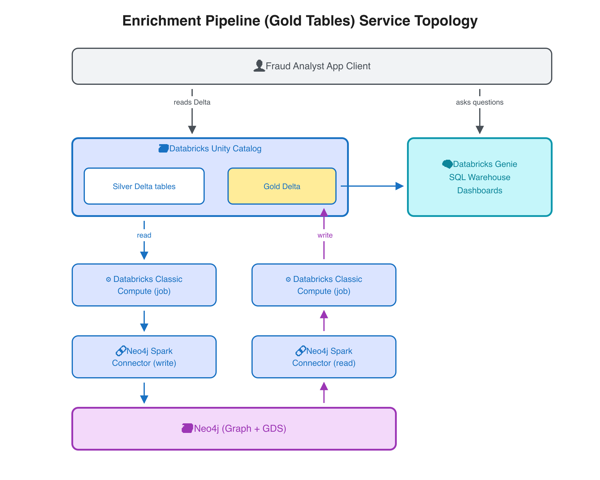
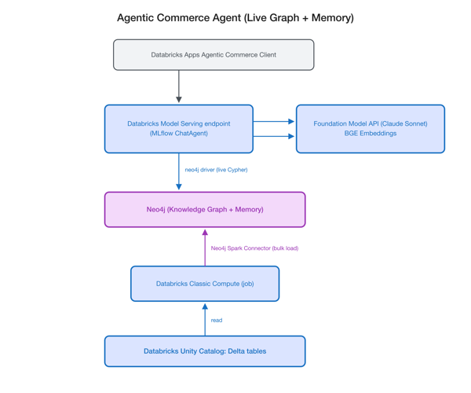
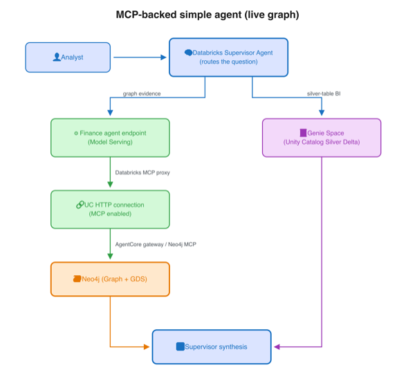

# Architecture Diagrams

Reference diagrams for the graph-on-Databricks reference architecture. Each thumbnail links to the full-resolution PNG. Editable sources are available as `.excalidraw` files, with `.svg` exports alongside each PNG.

## Enrichment Pipeline (Gold Tables) Service Topology

The batch enrichment path. Silver Delta tables in Unity Catalog are read by a Databricks classic compute job, written into Neo4j (Graph + GDS) through the Neo4j Spark Connector, then GDS results are read back and written to Gold Delta. A fraud analyst consumes the Gold tables directly and asks natural-language questions through Databricks Genie over the SQL Warehouse and dashboards.

[Full image](enrichment-pipeline.png) · [SVG](enrichment-pipeline.svg) · [Excalidraw source](enrichment-pipeline.excalidraw)

## Agentic Commerce Agent (Live Graph + Memory)

The live agent path. A Databricks Apps client calls a Model Serving endpoint running an MLflow `ChatAgent`, which uses the Foundation Model API (Claude Sonnet) and BGE embeddings for reasoning, and queries Neo4j directly over the neo4j driver with live Cypher for both the knowledge graph and agent memory. The graph is bulk-loaded from Unity Catalog Delta tables by a Databricks classic compute job through the Neo4j Spark Connector.

[Full image](agentic-commerce.png) · [SVG](agentic-commerce.svg) · [Excalidraw source](agentic-commerce.excalidraw)

## MCP-backed Simple Agent (Live Graph)

The MCP-routed agent path. An analyst's question goes to a Databricks Supervisor Agent that routes it two ways: graph evidence flows to a Finance agent endpoint on Model Serving, which reaches Neo4j (Graph + GDS) through a UC HTTP connection (MCP enabled) via the Databricks MCP proxy and an AgentCore gateway / Neo4j MCP; silver-table BI flows to a Genie Space over Unity Catalog Silver Delta. Both results return to the Supervisor for final synthesis.

[Full image](mcp-simple-agent.png) · [SVG](mcp-simple-agent.svg) · [Excalidraw source](mcp-simple-agent.excalidraw)
