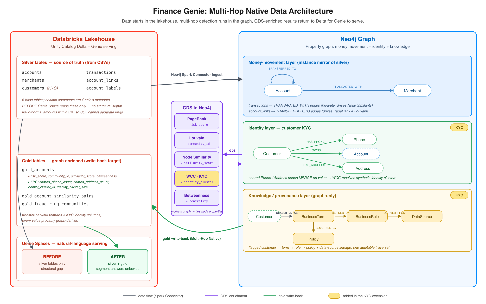

# Finance Genie — Pipeline Architecture

## What this document covers

This document describes the enrichment pipeline in `finance-genie/enrichment-pipeline/`. It covers each major stage, the configuration variables that control each stage, what those variables do and why they exist, and an honest assessment of what could be removed without losing the before/after GDS enrichment contrast at the center of the demo.

The pipeline has one job: demonstrate what becomes answerable when GDS enriches the Gold layer with structural dimensions that base tables cannot provide. GDS writes features: `risk_score` is PageRank eigenvector centrality, `community_id` is a Louvain community partition, `similarity_score` is Jaccard overlap of shared-merchant sets. Each carries a published mathematical definition. None is a fraud verdict. Genie reads those columns and answers segment questions over structural dimensions: portfolio composition, cohort comparisons, community rollups, operational workload, merchant-side analysis. That goal determines which variables are load-bearing and which are belt-and-suspenders.

---

## Stage 1: Data Generation

### Overview

`setup/generate_data.py` produces five CSVs and a `ground_truth.json` file in `enrichment-pipeline/data/`. These become the Silver-layer Delta tables that the rest of the pipeline reads. The generator creates 25,000 accounts, 7,500 merchants, 250,000 account-to-merchant transactions, and 300,000 peer-to-peer transfers. Within those records it embeds ten fraud rings, each connected by elevated transaction density and shared merchant preferences -- the structural signals that GDS algorithms will later surface.

The key constraint is that the fraud rings must be invisible to tabular aggregation. Transaction amounts for fraud accounts are deliberately set within 3% of normal amounts. On base tables, the structural-discovery questions asked in the BEFORE demo have no column-level handle — the answers live in network topology, not in any row-level aggregate. After GDS writes `risk_score`, `community_id`, and `similarity_score` back into the Gold tables, a different class of question becomes answerable: portfolio composition by community, cohort comparisons across risk tiers, community rollups, operational workload by region, and merchant-side analysis conditioned on structural membership. GDS does the structural discovery; Genie characterizes the labeled segment.

`diagnostics/verify_fraud_patterns.py` is an optional diagnostic. It reads the CSVs and checks four structural properties against fixed thresholds, which is useful when re-tuning parameters. It is not a required pipeline stage: the downstream GDS verification in `validation/verify_gds.py` covers the same structural ground, so a stable-parameter run does not need to invoke it.

---

### Scale variables

These control dataset size. They do not affect signal quality directly, but they do set the population context that the signal variables are calibrated against. The defaults have been validated together; changing one without re-verifying the others may require recalibrating the primary tuning knobs.

| Variable | Default | What it controls |
|----------|---------|-----------------|
| `NUM_ACCOUNTS` | 25,000 | Total account population. Sets the background density against which ring density is measured. |
| `NUM_MERCHANTS` | 7,500 | Total merchant population. Larger pools reduce Jaccard similarity between any two accounts; `RING_ANCHOR_PREF` compensates. |
| `NUM_TXN` | 250,000 | Account-to-merchant transactions. Determines how many merchant visits each account accumulates. |
| `NUM_P2P` | 300,000 | Peer-to-peer transfers. Sets the edge budget that `WITHIN_RING_PROB` and the whale parameters divide. |
| `FRAUD_RATE` | 0.04 (4%) | Fraction of accounts assigned to fraud rings. At 25,000 accounts, this creates 1,000 ring members across 10 rings. |
| `N_RINGS` | 10 | Number of distinct fraud rings. Each ring receives an equal share of the fraud population and its own set of anchor merchants. |
| `WHALE_RATE` | 0.008 (0.8%) | Fraction of normal accounts designated as "whale" accounts. At 25,000 accounts, this creates 200 whales. |
| `SEED` | 42 | RNG seed. Controls all random draws in the generator, producing a fully reproducible dataset at a fixed seed value. |

---

### Primary signal knobs (env-overridable)

Three variables determine whether the GDS algorithms produce clean, separable outputs. They are calibrated together and documented in `worklog/PARAMETER_CALIBRATION.md`. Each controls a specific algorithm's signal, and each has a documented lower bound below which that algorithm's verification check fails.

**Louvain community detection — `WITHIN_RING_PROB` (default 0.35)**

The fraction of peer-to-peer transfers that stay within a ring, and the primary driver of the within-ring edge density ratio. At 0.35, roughly 93% of edges originating from a ring member stay inside the ring, producing a within-ring density approximately 3,400 times higher than the background density. Louvain detects the community boundary from that density contrast. Below 0.25 the internal edge ratio drops below 89% and ring boundaries blur enough that some rings merge into large background communities. `WITHIN_RING_PROB` also controls the absolute inbound count received by ring captains, which is why it interacts with the hardcoded captain constants below.

**PageRank centrality — `WHALE_INBOUND` (default 0.14)**

The fraction of all P2P transfers directed toward whale accounts. At 300,000 total transfers and 200 whales, this gives each whale approximately 210 inbound transfers on average. That number must stay above the inbound count of ring captains so that naive inbound-count sorting finds whales, not ring captains -- establishing that tabular analysis fails and graph analysis is required.

**Node Similarity (Jaccard) — `RING_ANCHOR_PREF` (default 0.35)**

The probability that a fraud account visits a ring-specific "anchor" merchant on any given transaction, and the primary driver of Jaccard similarity between ring members. At 0.35, the fraud-to-normal Jaccard ratio is approximately 1.98x, clearing the verification threshold of 1.9x. Below 0.25 the ratio drops to roughly 1.50x and the Node Similarity gate fails.

---

### Secondary signal constants (hardcoded)

These values are calibrated together with the primary knobs and fixed in `setup/generate_data.py`. They are documented here because they shape the signal, but they are not `.env` variables -- changing them requires editing the module and re-running the verification suite.

| Constant | Value | Role |
|----------|-------|------|
| `WHALE_OUTBOUND` | equal to `WHALE_INBOUND` | Matching outbound volume gives whales symmetric in/out flow, so they resemble payment aggregators rather than pure collection accounts. Outbound transfers go to non-ring accounts, keeping whale senders peripheral and preserving the PageRank separation. |
| `WHALE_RECIPIENT_POOL_SIZE` | 30 | Each whale's outbound transfers route to a fixed pool of 30 recurring recipients drawn from plain normal accounts, mirroring the consistent-counterparty pattern of a real payment aggregator. Recipients stay low-degree and do not absorb PageRank. |
| `RING_ANCHOR_CNT` | 4 | Shared anchor merchants per ring. Sets the ceiling on within-ring Jaccard similarity; fewer anchors narrows the shared merchant pool, more anchors raises the ceiling but increases collision risk between rings. |
| `CAPTAIN_COUNT` | 5 | Captains per ring. Captains absorb a fraction of intra-ring inbound transfers to concentrate PageRank within the ring, ensuring ring members surface near the top of risk-score rankings. |
| `CAPTAIN_TRANSFER_PROB` | 0.02 | Fraction of within-ring transfers routed to a captain. At 0.02 with 300,000 P2P transfers, each captain receives approximately 12 extra inbound for a total around 155 -- kept below whale inbound (~210) so the whale-hiding property holds. At 0.10 captains would breach the top-200 inbound accounts and break the separation. |

---

### Tabular signal constants (hardcoded)

Six lognormal-distribution constants keep the fraud/normal tabular signal deliberately weak -- the gap between fraud and normal transaction medians is less than 3%. This is what makes structural-discovery questions unanswerable from row-level SQL on the Silver tables and what makes the BEFORE Genie run's gap authentic. The enrichment step changes which questions the analyst can usefully bring to Genie; the transaction distributions are fixed to ensure that base-table analysis alone cannot shortcut that gap. The values are fixed in `setup/generate_data.py` and do not need ongoing adjustment.

| Constant | Value | What it controls |
|----------|-------|-----------------|
| `FRAUD_LOGNORM_MU` | 4.1 | Log-mean of transaction amounts for fraud accounts (~$60 median). |
| `FRAUD_LOGNORM_SIGMA` | 1.2 | Log-std of transaction amounts for fraud accounts. |
| `NORMAL_LOGNORM_MU` | 4.0 | Log-mean of transaction amounts for normal accounts (~$55 median). |
| `NORMAL_LOGNORM_SIGMA` | 1.2 | Log-std of transaction amounts for normal accounts. |
| `P2P_LOGNORM_MU` | 5.0 | Log-mean of P2P transfer amounts (~$148 median). |
| `P2P_LOGNORM_SIGMA` | 1.5 | Log-std of P2P transfer amounts. |

---

## Stage 2: Lakehouse Bootstrap

### Overview

Three scripts run once to configure the Databricks workspace for the pipeline:

`upload_and_create_tables.sh` creates the Unity Catalog schema and volume, applies `sql/schema.sql` to create the five Silver Delta tables, and uploads the generated CSVs plus `ground_truth.json` into the volume. Column-level comments on every table are the primary metadata Genie uses to understand table semantics; these comments are preserved across data reloads because the script uses `INSERT OVERWRITE` rather than `CREATE OR REPLACE TABLE`.

`setup_secrets.sh` writes Neo4j credentials and both Genie Space IDs into a Databricks secret scope named `neo4j-graph-engineering`. This keeps credentials out of job definitions and out of `.env` files committed to source control.

`setup/provision_genie_spaces.py` configures both Genie Spaces to a deterministic state: table sets, sample questions, and instruction text. The script is idempotent -- it can be re-run after any space drift.

---

### Bootstrap variables

These live in `.env` and are infrastructure coordinates rather than signal parameters.

| Variable | What it controls |
|----------|-----------------|
| `DATABRICKS_PROFILE` | CLI profile used for all Databricks SDK calls in the bootstrap scripts. |
| `DATABRICKS_WAREHOUSE_ID` | SQL Warehouse used to execute DDL in `upload_and_create_tables.sh`. |
| `CATALOG` | Unity Catalog catalog name for all tables and volumes. |
| `SCHEMA` | Unity Catalog schema name. |
| `DATABRICKS_VOLUME` | Volume path where CSVs and `ground_truth.json` are staged. |
| `NEO4J_URI` | Neo4j Aura connection string written to the secret scope. |
| `NEO4J_USERNAME` | Neo4j username written to the secret scope. |
| `NEO4J_PASSWORD` | Neo4j password written to the secret scope. |
| `GENIE_SPACE_ID_BEFORE` | ID of the Genie Space configured with the four base Silver tables only. |
| `GENIE_SPACE_ID_AFTER` | ID of the Genie Space configured with the base tables plus three Gold tables. |
| `NEO4J_SECRET_SCOPE` | Name of the Databricks secret scope. Defaults to `neo4j-graph-engineering`. |

---

## Stage 3: Neo4j Ingest

### Overview

`jobs/neo4j_ingest.py` runs as a Databricks Python job on the cluster. It reads the five Silver Delta tables and loads them into Neo4j as a property graph: `:Account` nodes, `:Merchant` nodes, `TRANSACTED_WITH` relationships (account to merchant), and `TRANSFERRED_TO` relationships (account to account). It clears the graph before each run using batched `DETACH DELETE` queries to stay within Neo4j Aura memory limits.

The Neo4j Spark Connector and the `graphdatascience` library must be installed on the cluster before this job can run. `validation/validate_cluster.py` checks for both before the ingest job is submitted.

---

### Ingest variables

| Variable | What it controls |
|----------|-----------------|
| `CATALOG` | Source catalog for the Silver tables. Forwarded to the job by the CLI runner. |
| `SCHEMA` | Source schema for the Silver tables. |
| `NEO4J_SECRET_SCOPE` | Secret scope from which the job reads Neo4j credentials at runtime. |
| `DATABRICKS_CLUSTER_ID` | Cluster ID the CLI runner submits the job to. |
| `DATABRICKS_COMPUTE_MODE` | Set to `cluster` to use a named cluster rather than serverless compute. Required because the Neo4j Spark Connector JAR is not available in serverless. |

The Spark Connector batch size is hardcoded at 10,000 rows per write operation in `jobs/neo4j_secrets.py`. This value manages Neo4j Aura memory during writes and does not need to be configurable for the demo.

---

## Stage 4: GDS Execution

### Overview

`validation/run_gds.py` runs locally against the Neo4j Aura instance. It executes three GDS algorithms in sequence and writes the results back as node properties. `validation/verify_gds.py` runs afterward as a separate script and checks the results against fixed thresholds.

**PageRank** runs on a graph projection of `TRANSFERRED_TO` edges treated as undirected. It writes `risk_score` to every `:Account` node. Ring captains, which have elevated inbound transfer counts from other ring members, accumulate higher scores than background accounts.

**Louvain** runs on the same projection and writes `community_id` to every `:Account` node. Because within-ring edge density is approximately 3,400 times higher than background density, Louvain assigns most ring members to the same community.

**Node Similarity** runs on a bipartite projection of `:Account` nodes connected through shared `:Merchant` nodes via `TRANSACTED_WITH` edges. It writes `:SIMILAR_TO` relationships between account pairs with high Jaccard overlap in merchant visit history. The `degreeCutoff` parameter (hardcoded at 5) excludes accounts with fewer than five unique merchant visits from the projection; accounts below this cutoff receive `similarity_score=0` and are later tiered as `medium` rather than `high` in the Gold tables.

`validation/verify_gds.py` checks the results against fixed thresholds:

- PageRank fraud/normal average ratio must be at least 3.0x
- Louvain community purity for at least one ring must reach 50%
- Node Similarity fraud/normal Jaccard ratio must be at least 1.9x
- All 25,000 accounts must have all three properties populated

It exits with status 1 if any check fails.

---

### GDS variables

The GDS algorithm parameters (iterations, damping factor, topK) are hardcoded in the script because they are calibrated to the dataset and do not benefit from being tunable at runtime. The only environment variables this stage needs are:

| Variable | What it controls |
|----------|-----------------|
| `NEO4J_URI` | Direct connection to Neo4j Aura. Read from `.env` since the script runs locally, not on the cluster. |
| `NEO4J_USERNAME` | Neo4j username. |
| `NEO4J_PASSWORD` | Neo4j password. |

---

## Stage 5: Gold Table Production

### Overview

`jobs/pull_gold_tables.py` runs as a Databricks job. It reads the GDS-enriched node properties from Neo4j via the Spark Connector and writes three Gold Delta tables that Genie can query directly.

`gold_accounts` adds `risk_score`, `community_id`, `similarity_score`, and four derived columns to the base account dimension: `community_size`, `community_avg_risk_score`, `community_risk_rank`, and `inbound_transfer_events`. It also computes `is_ring_community` and `fraud_risk_tier` (high when in a ring community, otherwise low) from those columns. The Genie Space for the "after" demo queries this table.

`gold_fraud_ring_communities` aggregates `gold_accounts` by community to produce one row per candidate ring: member count, average and maximum risk score, average similarity score, high-risk member count, and the top-ranking account in the community.

`gold_account_similarity_pairs` reads `:SIMILAR_TO` edges from Neo4j and surfaces them as a flat table of (account_a, account_b, similarity_score, same_community) pairs.

`jobs/validate_gold_tables.py` runs immediately after as a separate job. It reads `ground_truth.json` from the UC Volume and checks six correctness properties against the gold tables: ring candidate count, community dominance by ring, community size bounds, high-tier coverage, top account membership, and same-ring pair fractions.

---

### Gold table variables

The ring candidate thresholds live in `jobs/gold_constants.py` and are shared between `pull_gold_tables.py` (where they define what counts as a ring) and `validate_gold_tables.py` (where they define what counts as a passing gate). They are not `.env` variables; changing them requires editing the module.

| Constant | Default | What it controls |
|----------|---------|-----------------|
| `RING_SIZE_LOW` | 50 | Minimum community member count for a community to be classified as a ring candidate. |
| `RING_SIZE_HIGH` | 200 | Maximum member count. Communities larger than 200 are background communities, not rings. |
| `COMMUNITY_AVG_RISK_MIN` | 1.0 | Minimum average `risk_score` for a community to be classified as a ring candidate. Ensures the community is elevated in PageRank, not just cohesive. |

`fraud_risk_tier` is binary: accounts in a ring-candidate community receive `TIER_HIGH` ("high"), everything else receives `TIER_LOW` ("low"). The same module also holds the GDS verification thresholds (`GDS_PR_RATIO_MIN`, `GDS_COMMUNITY_PURITY_MIN`, `GDS_SIM_RATIO_MIN`, `GDS_RING_EXCLUSION_MAX`) used by `validation/verify_gds.py`.

The validation job also uses two `.env` variables:

| Variable | What it controls |
|----------|-----------------|
| `GROUND_TRUTH_PATH` | UC Volume path to `ground_truth.json`. Used by the validation job to check that the Gold tables match the ground truth embedded at generation time. |
| `RESULTS_VOLUME_DIR` | UC Volume directory where validation artifacts (JSON result files) are written. |

---

## Stage 6: Genie Validation

### Overview

Two jobs ask different classes of question against the two Genie Spaces and write independent JSON artifacts to the UC Volume.

`jobs/genie_run_before.py` queries the BEFORE space (base Silver tables only) with three structural-discovery questions and one teaser. The three structural questions ask about transfer-network hubs, groups of accounts transferring heavily among themselves, and accounts with common merchant histories. On base tables, none of these questions can be resolved from row-level SQL. The answers live in network topology, not in any base-table column. Genie will answer, but it answers a different question than the one asked: it ranks by transfer volume rather than eigenvector centrality, or groups by a shared attribute rather than interaction density. Transfer volume is not network centrality. No amount of SQL over flat rows produces eigenvector centrality. This substitution is silent; the response looks plausible. That is the structural gap the BEFORE run captures. Each response is measured against `ground_truth.json` and reported as evidence of the gap rather than a test failure. The verdict label for a result that does not meet the post-GDS criterion is `STRUCTURAL GAP CONFIRMED`, the expected outcome. `UNEXPECTED SIGNAL FOUND` appears only when base-table SQL accidentally meets the threshold, which would indicate a calibration issue. The teaser question asks what share of accounts sits in ring-candidate communities by region. It is reported as `NOT AVAILABLE ON THIS CATALOG — answered in AFTER run`, previewing the AFTER question class without requiring columns that do not yet exist. The BEFORE summary closes with a statement of the structural gap and a pointer to the AFTER artifact.

`jobs/genie_run_after.py` queries the AFTER space (Silver tables plus the three Gold tables) with a different class of question: portfolio composition, cohort comparisons, community rollups, operational workload, and merchant-side analysis. Five sampler modules (`cat1_portfolio` through `cat5_merchant`) each hold a bank of questions in their `QUESTIONS` list; the runner picks one question per category and asks all five. Every question is asked in plain business language with no SQL hints. Responses — the SQL Genie generated, the rows returned, and any summary text — are captured as an artifact. No grading is performed in this job; that lands in Phase 5. Per-question status is `RESPONDED`, `NO DATA`, or `ERROR`. The closing summary names the five dimensions the AFTER catalog unlocked.

Each runner writes its own JSON artifact to the results volume. There is no compare job.

For each structural question, the BEFORE runner measures one metric against `ground_truth.json`:

- Hub detection: precision of the top-20 returned accounts against ground-truth ring members
- Community structure: maximum ring coverage fraction within any returned community group
- Merchant overlap: fraction of returned account pairs that belong to the same ground-truth ring

The AFTER runner records no metrics. Evaluation (response-shape checks and LLM-as-judge scoring) is Phase 5.

---

### Genie validation variables

| Variable | Default | What it controls |
|----------|---------|-----------------|
| `GENIE_SPACE_ID_BEFORE` | (required) | Space ID for the pre-GDS Genie Space. |
| `GENIE_SPACE_ID_AFTER` | (required) | Space ID for the post-GDS Genie Space. |
| `GENIE_TEST_RETRIES` | 2 | Number of times to retry a question if Genie returns an error or empty result before marking it as failed. Applies to both runners. |
| `GENIE_TEST_TIMEOUT_SECONDS` | 120 | Per-attempt timeout. Genie query planning can be slow; 120 seconds covers typical warehouse startup latency. Applies to both runners. |
| `GROUND_TRUTH_PATH` | (required) | UC Volume path to `ground_truth.json`. Used by `genie_run_before.py` for metric computation against ground-truth ring labels. Not used by `genie_run_after.py`. |
| `RESULTS_VOLUME_DIR` | (required) | UC Volume directory where Genie run artifacts are written by both runners. |
| `SAMPLERS` | (all five) | Comma-separated category module names passed to `genie_run_after.py` (e.g. `cat1_portfolio,cat4_operational`). Defaults to all five categories. Useful for running a single-category demo when time is short. |

---

## What each GDS algorithm guarantees

Each of the three GDS algorithms carries a published mathematical guarantee. The output is a feature. A downstream consumer reads that feature and makes the call the algorithm does not.

**PageRank guarantees eigenvector centrality.** The score `risk_score` converges to the principal eigenvector of the transfer network's transition matrix under the configured damping factor. Ring captains and whales score higher than background accounts because more probability mass flows toward them. A fraud investigator or supervised classifier consumes the ranked list and adjudicates which high-score accounts warrant review.

**Louvain guarantees a modularity-optimal community partition.** The label `community_id` assigns every account to the community that maximizes the graph's modularity score given the projection. Rings surface as communities because their within-ring edge density is roughly three orders of magnitude above background. A Genie analyst reading `gold_fraud_ring_communities` queries the candidate communities, and a human or downstream model decides which are real rings.

**Node Similarity guarantees Jaccard overlap.** The edges in `:SIMILAR_TO` and the column `similarity_score` carry exact Jaccard similarity of merchant-visit sets above the configured degree cutoff. Ring members cluster because anchor-merchant preferences drive overlap. A dashboard or analyst consumes the ranked pairs and investigates which high-similarity pairs represent collusion.

Each feature is reproducible given a fixed projection. Each is a named mathematical object with a published definition. The Databricks-hosted workflow that reads the gold columns is where precision, recall, and business judgment get applied.

---

## Glossary

Terms used throughout this document and in the pipeline code. Each entry defines the term generally and notes how it shows up in this specific demo.

**Fraud ring.** A coordinated group of accounts that move money among themselves or transact with shared merchants to obscure the origin of funds or build reputation signal. In this demo, ten rings of 50-200 accounts each are embedded in the 25,000-account population. Ring membership is recorded in `ground_truth.json` and is the ground-truth label every verification check compares against.

**Ring captain.** An account inside a ring that absorbs a disproportionate share of intra-ring inbound transfers. Captains exist to concentrate PageRank inside the ring so ring members surface near the top of risk-score rankings. In this demo, `CAPTAIN_COUNT=5` captains per ring each receive approximately 12 extra intra-ring inbound transfers at `CAPTAIN_TRANSFER_PROB=0.02`, for a total around 155 inbound per captain. That total is deliberately kept below whale inbound so that even the closest tabular proxy for hub detection — sorting by inbound-transfer count — surfaces whales rather than captains, which is what makes hub-detection a structural question that base-table SQL cannot answer.

**Whale.** A normal (non-ring) account that receives an elevated volume of peer-to-peer transfers, resembling a payment aggregator or a high-volume personal account. Whales exist to ensure that the closest tabular proxy for hub detection — sorting by inbound-transfer count — returns false positives rather than ring members, which is what makes hub-detection questions structurally out of reach for base-table SQL. In this demo, `WHALE_RATE=0.008` creates 200 whales, each receiving roughly 210 inbound transfers under `WHALE_INBOUND=0.14`. Whales send matching outbound volume to a fixed pool of 30 recurring recipients (`WHALE_RECIPIENT_POOL_SIZE`), keeping them peripheral to the graph topology rather than structurally identical to ring captains.

**Anchor merchant.** A merchant preferentially visited by members of a specific ring, producing shared merchant history across that ring's accounts. Anchor merchants are the mechanism that drives elevated Jaccard similarity between ring members. In this demo, `RING_ANCHOR_CNT=4` anchor merchants are assigned to each ring, and each ring account visits its anchors with probability `RING_ANCHOR_PREF=0.35` on any given transaction.

**Background density.** The rate at which peer-to-peer edges exist between arbitrary pairs of accounts, measured across the full population. In this demo the background density is roughly three orders of magnitude below within-ring density. The ratio between the two is what Louvain uses to draw community boundaries.

**Within-ring density.** The rate at which peer-to-peer edges exist between accounts that are both members of the same ring. At the demo's default parameters, within-ring density is approximately 3,400 times the background density, which is what makes rings detectable as communities rather than as noise.

**Jaccard ratio.** The ratio of fraud-to-fraud Jaccard similarity (averaged over ring-member pairs) to fraud-to-normal Jaccard similarity (averaged over mixed pairs), measured on each account's shared-merchant set. In this demo the ratio sits near 1.98 at default parameters, and `validation/verify_gds.py` requires at least 1.9. Below that threshold, Node Similarity cannot cleanly separate rings from background.

**PageRank separation.** The ratio of average PageRank score among ring members to average PageRank score among normals. This demo targets at least 3.0x, enforced by `validation/verify_gds.py` as `GDS_PR_RATIO_MIN`. It is the numeric form of the claim that ring members are structurally more central in the transfer network than random accounts.

**Community dominance.** The fraction of a detected Louvain community that belongs to a single ground-truth ring. `jobs/validate_gold_tables.py` requires each ring-candidate community to be dominated at 80% or higher by one real ring. Dominance normalizes by community size and answers the question "is this community mostly one ring?".

**Ring coverage.** The fraction of a ground-truth ring captured by a single Louvain community. Complementary to dominance: where dominance asks "is this community mostly one ring?", coverage asks "is this ring mostly in one community?". The Genie `community_structure` question measures maximum ring coverage across returned communities.

**Confuser cohort.** A population of accounts deliberately injected into the synthetic dataset that looks structurally similar to a fraud ring but is not one. Examples include family units, commuter corridors, small-business payroll clusters, and university cohorts, each of which produces elevated within-group transfer rates and shared-merchant Jaccard similarity for benign reasons. Confuser cohorts force GDS and downstream filtering to rank real rings above lookalikes, converting "GDS found all rings perfectly" into the more production-realistic "GDS produced a ranked candidate list where real rings sit at the top and benign lookalikes sit below." Not currently present in this demo's generator; proposed as Phase 3 in `REFINE_DEMO.md`.

**Ground truth.** The file `ground_truth.json` produced by the data generator, recording which accounts belong to which ring, which merchants are anchors for which rings, and which accounts are captains or whales. Every verification check joins against this file, keyed on `account_id` rather than `community_id` (which drifts across GDS runs), to compute precision and coverage metrics. Ground truth exists only because the data is synthetic, which is both the strength of the demo (verifiable metrics against a known-correct answer) and its limitation (not representative of production conditions where ground truth is partial, delayed, or absent).
