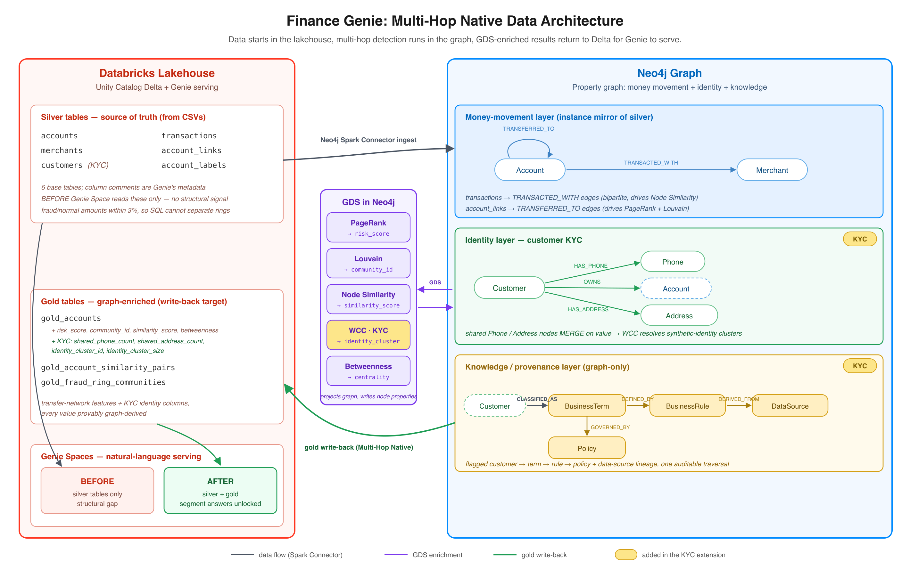

# Finance Genie Pipeline Architecture

Finance Genie adds graph-derived features to Databricks Gold tables. Neo4j Graph
Data Science computes the features. Databricks Genie queries them as ordinary
columns.

## Overview

- **Input:** Silver tables for accounts, customers, merchants, transactions, and transfers.
- **Graph analysis:** Neo4j GDS computes centrality, community, and similarity features.
- **Output:** Gold tables store those features with account and merchant data.
- **Demo result:** Genie can answer questions about relationship-based segments.
- **Decision boundary:** Graph features identify investigation candidates. Analysts make fraud decisions.

Two applications use the same graph data for different workflows:

- **Fraud Signal Workbench:** [`fraud-signal-workbench/`](../fraud-signal-workbench/README.md) selects graph evidence and sends analysis questions to Genie.
- **Graph agent:** [`neo4j-mcp-graph-agent/`](../neo4j-mcp-graph-agent/README.md) retrieves live graph evidence through an MCP connection.

Each application README is the source of truth for deployment. This guide
covers the enrichment pipeline.

## Data Flow

1. Generate a repeatable synthetic banking dataset.
2. Load the source tables into Unity Catalog Silver tables.
3. Load accounts, merchants, customers, and relationships into Neo4j.
4. Run PageRank, Louvain, Node Similarity, and identity resolution.
5. Pull the graph results back into Databricks Gold tables.
6. Validate the Gold tables and run the before and after Genie questions.

## Stage 1: Generate Data

`enrichment-pipeline/setup/generate_data.py` creates the CSV inputs and
`ground_truth.json`.

- **Accounts:** 25,000.
- **Merchants:** 7,500.
- **Merchant transactions:** 250,000.
- **Peer transfers:** 300,000.
- **Fraud rings:** 10 synthetic rings with 1,000 total members.
- **Seed:** 42 for repeatable data.

The generator keeps fraud transaction amounts close to normal transaction
amounts. This removes a simple volume shortcut. The useful signal comes from
transfer structure and shared merchant behavior.

### Main Signal Settings

| Setting | Default | Purpose |
| --- | ---: | --- |
| `WITHIN_RING_PROB` | `0.35` | Creates dense transfers inside each ring for Louvain. |
| `WHALE_INBOUND` | `0.14` | Creates high-volume normal accounts that weaken inbound count as a proxy for centrality. |
| `RING_ANCHOR_PREF` | `0.35` | Creates shared merchant behavior for Node Similarity. |
| `FRAUD_RATE` | `0.04` | Sets the synthetic ring population. |
| `N_RINGS` | `10` | Sets the number of planted rings. |
| `WHALE_RATE` | `0.008` | Sets the high-volume normal population. |

These values form one calibrated set. Run the validation suite after changing
any of them.

## Stage 2: Prepare Databricks

The bootstrap scripts create the Unity Catalog schema, load the Silver tables,
store secrets, and configure the two Genie Spaces.

- **Upload:** `enrichment-pipeline/upload_and_create_tables.sh` creates tables and loads files.
- **Secrets:** `enrichment-pipeline/setup_secrets.sh` stores Neo4j and Genie values in a Databricks secret scope.
- **Genie setup:** `enrichment-pipeline/setup/provision_genie_spaces.py` configures the Silver and Gold spaces.

Important environment values include:

| Setting | Purpose |
| --- | --- |
| `DATABRICKS_PROFILE` | Selects the Databricks CLI profile. |
| `DATABRICKS_WAREHOUSE_ID` | Selects the SQL warehouse for setup statements. |
| `CATALOG` and `SCHEMA` | Select the Unity Catalog location. |
| `DATABRICKS_VOLUME` | Selects the staging volume. |
| `NEO4J_URI`, `NEO4J_USERNAME`, `NEO4J_PASSWORD` | Connect to Neo4j. |
| `GENIE_SPACE_ID_BEFORE` | Selects the Silver-only Genie Space. |
| `GENIE_SPACE_ID_AFTER` | Selects the enriched Genie Space. |
| `NEO4J_SECRET_SCOPE` | Selects the Databricks secret scope. |

## Stage 3: Load Neo4j

`enrichment-pipeline/jobs/02_neo4j_ingest.py` reads the Silver tables and builds
the property graph.

- **Account network:** `Account` nodes connect through `TRANSFERRED_TO` relationships.
- **Merchant network:** `Account` nodes connect to `Merchant` nodes through `TRANSACTED_WITH` relationships.
- **Identity network:** `Customer` nodes connect to `Phone` and `Address` nodes through shared identifiers.
- **Runtime:** A Databricks cluster runs the Neo4j Spark Connector and the GDS Python client.

The ingest clears and rebuilds the demo graph. Batch writes limit memory use on
Neo4j Aura.

## Stage 4: Run Graph Data Science

`enrichment-pipeline/validation/run_gds.py` computes the graph features.

- **PageRank:** Writes `risk_score` to accounts based on transfer-network centrality.
- **Louvain:** Writes `community_id` based on transfer density.
- **Node Similarity:** Writes `SIMILAR_TO` relationships and `similarity_score` from shared merchant neighborhoods.
- **Weakly Connected Components:** Writes identity cluster fields from shared phones and addresses.

`enrichment-pipeline/validation/verify_gds.py` checks the expected synthetic
signals:

- **PageRank ratio:** Fraud accounts average at least three times the normal score.
- **Community purity:** At least one ring reaches 50% purity.
- **Similarity ratio:** Fraud pairs reach at least 1.9 times the mixed-pair score.
- **Coverage:** Every account receives the required graph properties.
- **Identity fixture:** The planted eight-account identity cluster matches ground truth.

## Stage 5: Build Gold Tables

`enrichment-pipeline/jobs/03_pull_gold_tables.py` reads graph properties through
the Neo4j Spark Connector and writes three Gold tables.

- **`gold_accounts`:** Adds graph scores, community fields, identity fields, and derived tiers to each account.
- **`gold_fraud_ring_communities`:** Summarizes candidate communities for portfolio and workload questions.
- **`gold_account_similarity_pairs`:** Stores high-similarity account pairs for shared-behavior questions.

The demo classifies a community as a ring candidate when its size is between 50
and 200 and its average risk score is at least 1.0. These values support the
synthetic fixture. Production teams must calibrate them with representative data.

The Gold validation job checks community counts, coverage, sizes, risk tiers,
top accounts, similarity pairs, and identity outputs against `ground_truth.json`.

## Stage 6: Compare Genie Results

The before and after jobs ask different question classes.

- **Before:** `jobs/01_genie_run_before.py` asks structural questions against Silver tables. It records when volume or attribute proxies miss the graph criterion.
- **After:** `jobs/05_genie_run_after.py` asks portfolio, cohort, community, workload, and merchant questions against Gold tables.
- **Artifacts:** Both jobs store generated SQL, rows, summaries, and status values in the configured results volume.

Genie can generate different valid SQL for the same question. The graph features
remain stable for a fixed graph projection. Use explicit top counts when the
demo needs a broad sample.

## Validation Layers

- **Source checks:** Confirm file counts, schema, and planted patterns.
- **Graph checks:** Confirm algorithm separation, coverage, and identity clusters.
- **Gold checks:** Confirm table contracts and ground-truth alignment.
- **Genie checks:** Capture query behavior before and after enrichment.
- **Production checks:** Measure precision, recall, review volume, runtime, and drift on representative data.

See the [production scoping guide](SCOPING_GUIDE.md) for production evaluation
requirements.

## Design Principles

- **Keep discovery in the graph:** GDS computes properties that depend on network structure.
- **Keep analysis in Genie:** Genie groups, filters, ranks, and compares the stored features.
- **Store evidence:** Preserve graph configuration, Gold values, generated SQL, and validation artifacts.
- **Separate signals from decisions:** Treat scores and communities as investigation inputs.
- **Recalibrate for production:** Reevaluate data scale, thresholds, capacity, and review policy for each deployment.
