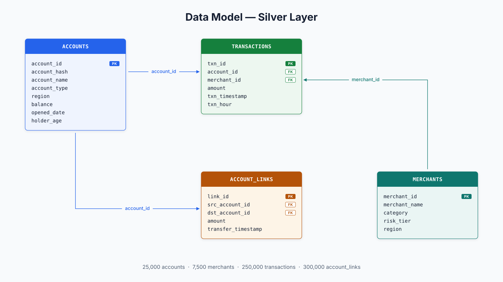

<style>
section {
  --marp-auto-scaling-code: false;
}

li {
  opacity: 1 !important;
  animation: none !important;
  visibility: visible !important;
}

.marp-fragment {
  opacity: 1 !important;
  visibility: visible !important;
}

ul > li,
ol > li {
  opacity: 1 !important;
}
</style>

# Graph-Enriched Lakehouse

Combining Databricks Genie with Neo4j Graph Data Science

<!--
One-line argument: financial crime is a network problem, the row
is the wrong unit of analysis, and we close that gap by running
Neo4j GDS as a silver-to-gold enrichment stage in front of
Databricks Genie.
-->

---

## What This Talk Covers

1. **The problem.** Fraud rings are network patterns; row-level analytics cannot see them
2. **What Genie does well.** High-quality natural language to Structured Query Language over Delta tables
3. **What Graph Data Science does well.** Centrality, community membership, and neighborhood overlap: structural patterns no SQL query can produce
4. **The enrichment pipeline.** How graph intelligence lands in the lakehouse as plain Delta columns
5. **What the pipeline unlocks for Genie.** Structural dimensions in the Gold layer that Genie treats as ordinary columns; the full range of BI questions now applies to network-defined segments
6. **Where it applies.** The general pattern beyond fraud rings

<!--
Short agenda. The audience gets oriented in ten seconds and you
get to point at the enriched-catalog unlock as the demo anchor.
Everything else is scaffolding around that single payoff.
-->

---

## Demo Data Set: Synthetic Banking Network

- **Two financial networks:** a spending graph and a peer-to-peer transfer graph
- **Spending graph:** accounts transact with merchants
- **Transfer graph:** accounts send money directly to other accounts
- **Fraud rings** leave structural footprints in both
- The goal: surface those patterns, not score individual transactions

<!--
The dataset contains two overlapping networks. The first is a
bipartite account-merchant graph: accounts spend at merchants.
The second is a peer-to-peer transfer network: accounts send money
directly to other accounts. Fraud rings leave footprints in both —
tight clusters of accounts trading with each other and routing
through the same merchants. The goal is not to label fraud; it is
to make the structural patterns visible so analysts can investigate.
-->

---



---

## Financial Crime Is a Network Problem

- **Criminals organize, coordinate, and move money in networks.** Most fraud rules do not see the network
- **The gap is the unit of analysis:** rules fire against individual transactions, but fraud rings operate as connected patterns across dozens of accounts and thousands of transactions
- **The individual event looks clean.** The connected pattern does not
- **Result:** coordinated schemes evade detection while false-positive rates commonly run into the high double digits across published industry surveys

<!--
The last bullet is the payload but say it carefully. "Above 90%"
is a widely-cited figure but sourcing it mid-deck slows the
story. "High double digits across published industry surveys" is
defensible without citation and still makes the point: the
baseline is broken, and it is broken because the unit of
analysis is wrong.
-->

---

## A Fraud Ring Is a Subgraph

- **Finding a ring means finding the shape:** a cluster of accounts moving money densely among themselves
- **The pattern appears anywhere in the network,** without knowing in advance which accounts to start from
- **A fraud ring is not a property of any individual transaction.** It is the pattern of connections between accounts
- **No row-level aggregation can produce a network property**
- **The patterns live in the connections, not in individual rows**

<!--
A ring is a shape, not a row. You cannot reach it by summing
columns or joining tables. Sets up the next slide, which names
the data structure that can represent and traverse those
connections efficiently.
-->

---

## What Genie Excels At

- **High-quality text-to-SQL translator:** Translates analyst questions to SQL over Delta tables
- **Standard BI operations without difficulty:** aggregation, filtering, ranking, cohort comparisons, time-series rollups
- **What we do:** expand the column inventory Genie can group by, filter on, and compare across
- **Same Genie, same SQL vocabulary. Strictly more answers.**

<!--
Do not frame this as Genie having limits. The enriched-catalog
demo does not make Genie better; it gives Genie new dimensions
to operate over. Customers evaluating Genie on its merits need
to hear it is working as designed throughout.
-->

---

## Genie in Action on the Existing Catalog

Two questions from the base catalog, Genie answering what it's built for:

- **Q1:** "What are the top 10 accounts by total amount spent across merchants?" — clean ranked list; standard aggregation over `transactions`
- **Q2:** "Show accounts with above-average spend and more than 20% of transactions at night" — join and conditional aggregate; correct top-15 with night ratio and balance
- **Genie doing its designed job** on the catalog the customer already runs
- **The SQL shapes are standard:** all dimensions live in the base tables

<!--
The baseline slide. Genie works correctly on the tabular
questions the catalog supports — these two cells in
01_genie_before.ipynb exercise aggregation and a conditional
aggregate over a join. The point is not that Genie has limits;
the point is that Genie is a capable BI translator before any
enrichment happens. That establishes the floor the enriched-
catalog slide builds on later in the deck.
-->

---

## Structural Questions Require a Different Data Layer

- **Structural questions live in network topology,** not in the rows of a table
- **"Which accounts are central in the transfer network?"** How central an account is to the flow of money across the network is not a column; no SQL query can compute it from rows
- **"Which accounts form tightly-interconnected communities?"** How tightly a cluster of accounts trades with each other is not a stored attribute; no GROUP BY captures it
- **"Which accounts route through the same merchants?"** Whether two accounts route through the same counterparties is not stored; no join recovers it

<!--
Frame the gap as a data layer problem, not a query layer
problem. The answer exists — it just has to be computed by GDS
and materialized before any query tool can reach it. This motivates
GDS as the silver-to-gold stage: the network is where those answers
live, and enrichment lands them in the catalog as ordinary columns.
-->

---

## Why a Graph Database Answers What SQL Cannot

Those answers exist in the network. Reaching them requires a data store built for connections, not rows.

- **SQL needs a starting point:** a specific account ID or customer number to begin a search
- **A graph database needs only a description of the pattern** and finds every place that pattern exists in the network
- **The graph provides the data structure.** Detection comes from the queries written against it

<!--
The pivot slide. Traditional databases are point-lookup machines;
graph databases are pattern-matching machines. Now positioned after
the Genie gap, this slide answers "why can't SQL reach those questions?"
rather than introducing graph databases from scratch.
-->

---

## What We Need: Better Columns for Better Genie Answers

- **The gap is in the columns, not in Genie.** Structural questions have no column to query against — yet.
- **The result looks authoritative but answers the wrong question:** high-volume accounts surface, not the ones with suspicious network connections
- **Add `risk_score` from PageRank** and the right accounts are findable by any tool, including Genie
- **Change the columns. Change what Genie finds.**

<!--
The insight this slide needs to land: the gap is not in the
query layer, it is in the column inventory. Any tool that reads
the table will reach for what is there. Put the right column in
the table and the right answer becomes retrievable. This reframes
enrichment as a data engineering decision, not a workaround.
-->

---

## What Graph Data Science Excels At

- **Graph Data Science runs inside the graph database** and operates on the network as a whole rather than on individual rows
- **Output is deterministic given a fixed graph projection.** Same projection, same scores, every time
- **Five algorithm families:** centrality (who is central to money flow), community detection (who trades tightly together), similarity (who shares the same counterparties), pathfinding, node embeddings. This pipeline uses three

<!--
Keep this slide general. The next three slides each cover one
algorithm in detail; this one sets the category and the
reproducibility property. That reproducibility matters when
scores become columns in a catalog that a non-deterministic
translator queries.
-->

---

## Sample GDS Algorithms

- **PageRank → `risk_score`:** centrality in the account transfer network; which accounts the most-connected accounts route flow through
- **Louvain → `community_id` / `fraud_risk_tier`:** community membership by transaction density; accounts that trade more tightly with each other than with the rest of the network
- **Node Similarity → `similarity_score`:** overlap of shared merchant connections; two accounts that never transacted directly can score high if they route through the same merchants

<!--
PageRank: eigenvector centrality over the account-to-account transfer graph.
Fraud population averages 3.65× the centrality of non-fraud accounts on the
demo dataset.

Louvain: modularity-optimal partition. Each of the ten synthetic rings lands
in its own community with 100% ring coverage; average community purity is 70%
(~100 ring members + ~44 non-ring accounts per ring-candidate community).
fraud_risk_tier is a derived column, not a direct GDS output.

Node Similarity: Jaccard overlap of shared-merchant sets over the bipartite
account-merchant graph. Fraud ring members score 1.98× higher than non-fraud
on average. Degree cutoff: accounts with fewer than five unique merchant visits
are excluded; 3.2% of ring members fall below.
-->

---

## The Enrichment Pipeline

Four steps convert a network of account relationships into plain columns that Genie queries like any other dimension.

- **Load:** Reads account and transaction records from the existing lakehouse and maps them as a network in Neo4j Aura
- **Compute:** Runs graph algorithms against the full network to surface structural patterns: which accounts are central to money flow, which cluster together, which share the same connections
- **Enrich:** Writes the results back to the lakehouse as plain columns, such as `risk_score`, `community_id`, and `similarity_score`, that any query tool can read
- **Query:** Genie queries those columns directly, treating graph-derived results as ordinary dimensions

<!--
Four steps. Structural analysis runs once per pipeline cycle;
every downstream consumer reads the results as columns. The
graph analysis is invisible to the query layer.
-->

---

## Architecture at a Glance

```
Unity Catalog Silver          Neo4j Aura + GDS               Unity Catalog Gold
+-------------------+         +-------------------+          +---------------------------+
| accounts          |         | PageRank          |          | gold_accounts             |
| account_links     |--load-->| Louvain           |--pull--> |   risk_score              |
| merchants         |  (nb02) | Node Similarity   |  Spark   |   community_id            |
| transactions      |         | property graph    |  + join  |   similarity_score        |
| account_labels    |         +-------------------+  (nb04)  +---------------------------+
+-------------------+                                        | gold_account_             |
                                                             |   similarity_pairs        |
                                                             +---------------------------+
                                                                        |
                                                                        v
                                                             +--------------------+
                                                             | Databricks Genie   |
                                                             | text-to-SQL        |
                                                             +--------------------+
```

- **The graph and the warehouse are connected entirely through enriched Delta tables.** No live query path between them
- **nb04 pulls account features from Neo4j via the Spark Connector** and joins them with Silver tables before writing Gold — `account_labels` feeds the join but is not loaded into Neo4j

<!--
The pull direction matters. Neo4j does not write to Unity Catalog
directly; Databricks pulls from Neo4j via the Spark Connector in
nb04, joins with Silver tables (accounts, account_labels), and
materializes the Gold tables. That is the architectural commitment
that lets security review, MRM, and platform teams sign off:
nothing in the graph reaches production queries except what the
pipeline has already materialized to Gold.

Two Gold tables support the Genie AFTER demo: gold_accounts
(account metadata + three GDS features) and
gold_account_similarity_pairs (similarity edge pairs). Both are
queried directly in 05_genie_after.ipynb.
-->

---

## What the Enriched Catalog Unlocks

GDS results land in the Gold layer as plain lakehouse columns:

- **Graph-derived features**: structural analysis results stored as plain lakehouse columns 
- **Structural dimensions**: network-derived categories (`community_id`, `fraud_risk_tier`) for grouping and filtering
- **Structural scores**: network-derived numbers (`risk_score`, `similarity_score`) for ranking and thresholding
- **Community-level aggregates**: pre-joined summary tables ready to query at the community level
- **New dimensions, same SQL**: every classic BI question now applies to segments defined by network structure

<!--
Frame it as dimensions, not capabilities. Genie's SQL vocabulary
did not grow; the column invenftory did. Three scalar columns
plus a pre-joined community table, and classic BI starts
producing answers that were unreachable before.
-->

---

## Genie on the Enriched Catalog: One Question, Two Sources

*"Which merchants are most commonly visited by accounts in ring-candidate communities?"*

Two data sources. One SQL query.

- **Original lakehouse:** `transactions` and `merchants` — who shopped where, how often, for how much
- **GDS enrichment:** `community_id`, `is_ring_community` — which accounts belong to ring-candidate communities
- **Neither half answers the question alone.** The enrichment pipeline put both in the same catalog; Genie writes one standard query against both.
- **New dimensions, same SQL. Strictly more answers.**

<!--
One question carries the whole AFTER story cleanly. The merchant
question (category 5 in 05_genie_after.ipynb) is the best
example because it visibly combines two sources: the original
transaction and merchant tables from the base lakehouse, and
the community_id / is_ring_community columns written by GDS.
Neither alone resolves the question; the join does. That is the
architectural payoff — structural columns land in the same
catalog as transactional columns, and Genie treats them as one
schema.

If the audience wants to see the other four classes
(portfolio, cohort, rollup, operational), point at the
notebook — 05_genie_after.ipynb walks through all five with the
same pattern.
-->

---

## Where This Pattern Applies

- **Fraud-ring surfacing:** tight-community trading, shared merchant preferences that do not fit the background distribution
- **Entity resolution:** collapsing customer, device, and household records that refer to the same real-world entity based on shared attributes and topology
- **Supplier-network risk:** tiers of supplier exposure, single points of failure, concentrations of risk in multi-tier supply graphs
- **Recommendation structure:** communities of users, products, or content with shared consumption patterns as features for downstream recommenders
- **Compliance network review:** counterparty clusters and beneficial-ownership paths that require human review under regulatory frameworks

<!--
Generalize the pattern. Anywhere the answer lives in
relationships rather than individual rows, GDS-as-silver-to-gold
applies. The algorithm changes; the architecture does not.
-->

---

## Going Deeper: Genie's Behavior in Practice

These two slides apply when running the demo live or fielding detailed questions about how Genie behaves under the hood.

---

## Deterministic Foundation, Non-Deterministic Translation

- **Genie generates different SQL each run.** Same question, different shape: `RANK()=1` one time, `LIMIT 100` the next. That is how text-to-SQL works
- **GDS columns are fixed.** Same projection, same scores, every time. The signal does not move
- **The combination is reliable:** SQL variance only changes how much signal Genie surfaces, never whether it exists

<!--
This is the architectural claim that answers "can we trust
Genie?" You do not need a deterministic LLM. You need a
deterministic column inventory underneath a non-deterministic
translation layer. The LLM rewrites the SQL shape on every run;
the underlying answer does not change because the columns it is
generating SQL against do not change.
-->

---

## Genie on Structural Questions: A Precision Problem

- **Without the right column, Genie answers a different question.** Asked which accounts are structurally central, it ranks by volume. Volume and centrality are not the same thing
- **The result looks authoritative.** High-volume accounts surface with confidence. The SQL is correct. The question answered is wrong
- **Enrichment resolves it:** once `risk_score` exists as a column, Genie retrieves the correct quantity. Precision recovers fully

<!--
This is the silent question substitution problem from the FINAL_GUIDE.
Genie does not fail visibly — it returns results with full confidence.
The problem is that it answered "which accounts have the highest volume"
instead of "which accounts are structurally central." Without the right
column, that substitution is invisible. The enrichment pipeline closes
the gap by converting the structural quantity into a column before
Genie is involved.
-->

---

## GDS Narrows the Search Space. Humans Close It.

- **GDS does not label fraud.** The Gold columns are features: `risk_score` is a float, `community_id` is an integer, `fraud_risk_tier` is a string
- **Each column has a published mathematical definition.** PageRank, Louvain, and Jaccard are documented with reproducible computation
- **The analyst, investigator, or downstream model adjudicates.** GDS narrows the search space; humans and downstream systems make the call
- **Three columns with published mathematical definitions.** Concrete inputs for analysis, not fraud verdicts

<!--
This is the defensible framing for regulated environments. GDS
does not produce verdicts. It produces three features whose
mathematical definitions are published in the GDS documentation
and whose values are reproducible given a fixed projection.
Whatever reads the columns adjudicates: investigator triage,
supervised classifier, analyst in Genie. MRM stands for Model
Risk Management; if the audience is non-regulated, retitle the
slide.
-->

---

## Key Takeaways

- **The unit of analysis matters.** Rows cannot represent the patterns fraud rings produce; subgraphs can
- **Column inventory determines the answer.** Without graph-derived columns, any query tool reaches for proxies: volume, count, balance. Those correlate loosely with structural quantities but do not measure them
- **GDS as silver-to-gold** writes three deterministic structural columns that Genie reads as ordinary dimensions
- **Deterministic foundation under non-deterministic translation** produces consistent analyst-facing answers without pinning the LLM
- **After enrichment, classic BI shapes answer questions that had no handle before:** composition, cohort, rollup, workload, merchant
- **The pattern generalizes** to any workload where the answer lives in relationships

<!--
Six points. Unit of analysis, confident wrong answers, pipeline
shape, determinism claim, what opens up, generality. The
confident-wrong-answers bullet is the sharpest. It reframes
the whole discussion around column inventory, not tool choice.
-->
