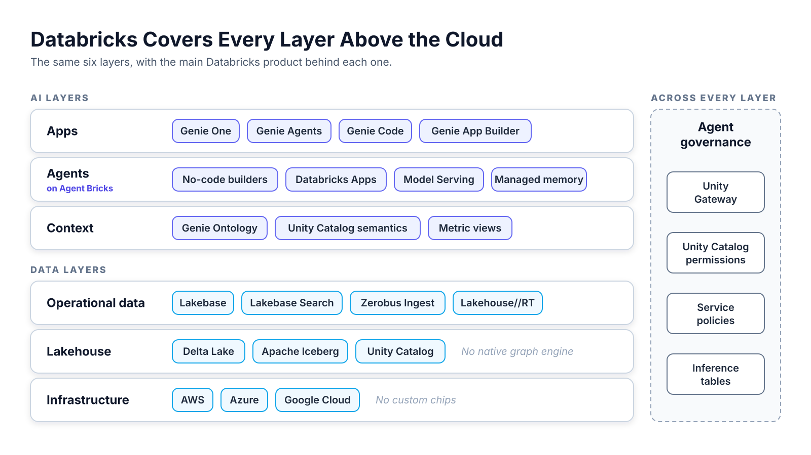
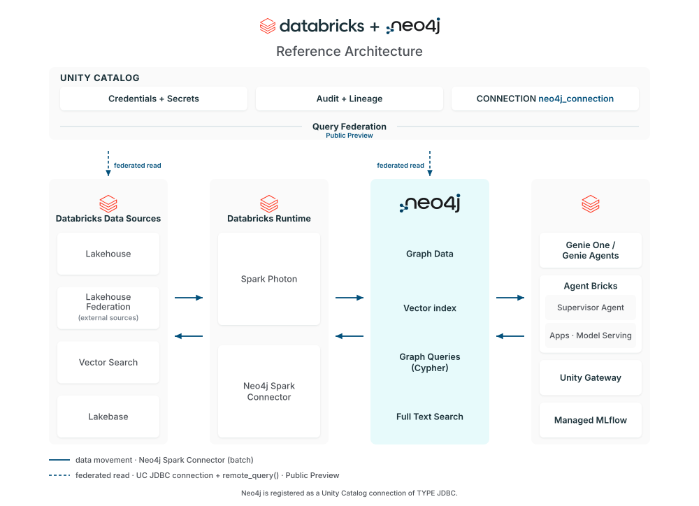
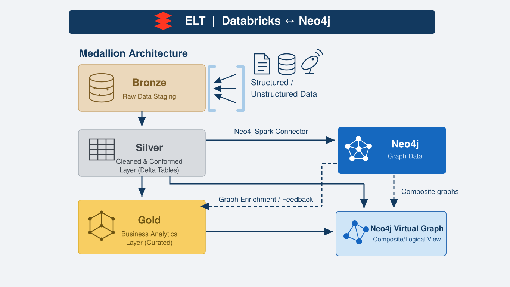
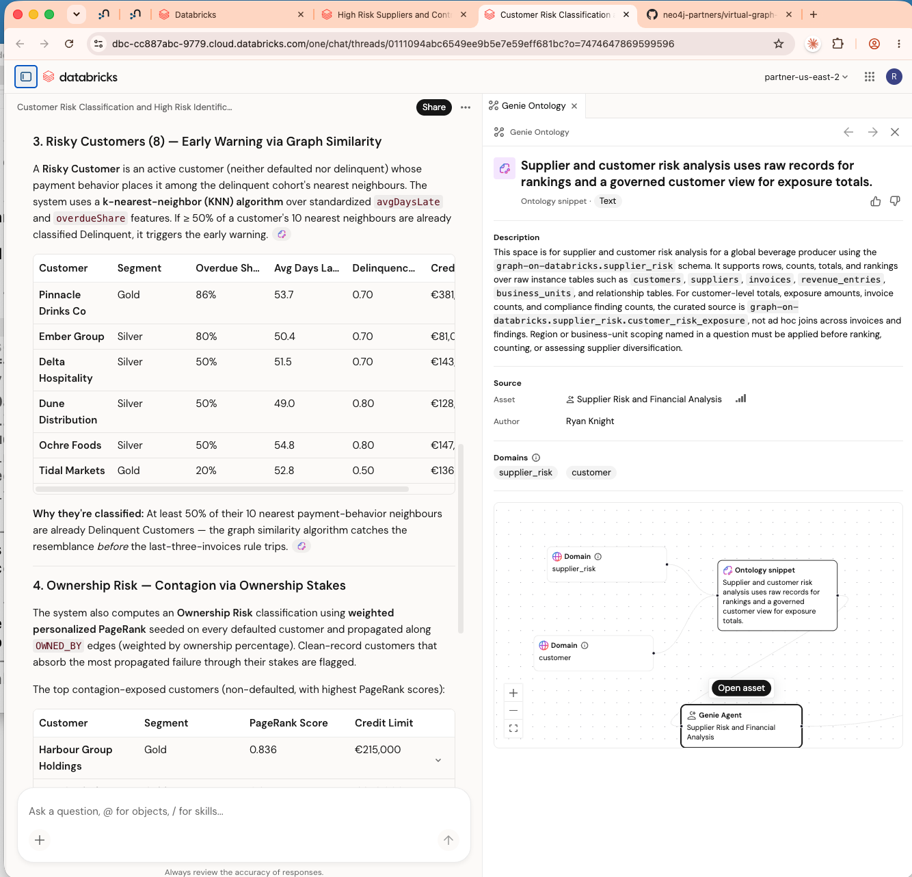
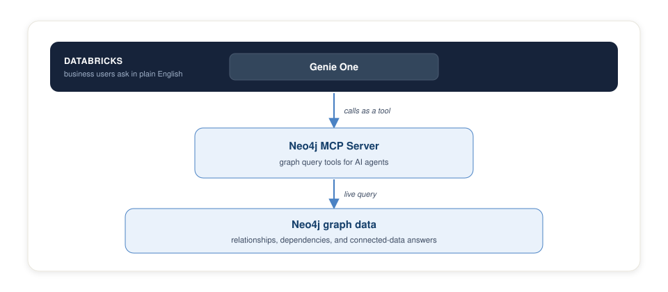

# Databricks Main Services

The main Databricks products behind each layer of the stack.

For a general overview of the hyperscalers, see <a href="https://neo4j-partners.github.io/aws-starter/hyperscaler-overview.html">Cloud Data and AI Stacks</a>.

<!--
A closer look at one vendor. The slides follow the stack from the bottom up:
data first, then context, agents, and apps. The last slides show where Neo4j
plugs in.

Checked on September 29, 2026. Source material: cloud-integration/hyperscaler.md,
cloud-integration/databricks/current/briefing/genie-briefing-draft.md, and
cloud-integration/databricks/current/knowledge-layer/genie-ontology.md.
-->

---

<!--
Databricks has a product on every layer above the cloud.

- Infrastructure: Databricks runs on AWS, Azure, and Google Cloud. It uses
  their chips and builds none of its own.
- Lakehouse: Delta Lake and Apache Iceberg tables sit under Unity Catalog.
  Databricks ships no native graph engine.
- Operational data: Lakebase is serverless Postgres. Zerobus Ingest and
  Lakehouse//RT handle streams.
- Context: Genie Ontology combines Unity Catalog semantics with context Genie
  mines on its own.
- Agents and models: Agent Bricks builds agents. Model Serving and Databricks
  Apps host them.
- Apps: Genie One serves business users. Genie Agents serve one team's domain.
  Genie Code serves data teams. Genie App Builder builds governed apps.

Agent governance runs across every layer. At Databricks it is Unity Gateway,
built on Unity Catalog permissions.

Genie Ontology is in Public Preview. Managed agent memory, service policies,
and Genie App Builder are in Beta.
-->

---

## Databricks Runs One Platform on Three Clouds

- **Three clouds:** Databricks runs the same platform on AWS, Azure, and Google Cloud.
- **No custom chips:** Databricks uses the chips of the cloud it runs on.
- **No frontier model:** Databricks sells no frontier model. Model Serving serves OpenAI and Anthropic models.
- **One bill:** Databricks usage bought through AWS Marketplace counts against the AWS commit.
- **Partners:** Customers can spend up to 10% of Universal Commits on Marketplace partners.

<!--
Databricks is not a hyperscaler in the strict sense. It builds the same stack
on other vendors' clouds, so a customer keeps one data platform across clouds.

Features reach each cloud at different times. Lakebase is GA on AWS and Azure
and in Beta on Google Cloud. Genie App Builder runs on AWS and Azure only.

The 10% partner spend runs through Databricks Marketplace.
-->

---

## Databricks Manages Delta and Iceberg Tables as Equals

- **Two formats:** Unity Catalog manages Delta Lake and Apache Iceberg tables as equals.
- **Default:** Managed tables are the recommended table type for both formats.
- **Open access:** Any Iceberg REST client reads and writes managed Iceberg tables.
- **Foreign tables:** Foreign Iceberg tables are read-only.
- **Converging:** Delta Lake 5.0 adopts the Iceberg v4 metadata tree as its own.

<!--
Managed Iceberg, Iceberg v3, and Foreign Iceberg reached GA in May 2026.

Databricks engineers presented Delta Lake 5.0 at Data + AI Summit 2026. Delta
and Iceberg clients will then read and write one on-disk format with no
translation layer. The merged format has not shipped yet. The Databricks
Iceberg docs, updated September 22, 2026, list Iceberg versions 1 to 3.

Unity Catalog also governs models, agents, and MCP tools. The Unity Gateway
slide covers that part.
-->

---

## Lakebase and Zerobus Run the Day-to-Day Business

- **Systems of record:** Lakebase runs the orders, accounts, and inventory the business changes every second.
- **Less to operate:** Lakebase is serverless Postgres, built on Neon.
- **No rewrite:** Standard Postgres lets existing apps, drivers, and tools connect unchanged.
- **One database:** Lakebase Search adds vector and keyword search to the same database.
- **Current everywhere:** Zerobus Ingest streams each event straight into Delta tables.
- **Real-time analytics:** Lakehouse//RT runs real-time analytics on the lakehouse.

**Transactions and history run on one platform.**

<!--
The lakehouse holds history. Lakebase holds the current state of the business.
Zerobus carries each change as it happens, so reports and alerts don't wait
for a nightly batch.

- Lakebase reached GA on AWS on February 3, 2026, and on Azure on March 2,
  2026. It is in Beta on Google Cloud.
- Lakebase Search reached GA on September 18, 2026.
- Zerobus Ingest reached GA on AWS and Azure on February 23, 2026. It is part
  of Lakeflow Connect.
- Lakehouse//RT entered Beta on June 16, 2026.

Lakebase also stores managed agent sessions and memory.
-->

---

## Databricks Ships No Graph Engine

- **No native engine:** Databricks has no graph database of its own.
- **GraphFrames:** The GraphFrames library runs graph algorithms on Spark in Databricks Runtime ML.
- **Genie Ontology:** Databricks calls it a "living context graph." The docs name no graph store.
- **OntoBricks:** OntoBricks is a Databricks Labs project that builds an ontology-backed graph.
- **Neo4j backend:** OntoBricks can store its graph in Neo4j.

<!--
The hyperscaler comparison counts native graph engines only. AWS has Neptune.
Google has Spanner Graph and BigQuery Graph. Databricks has neither.

OntoBricks is not part of the official Databricks product. It maps Unity
Catalog tables onto an ontology and turns the rows into a queryable graph. It
uses OWL for the ontology, R2RML for the table mappings, and SPARQL run as
Spark SQL. It deploys as a Databricks App.

Each OntoBricks domain picks its own backend: Lakebase, Lakehouse, Neo4j, or
no backend. With Neo4j, OntoBricks stores the RDF triples as a native graph.
-->

---

## Unity Catalog Semantics Defines Each Business Term Once

- **Metric views:** A metric view defines each KPI once as a reusable SQL object.
- **Agent metadata:** Synonyms map a question like "total sales" to the right measure.
- **Domains:** Domains group data assets by business area under governed tags.
- **Pages:** A Page defines a business term with an owner and synonyms.
- **Certification:** Certification marks the assets the organization trusts.
- **Open source:** Metric views are open source in Apache Spark and Unity Catalog OSS.

**One definition of "revenue" serves dashboards, notebooks, Genie, and BI tools.**

<!--
Databricks calls Unity Catalog semantics "the human-modeled layer of the Genie
Ontology."

Metric views reached GA on April 2, 2026. Pages are in Beta. A domain holds
subdomains one level deep, so domains form a two-level hierarchy, not a graph.

Databricks describes metric views as compliant with the Open Semantic
Interchange spec, now Apache Ossie. Power BI and Tableau can query them.
-->

---

## Genie Ontology Grounds Every Genie Answer

- **Two sources:** Teams author context in Unity Catalog semantics. Genie mines the rest.
- **Mined assets:** Genie reads metric views, dashboards, SQL queries, and Genie Agents.
- **OntoRank:** OntoRank scores each snippet by origin, usage, and freshness.
- **Priority:** A Page's definition wins over mined context.
- **Cited answers:** Each answer cites its snippets and follows Unity Catalog permissions.
- **Accuracy:** Genie scored 84.5% on a 28-question test. The best coding agent scored 52.4%.

<!--
Genie Ontology is in Public Preview. It has been on by default since August 6,
2026, and available to all customers since August 13, 2026. Curating snippets
is free for now.

Examples of mined snippets:
- A metric definition: "An 'active user' is a distinct user, deduplicated
  across all platforms."
- A trusted source: "Revenue questions should be answered using the curated
  Finance Genie Agent."
- A business rule: "A 'qualified lead' only counts once a demo is booked."

Databricks describes OntoRank as similar to PageRank. The launch blog lists
five factors: source origin, author authority, usage frequency, ties to
certified assets, and freshness. The docs list three.

The benchmark is Databricks' own. The weakest general-purpose agent scored
25%. Genie ran at about half the latency.
-->

---

## Genie Ontology Is Open on Top and Closed Underneath

| | **Authored layer** | **Mined layer** |
|---|---|---|
| **Holds** | Metric views, domains, Pages, certification | Relationships between concepts, metrics, tables, and teams |
| **Built by** | Data teams and domain owners | Genie, from usage |
| **What it records** | What each term means | How the concepts connect |
| **Visibility** | Governed objects in Unity Catalog | Citations on each answer |
| **Portability** | Metric views are open source | Can't be browsed, queried, or exported |

**A customer can move the vocabulary. The relationships stay in Databricks.**

<!--
The authored layer is flat. A metric view is a calculation over one source
table. A domain is a tag. A Page lists related assets without saying how they
relate. That layer standardizes what "revenue" means. It doesn't record how
revenue relates to the orders, customers, and contracts behind it.

The mined layer does that work, and it is the one part of the stack a
customer can't query or export.

Databricks follows Palantir in using "ontology" to mean a business-object
model rather than a formal OWL ontology. The internals of the mined layer are
not public, so parts of it could be more ontology-like than the docs show.
-->

---

## Genie One Gives Business Users One Place to Ask and Act

- **Questions:** Business users ask in plain English and get governed answers with no SQL.
- **Actions:** Genie One schedules tasks, creates documents, and writes to connected tools.
- **Connections:** Built-in connectors cover Gmail, Microsoft 365, Slack, Jira, and GitHub.
- **Reach:** Users reach Genie One on the web, in Slack and Teams, and on mobile.
- **Security:** Every answer enforces Unity Catalog row and column security.
- **MCP server:** Claude, Claude Code, ChatGPT, and Cursor call Genie One through its MCP server.

<!--
Chat in Genie One reached GA on June 15, 2026. The Slack, Teams, iOS, and
Android apps are in Public Preview. The macOS app and MCP writes are in Beta.
The built-in connectors reached GA on September 10, 2026. The product page
cites over 100 connectors.

Genie One searches Genie Agents first, then dashboards, queries, and metric
views. The docs warn that many Genie Agents in one workspace can reduce
routing accuracy.

The Genie One MCP server reached GA on September 22, 2026. It runs as
system.ai.genie_one_mcp on Unity Gateway and offers five tools. The old Beta
endpoint shuts down on October 31, 2026.

Usage by users is free through January 31, 2027. Usage by service principals
has been billed since September 24, 2026.

Renames: Databricks One became Genie on April 27, 2026, then Genie One on June
9, 2026.
-->

---

## Genie Agents Answer for One Team's Domain

- **Setup:** A domain expert picks up to 50 tables, views, or metric views.
- **Tuning:** The expert adds instructions, example queries, and SQL for business terms.
- **Scope:** Each agent answers only from the data attached to it.
- **Agent mode:** Agent mode runs several queries and returns a report with charts and sources.
- **Routing:** Genie One sends questions to a matching Genie Agent first.
- **Outside data:** Genie Agents reach data outside Databricks only through foreign catalogs.

<!--
Genie Agents were called Genie Spaces until July 9, 2026. The bundle resource
key is still genie_spaces.

The table limit rose from 30 to 50 on September 10, 2026. Agents have
answered only from attached data since September 17, 2026. Agent mode reached
GA on July 2, 2026, and its APIs on August 27, 2026.

Each Genie Agent has its own read-only managed MCP server, in Public Preview.

The launch blog markets MCP writes and scheduled tasks for Genie Agents. The
docs document them for Genie One only.

A foreign catalog needs a source that Databricks accepts for federation. That
rule matters for Neo4j later in the deck.
-->

---

## Genie Code Brings the Same Context to Data Teams

- **Where it runs:** Genie Code runs in notebooks, the SQL editor, pipelines, dashboards, and MLflow.
- **Agent mode:** Genie Code plans a task, runs code, and fixes its own errors.
- **Shared context:** Genie Code searches the same Genie Ontology as Genie One.
- **Builds semantics:** Genie Code drafts Pages and converts Tableau and Power BI files into metric views.
- **Extensions:** Teams add skills, instructions, memory, and MCP servers.

<!--
Genie Code was called Databricks Assistant until March 2026. It asks for
approval before it uses tools. It works under each user's own Unity Catalog
permissions.

The /importBI command does the BI file conversion.

Each user gets 150 free DBUs per month. Usage above that gets a 25% discount
through January 31, 2027. The Genie One free period does not cover Genie
Code.

Genie Code works only inside Databricks.
-->

---

## Agent Bricks Builds Agents on Company Data

- **Knowledge Assistant:** Knowledge Assistant answers questions over company documents, with citations.
- **Supervisor Agent:** Supervisor Agent routes each part of a question to the right subagent.
- **Subagents:** Subagents can be Genie Agents, agent endpoints, Unity Catalog functions, or MCP servers.
- **Feedback:** Subject matter experts improve quality with plain-language feedback.
- **Endpoints:** Each agent becomes an endpoint that apps and other agents call.
- **Access:** End users reach only the subagents and data they already have rights to.

<!--
Supervisor Agent, Knowledge Assistant, Document Intelligence, and Custom
Agents on Apps reached GA on April 14, 2026.

Supervisor Agent combines the subagent results into one answer. It can also
call custom agents.
-->

---

## Three Places to Run an Agent on Databricks

| | **Agent Bricks** | **Databricks Apps** | **Model Serving** |
|---|---|---|---|
| **Approach** | Low code, tuned with feedback | Your own Python or Node.js | Deploy models and agents |
| **Best for** | Document answers and routing | New custom agents and chat apps | Models and agents behind an API |
| **Runs as** | An endpoint | A serverless app | A serverless CPU or GPU endpoint |
| **Governance** | User's own permissions | App identity or the signed-in user | Permissions, rate limits, lineage |

<!--
Databricks recommends Databricks Apps for new custom agents. Each agent
template on Apps includes a chat interface and MLflow tracing. Apps also host
custom MCP servers.

Model Serving endpoints scale to zero when idle. Customers pay per token or
buy provisioned throughput.

Managed agent sessions and managed agent memory are backed by Lakebase.
Managed memory is in Beta. MLflow 3 evaluates agents.

Genie App Builder is in Beta on AWS and Azure. It builds a governed app that
runs on Databricks Apps.
-->

---

## Unity Gateway Governs Models, Agents, and Tool Calls

- **One permission model:** Models, agents, and MCP services register as Unity Catalog securables.
- **Traffic:** Rate limits, traffic splits, fallbacks, and budgets control each route.
- **Guardrails:** Service policies apply guardrails to AI traffic.
- **Audit:** Inference tables record every interaction for audit and tuning.
- **Outside tools:** An MCP server outside Databricks registers as a governed MCP Service.

**One governance layer covers the data, the models, and the traffic between them.**

<!--
Unity Gateway reached GA on August 4, 2026. The launch blog called it Unity AI
Gateway. Current docs call it Unity Gateway.
Service policies and agent services are in Beta.

The Genie One MCP server runs on Unity Gateway. Managed MCP servers are in
Public Preview.
-->

---

## Genie ZeroOps Fixes Failed Jobs in the Background

- **Scope:** Genie ZeroOps covers jobs, pipelines, tables, and ML workloads.
- **Root cause:** It traces a failure through Unity Catalog lineage, error logs, and data quality metrics.
- **Fix:** It tests a fix in a sandbox.
- **Human approval:** A person applies the fix.
- **Status:** Databricks announced Genie ZeroOps on June 16, 2026, for private preview.

<!--
Genie ZeroOps is Databricks' counterpart to AWS DevOps Agent.

Both agents need a map of how things connect. DevOps Agent builds an
application topology. ZeroOps reads Unity Catalog lineage. Lineage is a map
of how tables, jobs, and pipelines connect, which is what a graph stores.
That point is our inference from the vendor pages.
-->

---

## Neo4j Connects to Databricks Four Ways

| **Connector** | **What it does** | **Status** |
|---|---|---|
| **Spark Connector** | Moves data between Databricks tables and Neo4j, both ways | Available |
| **MCP Server** | Gives Genie One and other agents tools to query the graph | Available |
| **Virtual Graph** | Queries Databricks tables as a graph without copying them | Public Preview |
| **Unity Catalog Connector** | Queries Neo4j live with SQL, governed by Unity Catalog | Built, pending Databricks approval |

<!--
The Unity Catalog Connector works in federated queries today. It can't be a
foreign catalog for Genie Agents or Genie Ontology until Databricks accepts
Neo4j as an official federation source. The timing is open.

The Neo4j MCP Server also runs as a Databricks App, so other Databricks agents
can call the graph as a tool.
-->

---

<!--
The diagram shows two ways the platforms connect.

- Solid arrows: The Spark Connector moves lakehouse data into Neo4j to build
  the graph. It then writes graph results back to lakehouse tables.
- Dashed arrows: Databricks users run federated SQL against the graph in
  Neo4j without copying it. Unity Catalog manages credentials and audit.
- Right side: Genie, Agent Bricks, and Model Serving use the enriched tables
  and the graph.
-->

---

<!--
The medallion architecture organizes lakehouse data in three layers. Bronze
holds raw data, Silver holds cleaned tables, and Gold holds curated business
tables.

- Silver to Neo4j: The Spark Connector loads cleaned Silver tables into Neo4j
  to build the graph.
- Neo4j to Gold: Neo4j writes graph results, such as hidden supplier
  dependencies, back to Gold tables. Genie Agents answer from those tables.
- Virtual Graph: Virtual Graph queries Silver and Gold tables as a graph
  without copying them. It combines them with the graph data in Neo4j.
-->

---

## Graph Results Reach Business Users in Genie One

- **Enrich:** Neo4j ran graph similarity over customer payment behavior.
- **Write back:** Neo4j wrote the results to lakehouse tables.
- **Answer:** Genie One flagged 8 customers before the standard invoice rule tripped.
- **Context:** Genie Ontology recorded the business definition and cited it.

<!--
A business user asked Genie One to classify customer risk. This works today.

- A Genie Agent named Supplier Risk and Financial Analysis is built on the
  enriched customer and supplier tables.
- Each of the 8 customers has at least half of its 10 closest payment peers
  already delinquent. The graph catches the resemblance before the
  last-three-invoices rule trips.
- A second finding ranks customers exposed to defaults through ownership
  stakes.
- Domains classified the data into the supplier_risk and customer areas.
  Databricks then auto-created an ontology snippet that names the governed
  table holding exposure totals.

The Neo4j MCP Server was also added to Genie One. It is not shown here.
-->

---

<!--
Genie One calls the Neo4j MCP Server as a tool and queries the graph live. The
batch path writes graph results into tables. This path reads the graph at
question time.
-->

---

## Neo4j Reaches Each Databricks Agent Surface

- **Genie One:** Genie One queries the graph live through the Neo4j MCP Server.
- **Genie Agents:** Genie Agents answer multi-hop questions from graph-enriched tables.
- **Agent Bricks:** Supervisor Agent sends relationship questions to the Neo4j MCP Server.
- **Apps and Model Serving:** Custom agents use the Neo4j libraries and the MCP Server.
- **Unity Gateway:** Unity Gateway monitors calls to the Neo4j MCP Server like any other tool.
- **Open relationships:** The business owns its relationship model and queries it with Cypher.

<!--
The Genie Agents pattern has resonated well with Databricks.

The last bullet answers the openness gap in Genie Ontology. The mined
relationship layer can't be queried or exported. A Neo4j graph can be queried
with Cypher and moved across platforms.

Once Databricks accepts the Unity Catalog Connector, Neo4j connects to Genie
Ontology and Genie Agents directly as a foreign catalog.

Open items:
- Timing for Databricks to accept Neo4j as an official federation source.
- Neo4j Agent Memory with Genie One is untested. It would connect through the
  Agent Memory MCP server.
-->
