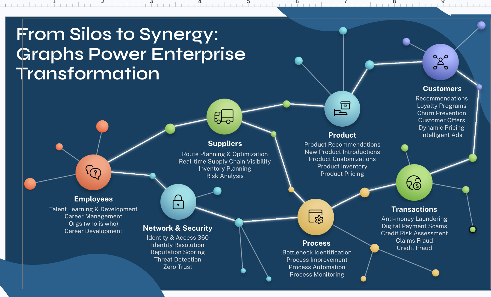
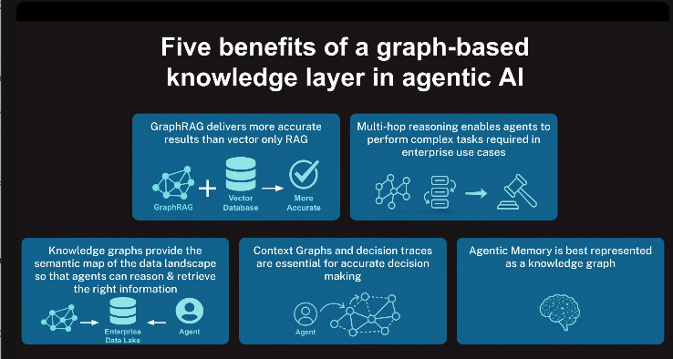

# Teaching Genie to See Connections

Graph Intelligence for the Databricks Lakehouse

<!--
One-line argument: financial crime is a network problem, the row
is the wrong unit of analysis, and we close that gap by running
Neo4j GDS as a silver-to-gold enrichment stage in front of
Databricks Genie. Framing throughout: expansion, not limitation
recovery.
-->

---

<!--
Graph databases model the data in a wide variety of industries as
digital twins. Employees, suppliers, products, customers,
transactions, processes, security: anywhere entities connect, a
graph captures the structure directly. This talk takes one of these,
financial crime in transactions, as a worked example.
-->

---

<!--
The graph makes it easy to find hidden patterns. Three kinds of
question: what's important (centrality), what's unusual (community
and shared identifiers), and what's next (similarity). Hold these
three; they come back later as the GDS columns that enrich Genie.
-->

---

# Worked Example: Finding Fraud with Genie + Graph

<!--
To show how graph improves Genie's responses with better context,
let's look at a motivating example. We'll start with the kind of
fraud question an analyst asks today, see where Genie lands without
graph columns, then bring in graph enrichment and ask the same
question again. The gap between the two answers is the whole point.
-->

---

## Financial Crime Hides Between the Rows

- **Coordinated fraud** spreads activity across dozens of accounts on purpose
- **Each transaction looks clean in isolation**
- **The fraud is hidden in the patterns across the accounts**
- **Row-level aggregation cannot produce a property that lives in the connections**

<!--
Money laundering rings, mule networks, and coordinated schemes
deliberately split activity across accounts to evade per-account
detection. The pattern is network-level; no GROUP BY recovers it.
This sets up the anchor reveal on the next slide.
-->

---

## Demo Data Set: Synthetic Banking Network

- **Purchases:** accounts spend at merchants
- **Transfers:** accounts send money directly to other accounts
- **Fraud rings** leave structural footprints in both
- The goal: surface those patterns, not score individual transactions

<!--
The dataset contains two overlapping networks. The first is a
bipartite account-merchant graph: accounts spend at merchants.
The second is a peer-to-peer transfer network: accounts send money
directly to other accounts. Fraud rings leave footprints in both:
tight clusters of accounts trading with each other and routing
through the same merchants. The goal is not to label fraud; it is
to make the structural patterns visible so analysts can investigate.
-->

---

## Genie: Merchant Favorites (Before Graph Enrichment)

*"Which merchants are most commonly transacted with by the top 10% of accounts by total dollar amount spent across merchants?"*

| Merchant | Transactions |
|---|---|
| MarketPlus | 30 |
| BeanStreet | 28 |
| GroceryHub | 27 |
| QuickCash | 26 |
| FuelZone | 26 |

**Top five tied at 26-30. No merchant stands out for investigation.**

<!--
Best proxy available without graph columns: biggest spenders,
their top merchants. Genie segments accounts into deciles by
transaction volume, counts transactions in the top decile.

Five merchants tied at 26 to 30. All look like ordinary commercial
activity. From this list there's no basis to pick one merchant
over another for investigation. The volume proxy consumed the answer.
-->

---

## Genie: Merchant Favorites (After Graph Enrichment)

*"Which merchants are most commonly transacted with by accounts in ring-candidate communities?"*

| Merchant | Top 10% (volume) | Ring members (after) |
|---|---|---|
| MarketPlus | 30 | **111** |
| QuickCash | 26 | **104** |
| CoinVault | not ranked | **101** |
| LoanEdge | not ranked | **99** |

**5% of accounts. 4× the transactions. Per account: 7×.**

**Volume proxy: where everyone goes. Ring filter: where ring candidates concentrate.**

<!--
Same question shape, different filter: community_id and
is_ring_candidate are now columns in Gold. The SQL collapses to
a single filter and count.

Two things change. MarketPlus and QuickCash were in the before
ranking at 30 and 26. From ring members alone: 111 and 104.
Half the cohort size, four times the raw count, seven times the
per-account rate. Second, CoinVault and LoanEdge never appeared
in the before ranking. The volume proxy couldn't surface them;
community membership can.

Hold on this slide until someone asks "how did you get that?"
That question is the invitation into the next section.
If nobody asks, offer it.
-->

---

# Better Data for Better Genie Answers

---

## What Graph Analysis Adds to Genie

One of the core values of a graph database is **graph analysis** (GDS):

- **Centrality:** how central an account is in the flow of money. A network position.
- **Community:** which accounts cluster tightly together. A density across many edges.
- **Similarity:** which accounts route through the same counterparties. A neighborhood property.

**Each becomes a column Genie can group by, filter on, and compare across.**

<!--
Positive-framed opening for the section. Lead with the unlock: graph
analysis is a core capability of the graph database, and it produces
three kinds of answers that don't exist as row-level properties.
Each of the three maps to a GDS algorithm named on the next pipeline
slide: PageRank, Louvain, Node Similarity. Every one of them lands as
a Delta column alongside region, product, and balance.

These three are the callback to the opening "what is graph" image:
what's important (centrality), what's unusual (community), what's
next (similarity).

Do not frame this as "SQL can't do X." Frame it as "graph analysis
unlocks these answers for Genie." Expansion, not limitation recovery.
-->

---

## The Graph Finds Candidates. The Analyst Finds Fraud.

- **GDS produces structural signals that indicate ring-like behavior:** community membership, centrality, similarity
- **A high-risk community is a candidate, not a verdict**
- **The analyst runs ordinary Genie queries against the enriched Gold tables** to decide which accounts and merchants warrant investigator time

<!--
The signals from the previous slide indicate ring-like behavior;
they do not declare it. The pipeline makes no judgment call. It
surfaces shapes that resemble rings and lets analysts do the fraud
work with the tools they already use. The "after" questions in this
demo cover merchant concentration, regional review workload, and
book share by community. That is the workflow.
-->

---

## The Enrichment Pipeline

Four steps convert a network of account relationships into plain columns that Genie queries like any other dimension.

- **Load:** Silver tables into Neo4j Aura as a property graph
- **Run GDS:** PageRank, Louvain, Node Similarity against the graph
- **Enrich:** pull scores via Neo4j Spark Connector, join with Silver, write to Gold
- **Query:** enriched columns sit alongside all base data in the Gold table

<!--
This is how the structural signals become columns. Four steps.
Structural analysis runs once per pipeline cycle; every downstream
consumer reads the results as columns. The graph analysis is
invisible to the query layer. The architecture diagram on the next
slide shows the pull direction.
-->

---

<!--
The pull direction matters. Neo4j does not write to Unity Catalog
directly; Databricks pulls from Neo4j via the Spark Connector in
nb04, joins with Silver tables such as accounts and account_labels,
and materializes the Gold tables. Nothing in the graph reaches
production queries except what the pipeline has already
materialized to Gold.

Two Gold tables support the Genie AFTER demo: gold_accounts holds
account metadata plus three GDS features, and
gold_account_similarity_pairs holds similarity edge pairs.
-->

---

## Graph Columns Change What Genie Finds

- **Graph results enrich the Gold tables:** `risk_score`, `community_id`, `similarity_score`, `fraud_risk_tier`
- **Genie treats them like any other dimension:** `GROUP BY fraud_risk_tier`, `WHERE is_ring_candidate = true`
- **New questions available:** candidate-population sizing, regional review workload, merchant concentration by community
- **Change the columns. Change what Genie finds.**

<!--
The pivot that ties the graph discussion back to Genie. Same Genie,
same SQL, new dimensions. The analyst works the way they always
have; the toolkit is strictly larger.

This is the slide that completes the answer to "how did you get
that?" Graph analysis produces the answers, the pipeline writes them
as Delta columns, Genie queries them like any other column.
-->

---

## Where This Pattern Applies

- **Fraud-ring surfacing:** tight-community trading, shared merchant preferences outside the background distribution
- **Entity resolution:** collapsing customer, device, and household records by shared attributes and topology
- **Supplier-network risk:** supplier exposure tiers, single points of failure, multi-tier supply concentrations
- **Recommendation structure:** user and product communities with shared consumption patterns as features
- **Compliance network review:** counterparty clusters and beneficial-ownership paths requiring regulatory review

<!--
Generalize the pattern. Anywhere the answer lives in
relationships rather than individual rows, GDS-as-silver-to-gold
applies. The algorithm changes; the architecture does not.
-->

---

## Key Takeaways

- **One question, two answers:** the gap is the whole argument
- **Graph for connection questions, lakehouse for everything Genie already does well**
- **GDS columns land in Gold as ordinary dimensions:** the analyst's toolkit gets bigger, not different

<!--
Three points aligned to the three-part structure: the anchor, the
architecture, the payoff. Close on expansion framing.
-->

---

<!--
This is just one of many examples of how Neo4j works with GenAI.
GraphRAG, multi-hop reasoning, a semantic knowledge layer, decision
traces, and agent memory: the enrichment pattern we just walked
through is one entry point into a broader set of graph-plus-AI
capabilities.
-->

---

## Fill-in / Q&A

The following slides apply when running the demo live or fielding detailed questions about how Genie behaves under the hood.

---

<!--
Backup: the Silver data model. Show if the audience wants to see
the underlying tables before enrichment. Two overlapping networks,
accounts-to-merchants and account-to-account transfers.
-->

---

## Graph Databases Find Every Instance of a Pattern

- **Describe a pattern:** cluster of accounts, shared counterparties, any network shape
- **Get every instance back:** no starting account, no ID to look up
- **Pattern-matching is the graph's native operation**

<!--
Backup: one slide on why a graph database is the right tool to
produce those three kinds of answers. Lead with capability, not
contrast. Describe the pattern, get every instance back.

If asked in Q&A, the point comparison is: SQL needs a starting
account ID; a graph database needs only the shape.
-->

---

## The Analyst's Toolkit, Expanded

- **`community_id` and `fraud_risk_tier`** sit alongside region, product, and balance as ordinary dimensions
- **New questions available:** candidate-population sizing, regional review workload, merchant concentration by community
- **`GROUP BY fraud_risk_tier`,** not "find the ring"

**Same Genie. More answers.**

<!--
Backup: expansion, not limitation recovery. The analyst works in
Genie the same way they always have; the difference is that graph-
derived columns are now available as ordinary dimensions.
-->

---

## Genie in Action on the Existing Catalog

- **Q1:** "Top 10 accounts by total spend": standard aggregation over `transactions`; clean ranked list
- **Q2:** "Above-average spend, 20%+ transactions at night": join and conditional aggregate; correct top-15
- **Standard SQL shapes:** all dimensions in the base tables
- **Genie doing its designed job** before enrichment changes anything

<!--
Use this slide if the audience wants to see Genie on the raw
catalog first. It establishes that Genie is a capable BI
translator before any enrichment happens.
-->

---

## Deterministic Foundation, Non-Deterministic Translation

- **Genie generates different SQL each run.** Same question, different shape: `RANK()=1` one time, `LIMIT 100` the next. That is how text-to-SQL works
- **GDS columns are fixed.** Same projection, same scores, every time. The signal does not move
- **The combination is reliable:** SQL variance only changes how much signal Genie surfaces, never whether it exists

<!--
The architectural claim that answers "can we trust Genie?" You
do not need a deterministic LLM. You need a deterministic column
inventory underneath a non-deterministic translation layer.
-->

---

## Defensibility

- **GDS produces features with published mathematical definitions:** PageRank, Louvain, Jaccard
- **Humans and downstream models adjudicate, not the pipeline**
- **The pipeline surfaces candidates; it does not label fraud**

<!--
Defensible framing for regulated environments. GDS outputs are
reproducible under a fixed projection; whatever reads the columns
adjudicates: investigator triage, supervised classifier, analyst
in Genie.
-->

---

## Backup Anchor: Ring Share by Region (Before)

*"What share of accounts send more than half their transfer volume to five or fewer repeat counterparties, broken out by region?"*

- **Genie's SQL:** per account, rank counterparties by transfer volume; flag accounts sending over half their volume to their top 5
- **Share of accounts flagged:** 95.5% to 96.3% across all six regions
- **Top:** US-East with 96.3% of accounts flagged; **Bottom:** EU-West with 95.5%

**A reasonable ranking: every region looks alike, with no minority to triage.**

<!--
Backup anchor if Merchant Favorites doesn't land. Same shape as
the primary: the fraud-hunting question the analyst asks without
graph columns.

With no community_id available, the best proxy for "coordinated
activity" is counterparty concentration: accounts that send most
of their volume to a handful of partners. Genie writes the query
against account_links: per account, rank counterparties by volume,
keep the ones sending over half their volume to their top five.
Group by region.

Answer: 95 to 96 percent across every region. The ranking flagged
almost the entire book. No regional minority, no cohort to pull
for triage. The question consumed the answer.
-->

---

## Backup Anchor: Ring Share by Region (After)

*"What share of accounts sits in communities flagged as ring candidates, broken out by region?"*

- **What changed:** BEFORE flagged counterparty concentration by transfer volume; AFTER filters to accounts whose community is flagged is_ring_candidate
- **Share of accounts in ring communities:** 4.69% to 5.51% across all six regions
- **Top:** US-West with 5.51% of accounts in ring communities; **Bottom:** APAC with 4.69%

**Structurally defined minority, roughly a tenth the size of the proxy minority.**

<!--
is_ring_candidate is a column in Gold, so the query collapses: one
left join, average by region. No CTEs, no counterparty ranking.

The answer: four and a half to five and a half percent per region.
Roughly a tenth the size of the proxy minority. US-West highest,
APAC lowest. The structural minority the volume-proxy could not
see, because concentration does not imply coordination.

Most accounts concentrate on a handful of counterparties for
legitimate reasons: payroll, family transfers, regular suppliers.
Ring candidates are accounts that concentrate AND trade densely
with each other. Only the graph makes that distinction, and once
it's a column, Genie can triage on it like any other dimension.
-->

---

## Validation: Merchant Ring-Candidate Share (Before)

*"Which merchants are most commonly visited by the top 20 accounts by total transaction volume?"*

- **Genie's SQL:** rank accounts by total volume, count merchant visits in the top 20
- **243 merchants returned:** no merchant visited by more than 2 of the 20 accounts
- **Top merchant:** Barnes-Harris (retail) with 2 visits; the remaining 242 merchants with 1 visit each
- **Shape:** the cohort is completely dispersed, with no shared merchants and no visible concentration

**A dispersed list: no merchant stands out as a triage priority.**

<!--
This is the before answer for the merchant ring-candidate
validation pair. The question is sharper than the primary anchor
because it uses the top 20 accounts rather than the top decile,
which makes the result more striking: across 20 of the highest-volume
accounts, no two accounts visit more than one shared merchant.
243 distinct merchants, maximum co-visit count of 2. The volume
proxy produces a flat, dispersed list that looks like ordinary
diverse spending.
-->

---

## Validation: Merchant Ring-Candidate Share (After)

*"For James-Conway, Cardenas and Sons, Johnson, Williams and May, and Meyer Ltd, what share of each merchant's customers are members of ring-candidate communities, and how does that compare to the book baseline?"*

- **What changed:** BEFORE ranked by volume; AFTER measures ring-candidate share of each merchant's customer base against the ~4% book baseline
- **James-Conway (crypto):** 76.2% ring-candidate share, ~19× above the ~4% baseline
- **Cardenas and Sons (utilities):** ~4%, at baseline
- **Johnson, Williams and May (grocery):** ~4%, at baseline
- **Meyer Ltd (retail):** ~4%, at baseline

**Three of four are at baseline. James-Conway is the one outlier worth investigating.**

<!--
The after answer validates which of the four merchants carry actual
structural signal. The SQL joins gold_accounts and
gold_fraud_ring_communities on fraud_risk_tier and is_ring_candidate.
Two columns that don't exist in Silver.

Three merchants are noise: utilities, grocery, and retail all sit at
the ~4% book baseline. The crypto merchant is the signal: 64 of 84
customers in ring-candidate communities against a ~4% book rate — 19×
above baseline. Not a verdict, a triage priority. The before answer
could not distinguish James-Conway from the others; the after answer can.
-->

---

## Validation: High-Volume Account Community Membership (Before)

*"For the top 20 accounts by total transaction volume, how many unique merchants did each account visit?"*

- **Genie's SQL:** rank accounts by volume, count distinct merchants per account
- **Range:** 7 to 21 unique merchants across the top 20
- **Top volume account:** account 13318 ($18,429) visited 9 merchants; account 11764 ($11,267) visited 21
- **No correlation** between transaction volume and number of merchants visited

**Looks like legitimate diverse spending. No structural red flag visible.**

<!--
The before answer for the account community membership validation
pair. The before question asks how spread out these high-volume
accounts are across merchants. It's the "diverse spending" reading
that was surfaced in the initial analysis. The answer is consistent
with ordinary commercial activity: high volume, spread across many
merchants, no suspicious concentration. Without community membership
in the catalog, this is the best signal available and it's
inconclusive.
-->

---

## Validation: High-Volume Account Community Membership (After)

*"For accounts in the top 20 by total transaction volume, what is their community membership status and risk tier?"*

- **What changed:** BEFORE counted unique merchants; AFTER adds community_id and fraud_risk_tier from Gold
- **19 of 20 accounts:** low risk, concentrated in three communities (16163, 6049, 3040)
- **1 account:** high risk, with account 3404 ($12,996) in community 3040
- **Merchant diversity is confirmed legitimate:** spread across 243 merchants is a community 16163 / 6049 pattern, not a ring pattern

**The before interpretation was correct. High volume and diverse merchants is not a layering signal here.**

<!--
The after answer closes the loop on the before interpretation.
19 of 20 top-volume accounts are low risk and cluster in two
main low-risk communities (16163 and 6049). The one high-risk
account (3404) is an isolated case in community 3040, not part
of a coordinated ring.

This is the validation result the before answer couldn't produce:
not just "these accounts visit many merchants" but "these accounts
are in known low-risk communities, and the diversity is structural,
not a cover." The enrichment confirmed the before reading rather
than overturning it, which is itself a useful demo beat. The
graph doesn't always find fraud; sometimes it confirms the analyst
was already right.
-->
