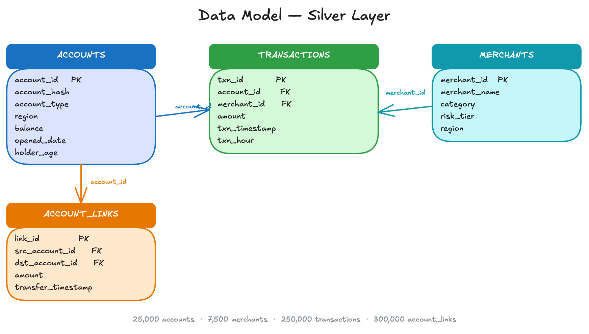

# Graph-Enriched Lakehouse

Combining Databricks Genie with Neo4j Graph Data Science

<!--
One-line argument: financial crime is a network problem, the row
is the wrong unit of analysis, and we close that gap by running
Neo4j GDS as a silver-to-gold enrichment stage in front of
Databricks Genie. Framing throughout: expansion, not limitation
recovery.
-->

---

## Financial Crime Is a Network Problem

- **Criminals organize in networks,** not isolated accounts; rings span dozens of accounts at once
- **Rules fire on individual transactions;** rings operate as connected patterns the row cannot encode
- **Each transaction looks clean.** The connected pattern does not
- **Result:** coordinated schemes evade detection; false-positive rates run into the high double digits

<!--
The last bullet is the payload but say it carefully. "Above 90%"
is a widely-cited figure but sourcing it mid-deck slows the
story. "High double digits across published industry surveys" is
defensible without citation and still makes the point: the
baseline is broken, and it is broken because the unit of
analysis is wrong.
-->

---

## A Fraud Ring Is a Subgraph

- **Finding a ring means finding the shape:** a cluster of accounts moving money densely among themselves
- **The pattern appears anywhere in the network,** without knowing which accounts to start from
- **A fraud ring is a pattern of connections,** not a property of any individual transaction
- **No row-level aggregation can produce a network property**

<!--
A ring is a shape, not a row. You cannot reach it by summing
columns or joining tables. Sets up the next slide, which names
the data structure that can represent and traverse those
connections efficiently.
-->

---

## Demo Data Set: Synthetic Banking Network

- **Two financial networks:** a spending graph and a peer-to-peer transfer graph
- **Spending graph:** accounts transact with merchants
- **Transfer graph:** accounts send money directly to other accounts
- **Fraud rings** leave structural footprints in both
- The goal: surface those patterns, not score individual transactions

<!--
The dataset contains two overlapping networks. The first is a
bipartite account-merchant graph: accounts spend at merchants.
The second is a peer-to-peer transfer network: accounts send money
directly to other accounts. Fraud rings leave footprints in both:
tight clusters of accounts trading with each other and routing
through the same merchants. The goal is not to label fraud; it is
to make the structural patterns visible so analysts can investigate.
-->

---

---

## Genie: Merchant Favorites (Before Graph Enrichment)

*"Which merchants are most commonly transacted with by the top 10% of accounts by total dollar amount spent across merchants?"*

| Merchant | Transactions |
|---|---|
| MarketPlus | 30 |
| BeanStreet | 28 |
| GroceryHub | 27 |
| QuickCash | 26 |
| FuelZone | 26 |

**Top five tied at 26-30. No merchant stands out for investigation.**

<!--
Best proxy available without graph columns: biggest spenders,
their top merchants. Genie ranks accounts by transaction volume
and counts transactions for the top 10%.

Five merchants tied at 26 to 30. All look like ordinary commercial
activity. From this list there's no basis to pick one merchant
over another for investigation. The volume proxy consumed the answer.
-->

---

## Genie: Merchant Favorites (After Graph Enrichment)

*"Which merchants are most commonly transacted with by accounts in ring-candidate communities?"*

| Merchant | Top 10% (before) | Ring members (after) |
|---|---|---|
| MarketPlus | 30 | **111** |
| QuickCash | 26 | **104** |
| CoinVault | not ranked | **101** |
| LoanEdge | not ranked | **99** |

**5% of accounts. 4× the transactions. Per account: 7×.**

**Volume proxy: where everyone goes. Ring filter: where ring candidates concentrate.**

<!--
Same question shape, different filter: community_id and
is_ring_candidate are now columns in Gold. The SQL collapses to
a single filter and count.

Two things change. MarketPlus and QuickCash were in the before
ranking at 30 and 26. From ring members alone: 111 and 104.
Half the cohort size, four times the raw count, seven times the
per-account rate. Second, CoinVault and LoanEdge never appeared
in the before ranking. The volume proxy couldn't surface them;
community membership can.

Hold on this slide until someone asks "how did you get that?"
That question is the invitation into the Architecture section.
If nobody asks, offer it.
-->

---

# Better Data for Better Genie Answers

---

---

## Graph Databases Find Every Instance of a Pattern

- **Describe a pattern:** cluster of accounts, shared counterparties, any network shape
- **Get every instance back:** no starting account, no ID to look up
- **Pattern-matching is the graph's native operation**

<!--
One slide on why a graph database is the right tool to produce
those three kinds of answers. Lead with capability, not contrast.
Describe the pattern, get every instance back. The audience does
not need a SQL-vs-graph mechanics lesson; they need to know the
graph is built for the questions we just listed.

If asked in Q&A, the point comparison is: SQL needs a starting
account ID; a graph database needs only the shape.
-->

---

## What Genie Excels At

- **Text-to-SQL translator** over Delta tables: aggregation, filtering, ranking, cohort comparisons, time-series rollups
- **Handles base Silver tables well:** account balances, transfer volumes, merchant categories, regional activity
- **Genie's capability doesn't change after enrichment.** What changes: the dimensions it can group by and filter on
- **Same Genie, same SQL; the column inventory grows**

<!--
Do not frame this as Genie having limits. The enriched-catalog
demo does not make Genie better; it gives Genie new dimensions
to operate over. Customers evaluating Genie on its merits need
to hear it is working as designed throughout.
-->

---

## Genie in Action on the Existing Catalog

- **Q1:** "Top 10 accounts by total spend": standard aggregation over `transactions`; clean ranked list
- **Q2:** "Above-average spend, 20%+ transactions at night": join and conditional aggregate; correct top-15
- **Standard SQL shapes:** all dimensions in the base tables
- **Genie doing its designed job** before enrichment changes anything

<!--
Two questions from the base catalog, Genie answering what it's
built for. The point is not that Genie has limits; the point is
that Genie is a capable BI translator before any enrichment
happens. That establishes the floor the enriched-catalog slides
build on.
-->

---

## Structural Questions Require a Different Data Layer

- **Structural questions live in network topology,** not in the rows of a table
- **"Which accounts are central in the transfer network?"** Eigenvector centrality is not a column; no SQL can produce it
- **"Which accounts form tightly-interconnected communities?"** Interaction density is not stored; no GROUP BY captures it
- **"Which accounts route through the same merchants?"** Jaccard overlap is not a row attribute; no join recovers it
- **The answer exists in the network.** GDS computes it and writes it to Gold as a plain Delta column

<!--
Frame the gap as a data layer problem, not a query layer
problem. The answer exists — it just has to be computed by GDS
and materialized before any query tool can reach it. This motivates
GDS as the silver-to-gold stage: the network is where those answers
live, and enrichment lands them in the catalog as ordinary columns.
-->

---

## Why a Graph Database

- **SQL needs a starting account:** a specific ID to begin from
- **A graph needs only the pattern's shape:** describe it, get every instance back
- **Pattern-matching is the graph's native operation**
- **Detection comes from queries written against it,** not from the database itself

<!--
The pivot slide. Traditional databases are point-lookup machines;
graph databases are pattern-matching machines. The closing bullet
is the bridge to the rest of the talk: we are not rebuilding the
analytics stack, we are landing graph intelligence in the
lakehouse as enriched Delta columns.
-->

---

## Graph Columns Change What Genie Finds

- **Graph results enrich the Gold tables:** `risk_score`, `community_id`, `similarity_score`, `fraud_risk_tier`
- **Genie treats them like any other dimension:** `GROUP BY fraud_risk_tier`, `WHERE is_ring_candidate = true`
- **New questions available:** candidate-population sizing, regional review workload, merchant concentration by community
- **Change the columns. Change what Genie finds.**

<!--
The pivot that ties the graph discussion back to Genie. Same Genie,
same SQL, new dimensions. The analyst works the way they always
have; the toolkit is strictly larger.

This is the slide that completes the answer to "how did you get
that?" Graph analysis produces the answers, those answers become
Delta columns, Genie queries them like any other column.
-->

---

## What Graph Analysis Adds to Genie

Examples of enrichment:

- **Centrality:** how central an account is in the flow of money. A network position.
- **Community:** which accounts cluster tightly together. A density across many edges.
- **Similarity:** which accounts route through the same counterparties. A neighborhood property.

**Each becomes a column Genie can group by, filter on, and compare across.**

<!--
Positive-framed opening for Architecture. Lead with the unlock:
graph analysis produces three kinds of answers that don't exist
as row-level properties. Each of the three maps to a GDS algorithm
we'll see later: PageRank, Louvain, Node Similarity. Every one of
them lands as a Delta column alongside region, product, and balance.

Do not frame this as "SQL can't do X." Frame it as "graph analysis
unlocks these answers for Genie." Expansion, not limitation recovery.
-->

---

# The Enrichment Pipeline

---

## What Graph Data Science Excels At

- **Operates on the network as a whole,** not on individual rows
- **Output is deterministic given a fixed graph projection:** same projection, same scores, every time
- **Five algorithm families:** centrality, community detection, similarity, pathfinding, node embeddings. This pipeline uses three

<!--
Keep this slide general. The next three slides each cover one
algorithm in detail; this one sets the category and the
reproducibility property. That reproducibility matters when
scores become columns in a catalog that a non-deterministic
translator queries.
-->

---

## PageRank → `risk_score`

- **Eigenvector centrality over the account-to-account transfer graph**
- **Measures structural position, not local counts:** 10 connections to central accounts outranks 50 to peripheral ones
- **Output:** one float per node representing centrality in the transfer network

<!--
This is exactly the quantity that proxies like transfer volume
approximate badly. Ring captains route volume through structure,
so PageRank surfaces them even when their raw throughput looks
normal. 3.65× on the demo is the measured separation.
-->

---

## Louvain → `community_id` / `fraud_risk_tier`

- **Modularity-optimal community partition:** groups accounts by within-community edge density, not attributes
- **Ignores attribute labels:** two merchants in different industries land together if their flows interweave
- **Output:** integer community membership per node; `fraud_risk_tier` is derived, not a direct GDS output

<!--
Louvain partitions by behavior, not by attributes. The 70%
purity number is honest: each ring-candidate community holds
~100 ring members and ~44 non-ring accounts absorbed by the
modularity objective. That is a Louvain tradeoff, not a GDS
failure. Worth naming directly if the audience pushes on
false positives.

Note fraud_risk_tier is a derived column, not a direct GDS
output. Worth calling out so the architecture diagram makes
sense two slides later.
-->

---

## Node Similarity → `similarity_score`

- **Jaccard overlap of shared-merchant sets,** computed over the bipartite account-merchant transaction graph
- **Two accounts that never transacted directly** can score high on similarity if they route through the same merchants
- **Output:** one float per node pair representing structural overlap
- **Degree cutoff:** accounts with fewer than five unique merchant visits are excluded

<!--
The "shared neighborhood" question. Ring members visit anchor
merchants at elevated rates, which produces the Jaccard
separation. The degree cutoff is the honest caveat: accounts
that barely interact get excluded.
-->

---

<!--
The pull direction matters. Neo4j does not write to Unity Catalog
directly; Databricks pulls from Neo4j via the Spark Connector in
nb04, joins with Silver tables such as accounts and account_labels,
and materializes the Gold tables. Nothing in the graph reaches
production queries except what the pipeline has already
materialized to Gold.

Two Gold tables support the Genie AFTER demo: gold_accounts holds
account metadata plus three GDS features, and
gold_account_similarity_pairs holds similarity edge pairs.
-->

---

## The Enrichment Pipeline

- **Load:** Silver tables into Neo4j Aura as a property graph
- **Run GDS:** PageRank, Louvain, Node Similarity against the graph
- **Enrich:** pull scores via Neo4j Spark Connector, join with Silver, write to Gold
- **Query:** enriched columns sit alongside all base data in the Gold table

<!--
Four steps convert a network of account relationships into plain
columns that Genie queries like any other dimension. Structural
analysis runs once per pipeline cycle; every downstream consumer
reads the results as columns. The graph analysis is invisible to
the query layer.
-->

---

## The Graph Finds Candidates. The Analyst Finds Fraud.

- **GDS produces structural signals:** community membership, centrality, similarity
- **A high-risk community is a candidate, not a verdict**
- **The analyst queries enriched Gold tables** to decide which accounts and merchants warrant investigator time

<!--
The pipeline makes no judgment call. It surfaces shapes that
resemble rings and lets analysts do the fraud work with the
tools they already use. The "after" questions in this demo cover
merchant concentration, regional review workload, and book share
by community. That is the workflow.
-->

---

## Five Question Classes Available After Enrichment

1. **Portfolio composition:** share in ring communities, balance split by risk tier, community-size distribution
2. **Cohort comparisons:** balance, age, transaction count, regional mix across tiers
3. **Community rollups:** total balance, regional breakdown, internal-vs-external transfer ratio
4. **Investigator workload:** review queue sizing, regional concentration, exposure rollups
5. **Merchant analysis:** merchants serving ring communities, tier composition of merchant customer bases

<!--
Five question classes the enriched catalog opens up. Each is a
question family an analyst already knows how to ask, conditioned
on a new structural dimension. The SQL shapes are standard; what
is new is the dimension.
-->

---

## One Question from Each Class

- **Composition:** *What share of accounts sits in ring-candidate communities, by region?*
- **Cohort:** *How do balance, age, and transaction count compare between the high-risk and low-risk tiers?*
- **Rollup:** *For each ring-candidate community, what is the ratio of internal transfers to external transfers?*
- **Workload:** *How many accounts need investigator review if the bar is the high-risk tier, and what is the regional breakdown?*
- **Merchant:** *Which merchants are most commonly visited by accounts in ring-candidate communities?*

<!--
Pick three of these for the live portion. Composition and
cohort are the safest plays. Standard BI shapes over a new
dimension, clean bar charts, no interpretation layer. Rollup
and workload play well to ops and audit audiences. Merchant is
the "oh, this opens new investigations" moment.
-->

---

## The Analyst's Toolkit, Expanded

- **`community_id` and `fraud_risk_tier`** sit alongside region, product, and balance as ordinary dimensions
- **New questions available:** candidate-population sizing, regional review workload, merchant concentration by community
- **`GROUP BY fraud_risk_tier`,** not "find the ring"

**Same Genie. More answers.**

<!--
Expansion, not limitation recovery. The analyst works in Genie
the same way they always have; the difference is that graph-
derived columns are now available as ordinary dimensions.
-->

---

## Where This Pattern Applies

- **Fraud-ring surfacing:** tight-community trading, shared merchant preferences outside the background distribution
- **Entity resolution:** collapsing customer, device, and household records by shared attributes and topology
- **Supplier-network risk:** supplier exposure tiers, single points of failure, multi-tier supply concentrations
- **Recommendation structure:** user and product communities with shared consumption patterns as features
- **Compliance network review:** counterparty clusters and beneficial-ownership paths requiring regulatory review

<!--
Generalize the pattern. Anywhere the answer lives in
relationships rather than individual rows, GDS-as-silver-to-gold
applies. The algorithm changes; the architecture does not.
-->

---

## Why This Framing Passes Regulatory Review

- **GDS produces features, not verdicts:** `risk_score` is a float, `community_id` is an integer, `fraud_risk_tier` is a string
- **Each column has a published definition:** PageRank, Louvain, Jaccard; reproducible under a fixed projection
- **Humans adjudicate.** GDS narrows the search space; analyst, investigator, or model makes the call
- **"Three columns with published definitions"** is defensible under Model Risk Management review. *"The graph found the fraud"* is not

<!--
Defensible framing for regulated environments. GDS outputs are
reproducible under a fixed projection; whatever reads the columns
adjudicates: investigator triage, supervised classifier, analyst
in Genie.
-->

---

## Key Takeaways

- **The unit of analysis matters.** Rows cannot represent fraud ring patterns; subgraphs can
- **Column inventory determines the answer.** Without graph columns, any tool reaches for proxies: volume, count, balance
- **GDS as silver-to-gold** writes three deterministic structural columns that Genie reads as ordinary dimensions
- **Deterministic foundation under non-deterministic translation** produces consistent answers without pinning the LLM
- **After enrichment:** composition, cohort, rollup, workload, and merchant questions all become answerable
- **The pattern generalizes** to any workload where the answer lives in relationships

<!--
Six points. Unit of analysis, column inventory, pipeline
shape, determinism claim, what opens up, generality. The
column-inventory bullet is the sharpest: it reframes
the whole discussion around data engineering, not tool choice.
-->

---

## Fill-in / Q&A

The following slides apply when running the demo live or fielding detailed questions about how Genie behaves under the hood.

---

## Deterministic Foundation, Non-Deterministic Translation

- **Genie generates different SQL each run.** Same question, different shape: `RANK()=1` one time, `LIMIT 100` the next. That is how text-to-SQL works
- **GDS columns are fixed.** Same projection, same scores, every time. The signal does not move
- **The combination is reliable:** SQL variance only changes how much signal Genie surfaces, never whether it exists

<!--
The architectural claim that answers "can we trust Genie?" You
do not need a deterministic LLM. You need a deterministic column
inventory underneath a non-deterministic translation layer.
-->

---

## Defensibility

- **GDS produces features with published mathematical definitions:** PageRank, Louvain, Jaccard
- **Humans and downstream models adjudicate, not the pipeline**
- **The pipeline surfaces candidates; it does not label fraud**

<!--
Defensible framing for regulated environments. GDS outputs are
reproducible under a fixed projection; whatever reads the columns
adjudicates: investigator triage, supervised classifier, analyst
in Genie.
-->

---

## Backup Anchor: Ring Share by Region (Before)

*"What share of accounts send more than half their transfer volume to five or fewer repeat counterparties, broken out by region?"*

- **Genie's SQL:** per account, rank counterparties by transfer volume; flag accounts sending over half their volume to their top 5
- **Share of accounts flagged:** 95.5% to 96.3% across all six regions
- **Top:** US-East with 96.3% of accounts flagged; **Bottom:** EU-West with 95.5%

**A reasonable ranking: every region looks alike, with no minority to triage.**

<!--
Backup anchor if Merchant Favorites doesn't land. Same shape as
the primary: the fraud-hunting question the analyst asks without
graph columns.

With no community_id available, the best proxy for "coordinated
activity" is counterparty concentration: accounts that send most
of their volume to a handful of partners. Genie writes the query
against account_links: per account, rank counterparties by volume,
keep the ones sending over half their volume to their top five.
Group by region.

Answer: 95 to 96 percent across every region. The ranking flagged
almost the entire book. No regional minority, no cohort to pull
for triage. The question consumed the answer.
-->

---

## Backup Anchor: Ring Share by Region (After)

*"What share of accounts sits in communities flagged as ring candidates, broken out by region?"*

- **What changed:** BEFORE flagged counterparty concentration by transfer volume; AFTER filters to accounts whose community is flagged is_ring_candidate
- **Share of accounts in ring communities:** 4.69% to 5.51% across all six regions
- **Top:** US-West with 5.51% of accounts in ring communities; **Bottom:** APAC with 4.69%

**Structurally defined minority, roughly a tenth the size of the proxy minority.**

<!--
is_ring_candidate is a column in Gold, so the query collapses: one
left join, average by region. No CTEs, no counterparty ranking.

The answer: four and a half to five and a half percent per region.
Roughly a tenth the size of the proxy minority. US-West highest,
APAC lowest. The structural minority the volume-proxy could not
see, because concentration does not imply coordination.

Most accounts concentrate on a handful of counterparties for
legitimate reasons: payroll, family transfers, regular suppliers.
Ring candidates are accounts that concentrate AND trade densely
with each other. Only the graph makes that distinction, and once
it's a column, Genie can triage on it like any other dimension.
-->

---

## Validation: Merchant Ring-Candidate Share (Before)

*"Which merchants are most commonly visited by the top 20 accounts by total transaction volume?"*

- **Genie's SQL:** rank accounts by volume, count merchant visits in the top 20
- **243 merchants returned:** no merchant visited by more than 2 of the 20 accounts
- **Top merchant:** Barnes-Harris (retail) with 2 visits; the remaining 242 merchants with 1 visit each
- **Shape:** the cohort is completely dispersed, with no shared merchants and no visible concentration

**A dispersed list: no merchant stands out as a triage priority.**

<!--
This is the before answer for the merchant ring-candidate
validation pair. The question asks how spread out these high-volume
accounts are across merchants. The answer is consistent with
ordinary commercial activity: high volume, spread across many
merchants, no suspicious concentration. Without community membership
in the catalog, this is the best signal available and it's
inconclusive.
-->

---

## Validation: Merchant Ring-Candidate Share (After)

*"For James-Conway, Cardenas and Sons, Johnson, Williams and May, and Meyer Ltd, what share of each merchant's customers are members of ring-candidate communities, and how does that compare to the book baseline?"*

- **What changed:** BEFORE ranked by volume; AFTER measures ring-candidate share of each merchant's customer base against the ~4% book baseline
- **James-Conway (crypto):** 76.2% ring-candidate share, ~19× above the ~4% baseline
- **Cardenas and Sons (utilities):** ~4%, at baseline
- **Johnson, Williams and May (grocery):** ~4%, at baseline
- **Meyer Ltd (retail):** ~4%, at baseline

**Three of four are at baseline. James-Conway is the one outlier worth investigating.**

<!--
The after answer validates which of the four merchants carry actual
structural signal. The SQL joins gold_accounts and
gold_fraud_ring_communities on fraud_risk_tier and is_ring_candidate.
Two columns that don't exist in Silver.

Three merchants are noise: utilities, grocery, and retail all sit at
the ~4% book baseline. The crypto merchant is the signal: 64 of 84
customers in ring-candidate communities against a ~4% book rate — 19×
above baseline. Not a verdict, a triage priority. The before answer
could not distinguish James-Conway from the others; the after answer can.
-->

---

## Validation: High-Volume Account Community Membership (Before)

*"For the top 20 accounts by total transaction volume, how many unique merchants did each account visit?"*

- **Genie's SQL:** rank accounts by volume, count distinct merchants per account
- **Range:** 7 to 21 unique merchants across the top 20
- **Top volume account:** account 13318 ($18,429) visited 9 merchants; account 11764 ($11,267) visited 21
- **No correlation** between transaction volume and number of merchants visited

**Looks like legitimate diverse spending. No structural red flag visible.**

<!--
The before answer for the account community membership validation
pair. The before question asks how spread out these high-volume
accounts are across merchants. It's the "diverse spending" reading
that was surfaced in the initial analysis. The answer is consistent
with ordinary commercial activity: high volume, spread across many
merchants, no suspicious concentration. Without community membership
in the catalog, this is the best signal available and it's
inconclusive.
-->

---

## Validation: High-Volume Account Community Membership (After)

*"For accounts in the top 20 by total transaction volume, what is their community membership status and risk tier?"*

- **What changed:** BEFORE counted unique merchants; AFTER adds community_id and fraud_risk_tier from Gold
- **19 of 20 accounts:** low risk, concentrated in three communities (16163, 6049, 3040)
- **1 account:** high risk, with account 3404 ($12,996) in community 3040
- **Merchant diversity is confirmed legitimate:** spread across 243 merchants is a community 16163 / 6049 pattern, not a ring pattern

**The before interpretation was correct. High volume and diverse merchants is not a layering signal here.**

<!--
The after answer closes the loop on the before interpretation.
19 of 20 top-volume accounts are low risk and cluster in two
main low-risk communities (16163 and 6049). The one high-risk
account (3404) is an isolated case in community 3040, not part
of a coordinated ring.

This is the validation result the before answer couldn't produce:
not just "these accounts visit many merchants" but "these accounts
are in known low-risk communities, and the diversity is structural,
not a cover." The enrichment confirmed the before reading rather
than overturning it, which is itself a useful demo beat. The
graph doesn't always find fraud; sometimes it confirms the analyst
was already right.
-->
