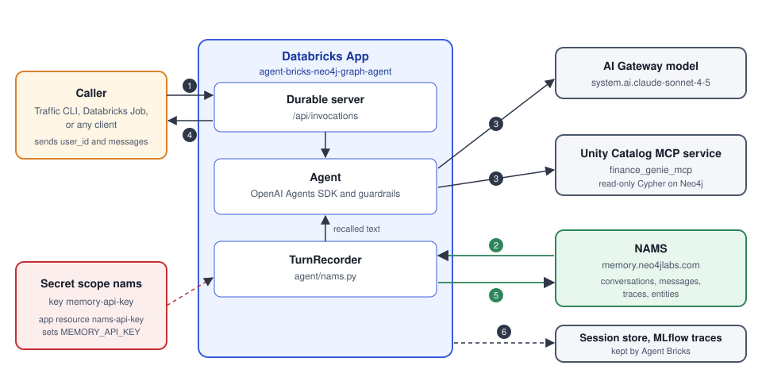
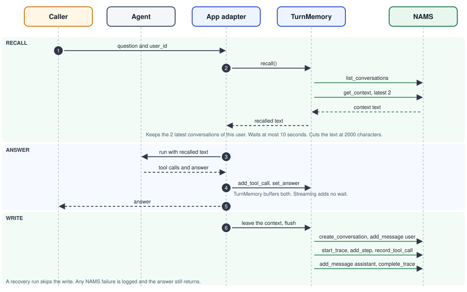

# neo4j-mcp-graph-agent

This is a Databricks App agent that answers questions about the finance-genie fraud graph. It also remembers each analyst's earlier questions in NAMS, the hosted [Neo4j Agent Memory Service](https://memory.neo4jlabs.com/).

## Table of contents

- [How it works](#how-it-works)
- [Prerequisites](#prerequisites)
- [Set up the key](#set-up-the-key)
- [Quick start](#quick-start)
  - [Getting started locally](#getting-started-locally)
  - [Setting up and generating traffic in the cloud](#setting-up-and-generating-traffic-in-the-cloud)
- [Running the ontology example](#running-the-ontology-example)
- [Add NAMS as a Databricks MCP service](#add-nams-as-a-databricks-mcp-service)
- [Generate traffic](#generate-traffic)
- [Architecture](#architecture)
- [How the sample uses NAMS](#how-the-sample-uses-nams)
- [Configuration](#configuration)
- [Evaluate](#evaluate)
- [Delete the agent](#delete-the-agent)
- [Layout](#layout)
- [Notes](#notes)
- [Known issue: Claude 5 models fail to stream](#known-issue-claude-5-models-fail-to-stream)

## How it works

- Analysts ask questions about the fraud graph in plain language.
- The agent reads the graph through a Unity Catalog MCP service, `graph-on-databricks.finance_genie.finance_genie_mcp`. The service fronts Neo4j, and the app calls it with its own service principal.
- The agent has two read-only graph tools, `get_neo4j_schema` and `read_neo4j_cypher`. Guardrails reject write Cypher, cut results at 8000 characters, and stop a run after 20 steps.
- The agent remembers each analyst. After every turn, the app saves the question and the answer to NAMS. Before every turn, it reads the analyst's two latest conversations back.
- Memory is best effort. If the key is missing or NAMS is slow or down, the agent still answers.
- NAMS finds entities such as accounts, communities, and cases in the saved conversations. An optional ontology tells it what to look for.
- The app runs on Agent Bricks. It uses the OpenAI Agents SDK for the agent loop and `DurableAgentServer` for sync, streaming, and background calls with crash recovery.
- Agent Bricks keeps the session history for multi-turn chats and the MLflow traces.
- `agentbricks deploy` creates the app and its stores. It also grants the app service principal `EXECUTE` on the MCP service, plus `USE_SCHEMA` and `USE_CATALOG` on its parents.
- A traffic generator sends fake analyst conversations through the deployed app so NAMS fills with data. It runs from your laptop or as a Databricks Job.
- An evaluation script grades the agent's answers with MLflow scorers.
- You can also add NAMS to Databricks as an MCP service, so other agents such as the Playground can use the same memory tools.

## Prerequisites

- **Tools:** You need Python 3.11 or newer, [uv](https://docs.astral.sh/uv/), [jq](https://jqlang.org/), and the [Databricks CLI](https://docs.databricks.com/aws/en/dev-tools/cli/install).
- **Agent Bricks CLI:** The CLI is in Beta. Install it with `uv tool install databricks-agentbricks`, or run it with `uvx --from databricks-agentbricks agentbricks ...`.
- **Workspace:** The workspace needs Databricks Apps and Unity Catalog AI Gateway.
- **MCP service:** The service `graph-on-databricks.finance_genie.finance_genie_mcp` must exist. It must expose the tools `get_neo4j_schema` and `read_neo4j_cypher`. TODO: link the MCP service creation doc.
- **Grant right:** You must own the MCP service or have `MANAGE` on it. Deploy grants `EXECUTE` on it for the app.
- **NAMS key:** You need a key from https://memory.neo4jlabs.com/.

## Set up the key

The agent reads the NAMS key from the `MEMORY_API_KEY` environment variable. Run these steps from the `neo4j-mcp-graph-agent/` directory.

1. **Create the key:** Make a key at https://memory.neo4jlabs.com/.
2. **Save it locally:** Copy `.env.example` to `.env`, then put the key in `.env` as `MEMORY_API_KEY`. Also set `DATABRICKS_CONFIG_PROFILE` in `.env`.
3. **Save it in Databricks:** Run `./setup_secrets.sh`. The script reads `MEMORY_API_KEY` and `DATABRICKS_CONFIG_PROFILE` from `.env`. It creates the secret scope `nams` if needed and writes the key as `memory-api-key`. Pass `--profile <name>` to use another profile.
4. **Attach it to the app:** After the first `agentbricks deploy`, add an app resource named `nams-api-key`. Use type secret, scope `nams`, key `memory-api-key`, and `CAN_READ`. Add it in the app's Resources settings, or with `databricks apps update`.
5. **Deploy again:** Run `agentbricks deploy neo4j-graph-agent` so the app picks up the key.

The resource stayed attached across later deploys in testing. Check it after each deploy anyway.

## Quick start

Pick one path. The local path runs the agent on your laptop. The cloud path deploys the app and fills NAMS with test conversations.

### Getting started locally

Run the agent on your laptop with memory on. This path uses two terminal windows, because the server keeps running.

1. **Install and sign in:** Install the Agent Bricks CLI, pick your Databricks profile, and log in.

   ```bash
   uv tool install databricks-agentbricks
   databricks auth profiles                      # list your profiles
   export DATABRICKS_CONFIG_PROFILE=<your-profile>
   agentbricks login --profile "$DATABRICKS_CONFIG_PROFILE"
   ```

2. **Check the code:** Run the tests and the CLI check from `neo4j-mcp-graph-agent/`.

   ```bash
   uv sync
   MLFLOW_DISABLE_AGENT_HINT=1 uv run pytest
   agentbricks doctor .
   ```

3. **Get the key:** Create a NAMS key at https://memory.neo4jlabs.com/.
4. **Start the server (window 1):** Put `DATABRICKS_CONFIG_PROFILE` and `MEMORY_API_KEY` in `.env`. Also export `MEMORY_API_KEY` in this shell, because `agentbricks dev` reads it from the shell and stops with an error if it is missing.

   ```bash
   cp .env.example .env     # set DATABRICKS_CONFIG_PROFILE and MEMORY_API_KEY
   export MEMORY_API_KEY=<your-key>
   agentbricks dev          # serves http://localhost:8000
   ```

5. **Ask a question (window 2):** Export `DATABRICKS_CONFIG_PROFILE` in this shell too, then send a request.

   ```bash
   agentbricks endpoint invoke --url http://localhost:8000 --path /api/invocations \
     --json '{"id":"'$(uuidgen)'","session_id":"demo-1","input":[{"role":"user","content":"Which communities look like fraud ring candidates?"}]}'
   ```

6. **See recall:** Send a `user_id` next to `messages`. Then send a second question with a new `session_id` and the same `user_id`. The second answer uses the hub focus from the first question.

   ```bash
   agentbricks endpoint invoke --url http://localhost:8000 --path /api/invocations \
     --json '{"id":"'$(uuidgen)'","session_id":"demo-1","input":{"user_id":"analyst-7","messages":[{"role":"user","content":"I focus on hub accounts. Which accounts act as hubs?"}]}}'
   ```

### Setting up and generating traffic in the cloud

Deploy the app, then send fake analyst traffic through it so NAMS fills with conversations.

1. **Install and sign in:** Install the Agent Bricks CLI, pick your Databricks profile, and log in.

   ```bash
   uv tool install databricks-agentbricks
   databricks auth profiles                      # list your profiles
   export DATABRICKS_CONFIG_PROFILE=<your-profile>
   agentbricks login --profile "$DATABRICKS_CONFIG_PROFILE"
   ```

2. **Save the key in Databricks:** Create a NAMS key at https://memory.neo4jlabs.com/ and put it in `.env` as `MEMORY_API_KEY`, next to `DATABRICKS_CONFIG_PROFILE`. Then run `./setup_secrets.sh`. It creates the secret scope `nams` and writes the key as `memory-api-key`.
3. **Deploy:** App names can have at most 30 characters, and the `agent-bricks-` prefix uses 13, so the deploy name can have at most 17. The last two lines save the app URL in `APP_URL` for the traffic commands.

   ```bash
   agentbricks deploy neo4j-graph-agent
   agentbricks deployments get agent-bricks-neo4j-graph-agent   # URL and status
   export APP_URL=$(databricks apps get agent-bricks-neo4j-graph-agent \
     -p "$DATABRICKS_CONFIG_PROFILE" -o json | jq -r .url)
   echo "$APP_URL"
   ```

4. **Attach the key:** On the first deploy, add an app resource named `nams-api-key` to the new app. Use type secret, scope `nams`, key `memory-api-key`, and `CAN_READ`. Add it in the app's Resources settings, or with `databricks apps update`. Then run `agentbricks deploy neo4j-graph-agent` again.
5. **Test the deployed app:** Use a new `id` for every request. Reuse `session_id` to continue a conversation.

   ```bash
   SESSION_ID=$(uuidgen)
   agentbricks --profile "$DATABRICKS_CONFIG_PROFILE" endpoint invoke agent-bricks-neo4j-graph-agent \
     --path /api/invocations --routing-key "$SESSION_ID" \
     --json '{"id":"'$(uuidgen)'","session_id":"'$SESSION_ID'","input":[{"role":"user","content":"What does the SIMILAR_TO relationship mean?"}]}'
   agentbricks deployments logs agent-bricks-neo4j-graph-agent
   ```

6. **Generate traffic:** Run the traffic CLI from `traffic/`. The setting `--users 6` is the smallest run that shows one community shared by two analysts. The dry run prints the plan and calls nothing. The second command signs in with your profile and sends 24 turns.

   ```bash
   cd traffic
   uv sync
   uv run agent-traffic --dry-run --users 6 --sessions-per-user 2 --turns-per-session 2
   uv run agent-traffic --profile "$DATABRICKS_CONFIG_PROFILE" --app-url "$APP_URL" \
     --users 6 --sessions-per-user 2 --turns-per-session 2
   cd ..
   ```

7. **Check NAMS:** Open your NAMS workspace and look for users named `nams-load-<run-id>-user-NNNN`.

## Running the ontology example

NAMS reads each stored conversation and extracts entities from the text. An ontology tells the extractor what to look for. This section loads the ontology that ships in this repo and then measures what it changes with a before and after run.

You need these before you start:

- **A deployed app:** The app must be deployed with the NAMS key attached, and `DATABRICKS_CONFIG_PROFILE` and `APP_URL` must be set in your shell.
- **NAMS workspaces:** The `MEMORY_API_KEY` selects the NAMS workspace. The before and after run needs empty workspaces, as the steps below explain.
- **Working directory:** Run every command from `neo4j-mcp-graph-agent/`. All three scripts take `MEMORY_API_KEY` from your shell or from `.env`.

### What the ontology is

The ontology has 11 entity types and 15 relationships. The types are Analyst, Team, InvestigationFocus, Account, Customer, Merchant, Community, IdentityCluster, PhoneNumber, Address, and Case.

The ontology is not the fraud graph schema. NAMS extracts entities from the conversation text, so the ontology describes what analysts talk about. Analyst covers managers too, because analysts name the person they report to.

The ontology runs in permissive validation. It guides extraction and does not reject anything.

### The files

- `ontology/finance_genie.ontology.yaml` is the ontology itself.
- `ontology/apply_ontology.py` validates the ontology and loads it into NAMS.
- `ontology/measure_ingestion.py` reads a NAMS workspace and computes quality metrics. It only reads.
- `ontology/replay_transcripts.py` exports the stored conversations from one workspace and writes them unchanged into another.

### Load the ontology

```bash
uv run ontology/apply_ontology.py                      # dry run, no network, validates locally
uv run ontology/apply_ontology.py --create             # load it in permissive mode
uv run ontology/apply_ontology.py --create --activate  # load it and make it the active ontology
uv run ontology/apply_ontology.py --update <ontology id>   # load the YAML as a new revision
uv run ontology/apply_ontology.py --rollback <version id>
```

- **Dry run:** The default run makes no network calls. It prints the types and relationships and checks them locally.
- **`--create`:** This flag loads the ontology with validation mode `permissive`. Afterward the script reads the version back and prints what the service dropped.
- **`--update`:** This flag loads the YAML as a new revision. It never edits an existing version.
- **`--activate`:** This flag makes the version active. Before it activates, the script prints the currently active version id and saves that id to `ontology/previous_active_<UTC timestamp>.json`. If no ontology is active, it records `none`.
- **`--rollback <version id>`:** This flag reactivates an earlier version. Use an id from a `previous_active_*.json` file. There is no way to unbind an ontology, so a rollback to `none` fails.

The hosted API spec does not model `aliases` on entity types, so the service may silently ignore the four Team aliases. The dry run prints a warning, and the read-back after `--create` shows what survived. The Team description also lists the aliases as a fallback. The `description` fields are accepted.

### Run the before and after comparison

Entities in NAMS are not scoped by run, so each snapshot needs its own empty NAMS workspace. A live agent also gives a different answer each time, and extraction is LLM based. If you ran live traffic on both sides, you could not tell the effect of the ontology from the agent's own variation.

So this comparison runs the agent once and replays the stored conversations into each workspace. Then the ontology and the extraction are the only things that change.

1. **Smoke test:** Ask the deployed app one question, "Which community is Account 15940 in?". The answer should name Community 19766. In NAMS, check for one conversation with two messages and one trace, and check that extraction has finished.
2. **Run live once:** Point `MEMORY_API_KEY` at an empty workspace A with the default ontology active. Run the traffic from `traffic/`. The run sends 24 turns. It needs 6 users, because users 1 and 6 investigate the same community, Community 3040, from different teams. That shows one entity shared across analysts.

   ```bash
   cd traffic
   uv sync
   uv run agent-traffic --profile "$DATABRICKS_CONFIG_PROFILE" --app-url "$APP_URL" \
     --users 6 --sessions-per-user 2 --turns-per-session 2
   cd ..
   ```

3. **Save the transcripts:** This reads the 24 conversations and fails if the count is wrong.

   ```bash
   uv run ontology/replay_transcripts.py export --out transcripts.json --expect-turns 24
   ```

4. **Replay into the default side:** Point `MEMORY_API_KEY` at an empty workspace with the default ontology active. Replay the transcripts, then snapshot. Do this in two separate empty workspaces, so you get `before-1.json` and `before-2.json`.

   ```bash
   uv run ontology/replay_transcripts.py replay transcripts.json --execute --wait
   uv run ontology/measure_ingestion.py snapshot --label before-1 --out before-1.json \
     --ontology-yaml ontology/finance_genie.ontology.yaml --expect-turns 24
   ```

5. **Replay into the ontology side:** Point `MEMORY_API_KEY` at another empty workspace. Load the ontology, then replay and snapshot as in step 4. Do this in two workspaces, so you get `after-1.json` and `after-2.json`.

   ```bash
   uv run ontology/apply_ontology.py --create --activate
   uv run ontology/replay_transcripts.py replay transcripts.json --execute --wait
   uv run ontology/measure_ingestion.py snapshot --label after-1 --out after-1.json \
     --ontology-yaml ontology/finance_genie.ontology.yaml --expect-turns 24
   ```

6. **Compare:** The `--users`, `--sessions`, and `--turns` flags give the run size and add the ground-truth rows.

   ```bash
   uv run ontology/measure_ingestion.py compare before-1.json after-1.json \
     --users 6 --sessions 2 --turns 2
   ```

The difference between `before-1` and `before-2`, and between `after-1` and `after-2`, is the noise floor. Treat a change smaller than that as noise.

If you can only use one workspace, reset it between snapshots. The reset path is not confirmed. Check the `ontology_version_id` that each snapshot records, because a reset might keep the active ontology. The second "before" would then use the custom one.

### Other commands

- **`gold`:** `uv run ontology/measure_ingestion.py gold --snapshot after-1.json --users 6 --sessions 2 --turns 2` scores one snapshot on its own.
- **`recompute`:** `uv run ontology/measure_ingestion.py recompute before-1.json --out before-1.new.json` redoes the metrics from the saved entities and relationships, with no network.
- **`--expect-turns`:** This check fails with exit code 3 if a conversation, message, or trace is missing. The app does not fail a turn when a NAMS write fails, so a run can store fewer turns than it sent. A turn where the agent made no tool call has no trace steps, so it also trips the trace check. Use `--allow-incomplete` to override the check.

### What the metrics mean

- **Generic-bucket share:** This is the share of entities typed `Object` or `Concept`. A high share means the extractor had no better type to use.
- **Duplicate surface forms:** These are the same entity written several ways. They are counted by exact type and by pole type, such as person or organization. The custom types Analyst and Customer both count as person.
- **Type conflicts:** These are the same name stored under several types.
- **Noise:** This counts entities that are tool or schema plumbing, such as MCP tool names and words like "schema" or "table".
- **Instance coverage:** This counts the entities for specific instances that reached memory, such as "Community 3040" or "CASE-4001". It covers Account, Community, identity cluster, phone, and case instances.
- **Ontology conformance:** This is the share of entities whose type the ontology declares.
- **Ground truth:** The traffic knows every analyst, manager, team, case, community, account, phone, and merchant it mentions. The `gold` rows show recall and type accuracy. They also show whether the analyst's first name, "D. Reyes" style name, and team abbreviation resolve to one entity. They show whether the relationships MEMBER_OF, REPORTS_TO, OWNS, and INVESTIGATES were stored. Relationships come from `GET /v1/entities/graph`, which is capped at 1000 nodes.
- **Ontology version:** Each snapshot records the active ontology version id. `compare` warns if both snapshots used the same version.

### An earlier baseline for context

An earlier run had no ontology, used older traffic, and ran against an agent with an empty graph. It produced 388 entities, 67.3% generic, 25 type conflicts, 40.2% noise, and 0 instances. This is context and not a comparison, because the traffic and the agent have changed since.

### Caveats

- **Results vary:** Extraction is LLM based, so two replays of the same side differ. The second workspace on each side shows the spread.
- **No proof of cause:** The comparison shows what changed. It does not prove the ontology caused the change.
- **Replay limits:** A replay writes the same message text and trace steps, but with new timestamps. NAMS does not store the trace task or outcome, so they are not replayed.
- **Snapshot contents:** The snapshot and transcript files hold entity names and conversation text from synthetic analysts.

## Add NAMS as a Databricks MCP service

This step is optional. The app in this repo calls NAMS directly through `agent/nams.py`. An MCP service exposes the same NAMS memory tools to other Databricks agents, such as the Playground, as a Unity Catalog object.

You need a NAMS key from https://memory.neo4jlabs.com/ and permission to create services in the target schema.

1. **Open the schema:** In Catalog Explorer, open the catalog and schema that will own the service. This sample uses `graph-on-databricks` and `finance_genie`.
2. **Create a service:** Click **Create**, then **Service**. Choose the MCP option to open the Create MCP Service dialog.
3. **Name it:** Enter a name such as `finance_agent_memory`. The name cannot change after creation.
4. **Create the connection:** Keep **Create new connection** selected and fill in these fields.
   - **Server URL:** Enter `https://memory.neo4jlabs.com/mcp`. NAMS uses Streamable HTTP.
   - **Authentication:** Choose **Bearer token**.
   - **Bearer token:** Paste the NAMS key. Paste the key only, without a `Bearer ` prefix.
5. **Load the tools:** Click **Create & load tools**. Databricks lists the 40 NAMS tools. A 401 error means the key is wrong.
6. **Trim the tools:** Click **Edit tools** on the service page and choose **Select manually**. Deselect every `memory_ontology_*` tool and `memory_create_relation`, which leaves 32 of 40 selected. The tool filter matches the exact start of a name, so type `memory_ontology` and then `memory_create_relation`.
7. **Grant access:** Give each user or service principal that will call the service `USE CONNECTION` on the connection.
8. **Try it:** Click **Try in Playground**, then ask the model to remember a fact and recall it in a new chat.

**Why trim the tools:** The Playground parses every tool schema and fails the whole listing when one schema is a bare `true`. Some NAMS ontology tools and `memory_create_relation` publish such schemas. The error reads `Failed to list tools from UC MCP service` and mentions `InputSchema from Boolean value (true)`. The sample does not use the ontology tools or `memory_create_relation`, so removing them loses nothing.

### Sample questions

Use these in the Playground to check that the NAMS tools work. Run the recall questions in a new chat, because remembering across chats is the point of memory.

**Save a fact**

- "Remember that I'm investigating community 4127 as a fraud ring candidate and that the hub account is A-10482."
- "I prefer results as a table, top 10 only, with risk_score included. Remember that."

**Recall in a new chat**

- "What was I investigating last time?" The answer should name community 4127 and account A-10482 without being told again.
- "What account did I say was the hub?" The answer should be the specific account, not a summary.
- "Show me the top ring candidate communities." The answer should follow the saved table preference.

**Entities**

- "List the accounts and communities I've mentioned so far." NAMS extracts entities from messages on its own servers, so these should come back as entities.

**Corrections**

- "Actually, the hub account is A-20931, not A-10482." Then ask "What's the hub account?" The answer should be the new value, or the agent should point out the conflict.

**Cases that should fail safely**

- "What did I tell you about merchant Contoso?" when you never did. The agent should say it has no memory of that and should not invent one.
- "What did another analyst ask you yesterday?" The agent should refuse or return nothing, because memory belongs to one user.

The Playground has no graph tools, so it cannot answer questions about the fraud graph itself. Ask those of the deployed app.

## Generate traffic

The traffic project fills NAMS with conversations. Fake analysts call the deployed app, and the app writes to NAMS. You can run it from your laptop or as a Databricks Job.

How the generator behaves:

- **Analysts:** The generator uses 12 fixed analyst names. In the first session, each analyst states a name, a team, a manager, a focus, and an owned case. Later sessions do not repeat it. They open with a first name, an "N. Surname" form, or a team alias. An answer that uses the focus or the case shows recall working.
- **Questions:** The questions mix generic graph questions with instance questions. Instance questions use real graph ids, such as accounts, communities, merchants, and phone numbers.
- **Same prompts every run:** The prompt text does not depend on the run id. Only the user, session, and invocation ids carry it. A run before and a run after an ontology change ask identical questions.
- **Shared community:** Cases go to analysts in turn. Users 1 and 6 investigate the same community from different teams, so use `--users 6` or more to get that overlap.
- **Graph ids:** The ids in `traffic/nams_traffic/scenarios.py` come from the seeded graph. Refresh them if the graph is seeded again.
- **Through the app:** Traffic goes through the app, so only the app holds the NAMS key.
- **Safe retries:** Each turn has a fixed invocation id. A retry cannot save a turn twice.
- **Replay:** Running the same `--run-id` again replays the stored invocations. It writes no new conversations.

Both run modes need a deployed app with the NAMS key attached, plus `DATABRICKS_CONFIG_PROFILE` and `APP_URL` in your shell. Skip this block if both variables are already set.

```bash
export DATABRICKS_CONFIG_PROFILE=<your-profile>
export APP_URL=$(databricks apps get agent-bricks-neo4j-graph-agent \
  -p "$DATABRICKS_CONFIG_PROFILE" -o json | jq -r .url)
```

### Run it from your laptop

```bash
cd traffic
uv sync
uv run agent-traffic --dry-run --users 6 --sessions-per-user 2 --turns-per-session 2
uv run agent-traffic --profile "$DATABRICKS_CONFIG_PROFILE" --app-url "$APP_URL" \
  --users 6 --sessions-per-user 2 --turns-per-session 2
```

The dry run prints the plan and calls nothing. The second command signs in with your profile. This run is 24 turns.

| Option | What it sets | Default |
| --- | --- | --- |
| `--users` | The number of analysts | 20 |
| `--sessions-per-user` | The sessions each analyst starts | 3 |
| `--turns-per-session` | The questions in each session | 4 |
| `--concurrency` | The sessions that run at once | 4 |
| `--timeout` | The seconds allowed for one turn | 300 |
| `--retry-attempts` | The tries for each turn | 1 |
| `--continue-after-error` | Keeps going after a failed turn | Off, so the run stops |
| `--run-id` | The name that the users and sessions carry | A random id |

The default run is 240 turns. Each turn takes 20 to 60 seconds, so the full run takes close to an hour.

### Run it as a Databricks Job

The Databricks Apps proxy returns a 401 for the token that a job gets from its own runtime. So the job signs in as a service principal. This setup happens once.

1. **Create the principal and its secret:** The first command saves the principal's id in `SP_ID` and its application id in `SP_CLIENT_ID`. The last command prints the OAuth secret once, so copy it now.

   ```bash
   SP_JSON=$(databricks service-principals create --display-name nams-traffic-runner \
     -p "$DATABRICKS_CONFIG_PROFILE" -o json)
   export SP_ID=$(jq -r .id <<<"$SP_JSON")
   export SP_CLIENT_ID=$(jq -r .applicationId <<<"$SP_JSON")
   databricks service-principal-secrets-proxy create "$SP_ID" -p "$DATABRICKS_CONFIG_PROFILE"
   ```

2. **Store the credentials:** The `client-id` command reads `SP_CLIENT_ID`. The `client-secret` command asks for the OAuth secret.

   ```bash
   databricks secrets create-scope nams-traffic -p "$DATABRICKS_CONFIG_PROFILE"
   databricks secrets put-secret nams-traffic client-id --string-value "$SP_CLIENT_ID" \
     -p "$DATABRICKS_CONFIG_PROFILE"
   databricks secrets put-secret nams-traffic client-secret -p "$DATABRICKS_CONFIG_PROFILE"
   ```

3. **Let the principal call the app:**

   ```bash
   databricks apps update-permissions agent-bricks-neo4j-graph-agent -p "$DATABRICKS_CONFIG_PROFILE" \
     --json '{"access_control_list":[{"service_principal_name":"'"$SP_CLIENT_ID"'","permission_level":"CAN_USE"}]}'
   ```

4. **Deploy the bundle and run the job:** The job runs as you, so you need `READ` on the scope `nams-traffic`.

   ```bash
   cd traffic
   databricks bundle deploy -p "$DATABRICKS_CONFIG_PROFILE" --var app_url="$APP_URL"
   databricks bundle run nams_traffic -p "$DATABRICKS_CONFIG_PROFILE" --var app_url="$APP_URL" \
     --params users=6,sessions_per_user=2,turns_per_session=2
   ```

The job parameters:

| Parameter | What it sets | Default |
| --- | --- | --- |
| `app_url` | The URL of the deployed app. Pass it with `--var`. | None, so it is required |
| `credentials_scope` | The scope that holds the principal's credentials | `nams-traffic` |
| `users`, `sessions_per_user`, `turns_per_session`, `concurrency`, `timeout` | The same settings as the CLI options. Change them with `--params`. | The CLI defaults |

To run the job every hour, set `pause_status: UNPAUSED` in `traffic/databricks.yml` and deploy the bundle again. The schedule is paused by default.

To check a run:

- **Job output:** Open the run URL that `bundle run` prints. The log ends with `done ok=N failed=0`.
- **NAMS:** Open your NAMS workspace and look for users named `nams-load-<run-id>-user-NNNN`. The run id is in the first log line.

If something fails:

- **401 from the app:** The principal lacks `CAN_USE` on the app, or the credentials in the scope are wrong.
- **`no value assigned to required variable app_url`:** Add `--var app_url=...` to the command.
- **No data in NAMS:** Check that the `nams-api-key` resource is still attached to the app.

The app is not part of this bundle. `agentbricks deploy` provisions its runtime store, session store, and MCP grants, and a bundle app resource would conflict with that.

## Architecture

The app answers questions about the fraud graph. It also remembers what each analyst asked before.



How one turn flows:

1. **Request:** A caller sends a question with a `user_id`.
2. **Recall:** The app reads that user's recent conversations from NAMS.
3. **Answer:** The agent asks the model and reads the graph through the MCP service.
4. **Reply:** The app sends the answer back to the caller.
5. **Write:** The app saves the turn to NAMS.
6. **History:** Agent Bricks keeps the session history and the MLflow traces.

The parts:

- **Caller:** The caller is the client that sends questions. It can be the traffic CLI, the Databricks Job, or any other client.
- **Databricks App:** The app is the deployed agent. It runs the Agent Bricks `DurableAgentServer`.
- **Agent:** The agent is the OpenAI Agents SDK loop. Guardrails allow only two read-only graph tools.
- **TurnMemory:** This class in `agent/nams.py` handles one turn, which is one question and its answer. It reads memory before the turn and writes the turn to NAMS after it.
- **AI Gateway model:** This model writes the answer. `app.yaml` pins `claude-sonnet-4-5`.
- **MCP service:** The Unity Catalog service `finance_genie_mcp` runs read-only Cypher on Neo4j.
- **NAMS:** The hosted [Neo4j Agent Memory Service](https://memory.neo4jlabs.com/) stores conversations, messages, traces, and entities.
- **Secret scope `nams`:** This scope holds the NAMS key. The app resource `nams-api-key` hands it to the app as `MEMORY_API_KEY`.

Two files hold the agent logic. `agent/agent.py` builds the agent, loads the MCP server from `agent.toml`, and applies the guardrails. `agent/guardrails.py` defines them. `agent.toml` declares the MCP service as an app-identity tool, a session store for multi-turn history, and the MLflow tracing experiment. The `runtime/` folder serves the agent at `/api/invocations`.

## How the sample uses NAMS

The app uses NAMS as long term memory. It saves every turn and reads recent turns back before it answers. The AWS `fraud-memory-agent` demo only saves. This sample also recalls.



How one turn uses NAMS:

1. **Request:** The caller sends a question and a `user_id`.
2. **Recall:** The app opens a `TurnMemory` for the turn. It lists the user's conversations in NAMS and reads the latest two.
3. **Run:** The app runs the agent with the recalled text in its instructions.
4. **Buffer:** The app hands each tool call and the final answer to `TurnMemory`. It holds them in memory.
5. **Reply:** The app sends the answer to the caller.
6. **Write:** `TurnMemory` saves the turn to NAMS as one conversation with two messages and a reasoning trace.

### What gets saved

- **One conversation per turn:** Each turn is its own conversation in NAMS. Each one carries the `user_id` in its metadata, and recall filters on it.
- **Clean answer:** The stored assistant answer has Cypher code fences and MCP tool names removed. `sanitize_answer` in `agent/nams.py` does this, because NAMS would otherwise extract Cypher and tool names as entities. Plain fences, such as result tables, keep their text. Ids, scores, and counts stay in the text.
- **Trace:** When the agent uses tools, the app saves one reasoning trace. The trace has one step and one tool call for each MCP call. Steps use the bare tool name and a plain sentence, such as "The agent read the graph schema." NAMS keeps the steps and tool calls, but not the trace task or outcome.
- **Entities:** NAMS finds entities in the messages on its own servers, and the app does nothing for this. The system prompt asks the agent to write ids the same way each time, as "Account <id>" and "Community <id>". That keeps the extracted names consistent.

### What gets recalled

- **Recall:** Before the agent runs, the app lists the user's latest conversations and reads the last two.
- **Where recall goes:** The recalled text goes into the agent instructions as background. It stays out of the message input, because Agent Bricks saves input to the session store.
- **User:** Send `user_id` next to `messages`. Without it, the app uses `session_id` as the user, and recall finds only turns from that session.
- **Limits:** Recall waits at most 10 seconds and adds at most 2000 characters.

### When NAMS is not available

- **Best effort:** If the key is missing, or NAMS is slow or down, the agent answers without memory. NAMS never breaks an answer.
- **Retries:** A recovery run reads memory but does not write. A replayed turn is not saved twice.
- **Evaluation:** `agent-evaluate` calls the agent directly. It never writes to NAMS.

### Try it

Start a local server with `agentbricks dev`. Export `MEMORY_API_KEY` in that shell first, because `agentbricks dev` reads the key from your shell and not from `.env`. Then send a question with a `user_id`.

```bash
agentbricks endpoint invoke --url http://localhost:8000 --path /api/invocations \
  --json '{"id":"'$(uuidgen)'","session_id":"demo-1","input":{"user_id":"analyst-7","messages":[{"role":"user","content":"I focus on hub accounts. Which accounts act as hubs?"}]}}'
```

Send a second question with a new `session_id` and the same `user_id`. The answer uses the hub focus from the first question.

## Configuration

| Setting | Where to change it | Default |
| --- | --- | --- |
| NAMS key | `MEMORY_API_KEY` env var, or the `nams-api-key` app resource when deployed | Unset, so memory is off |
| NAMS endpoint and workspace | Optional `MEMORY_ENDPOINT` and `MEMORY_WORKSPACE_ID` env vars | The NAMS defaults |
| MCP service | `agent.toml` `[[tools]]` | `graph-on-databricks.finance_genie.finance_genie_mcp` |
| Model | `LLM_MODEL` env var | Code default `system.ai.claude-sonnet-5-5`. `app.yaml` pins `system.ai.claude-sonnet-4-5`. |
| Judge model | `JUDGE_MODEL` env var | `databricks:/databricks-claude-sonnet-5-5` |
| Session store | `agent.toml` `[session_store]` | `neo4j-mcp-graph-agent-sessions` |
| Tracing experiment | `agent.toml` `[tracing]` | `/Shared/agentbricks_traces/neo4j-mcp-graph-agent` |
| Traffic credentials scope | `credentials_scope` job parameter | `nams-traffic` |

- **Other MCP service:** Edit the `service` value in `agent.toml`, or run `agentbricks tools add mcp <service> --auth app`. Then deploy again.
- **Model:** The Claude 5 models currently fail to stream in this agent, so keep the `claude-sonnet-4-5` pin in `app.yaml` until that is fixed.

## Evaluate

```bash
LLM_MODEL=system.ai.claude-sonnet-4-5 uv run agent-evaluate
```

- **What it runs:** The agent answers the questions in `agent/evaluate.py`. MLflow scorers grade the answers.
- **Judges:** The judges use a Databricks-hosted model, set by `JUDGE_MODEL`. They use no external API key.
- **Pass rule:** The run fails unless every case passes the safety and no-write checks.
- **Model:** Set `LLM_MODEL` as shown, because the code default fails to stream.
- **NAMS:** The run never writes to NAMS.

## Delete the agent

```bash
agentbricks --profile "$DATABRICKS_CONFIG_PROFILE" deployments delete agent-bricks-neo4j-graph-agent
```

- **What it deletes:** The command deletes the app and, when managed provisioning is on, its runtime store.
- **What it keeps:** The grants on the MCP service and the MLflow tracing experiment stay in place.
- **Stop only:** Run `agentbricks deployments stop agent-bricks-neo4j-graph-agent` to stop the app without deleting it.

## Layout

```
agent.toml          MCP binding, session store, tracing
app.yaml            App start command
setup_secrets.sh    Writes the .env secrets to a Databricks secret scope
docs/               Architecture diagram
agent/              agent, system prompt, guardrails, NAMS memory, evaluation
runtime/            DurableAgentServer entrypoint and adapter
tests/              guardrail, adapter, and memory tests
traffic/            synthetic analyst traffic CLI and its Databricks Job bundle
ontology/           NAMS ontology, loader, measurement, and transcript replay scripts
```

## Notes

- **Beta CLI:** The Agent Bricks CLI is in Beta. Its README documents the grant behavior.
- **Grant fails:** If deploy cannot grant on the MCP service, grant by hand in Catalog Explorer. Open Permissions on the MCP service. Give the app's service principal `EXECUTE`, plus `USE_CATALOG` and `USE_SCHEMA` on its parents.
- **Backing resources:** The MCP service must be allowed to reach whatever backs it. Agent Bricks does not grant access to those resources.

## Known issue: Claude 5 models fail to stream

The default in `agent/agent.py` is `system.ai.claude-sonnet-5-5`, and `app.yaml` overrides it with
`LLM_MODEL=system.ai.claude-sonnet-4-5`. Every run on the default fails with the error below.
`claude-sonnet-5` and `claude-opus-5-5` fail the same way, while `claude-sonnet-4-5` completes.

```
pydantic_core._pydantic_core.ValidationError: 1 validation error for ResponseTextDeltaEvent
delta
  Input should be a valid string [type=string_type, input_value=[{'type': 'reasoning', ...}]]
```

The OpenAI Agents SDK chat completions stream handler (`chatcmpl_stream_handler.py`, openai-agents
0.23.1) builds `ResponseTextDeltaEvent` from the chunk delta. The Claude 5 models return a list of
reasoning blocks in that field, and the event requires a string. The failure does not depend on NAMS,
MCP, or the Agent Bricks runtime. Calling `run_question` from `agent/evaluate.py` with no
`MEMORY_API_KEY` reproduces it.

To investigate, check whether a newer `openai-agents` release handles reasoning deltas, whether
the AI Gateway can return the reasoning in a separate field, or whether the Responses API works
for these models. Run `agent-evaluate` with `LLM_MODEL` set to the Claude 5 model to retest, then
remove the pin in `app.yaml`.

## Troubleshooting: Update the MCP connection

**Symptom:** `agentbricks endpoint invoke` returns `HTTP 500` with `{"detail": "agent invocation failed"}`. The app logs (`agentbricks deployments logs <name>`) show `No MCP server connected` and `Resource not found - Requested gateway does not exist`.

**Cause:** The Neo4j MCP server was rebuilt. A rebuild creates a new AgentCore gateway ID and a new Cognito OAuth client. The Unity Catalog connection behind `finance_genie_mcp` still holds the old host and client, so the gateway returns 404. Your direct gateway test can pass while the service fails, because the test uses the new URL from `.mcp-credentials.finance.json` and the service does not.

**Where the URL lives:** The service holds no URL or credentials. It points at the connection `graph-on-databricks.finance_genie.finance_genie_mcp_connection`. `databricks ai-gateway update-mcp-service` only changes the comment and owner, so it cannot fix this. Update the connection instead.

1. **Confirm the mismatch:** Compare the connection host with the `gateway_url` in `.mcp-credentials.finance.json`. The hosts differ after a rebuild.

   ```bash
   databricks connections get graph-on-databricks.finance_genie.finance_genie_mcp_connection -o json | jq '.options | {host, client_id}'
   jq '{gateway_url, client_id}' .mcp-credentials.finance.json
   ```

2. **Update the connection:** Build the request body with `jq` and pipe it to the CLI. This keeps the client secret out of your shell history and out of any file.

   ```bash
   jq -c '{options: {
       host: (.gateway_url | sub("/mcp$"; "")),
       base_path: "/mcp",
       client_id: .client_id,
       client_secret: .client_secret,
       token_endpoint: .token_url,
       oauth_scope: .scope,
       oauth_credential_exchange_method: "header_and_body"
     }}' .mcp-credentials.finance.json \
     | databricks connections update \
         graph-on-databricks.finance_genie.finance_genie_mcp_connection \
         --json @/dev/stdin
   ```

   The response shows the new `host` and a fresh `access_token_expiration`, which means Databricks fetched a token with the new client.

3. **Test the service:** Call the service as yourself. A healthy service returns HTTP 200 with a `serverInfo` result.

   ```bash
   HOST=$(databricks auth describe -o json | jq -r '.details.host // .details.configuration.host.value')
   TOKEN=$(databricks auth token -o json | jq -r .access_token)
   curl -s -X POST "$HOST/ai-gateway/mcp-services/graph-on-databricks.finance_genie.finance_genie_mcp" \
     -H "Authorization: Bearer $TOKEN" \
     -H 'Content-Type: application/json' \
     -H 'Accept: application/json, text/event-stream' \
     -d '{"jsonrpc":"2.0","id":0,"method":"initialize","params":{"protocolVersion":"2025-03-26","capabilities":{},"clientInfo":{"name":"t","version":"1"}}}'
   ```

4. **Invoke the agent:** Run the `agentbricks endpoint invoke` command from [Setting up and generating traffic in the cloud](#setting-up-and-generating-traffic-in-the-cloud) again. The app reads the service on every request, so it needs no redeploy.

**Notes:**
- **Repeat after each rebuild:** Every rebuild of the MCP server changes the gateway ID and the OAuth client, so repeat these steps each time.
- **Profile:** Pass `--profile` or set `DATABRICKS_CONFIG_PROFILE` for every command.
- **Permissions:** You must own the connection or have `MANAGE` on it.
