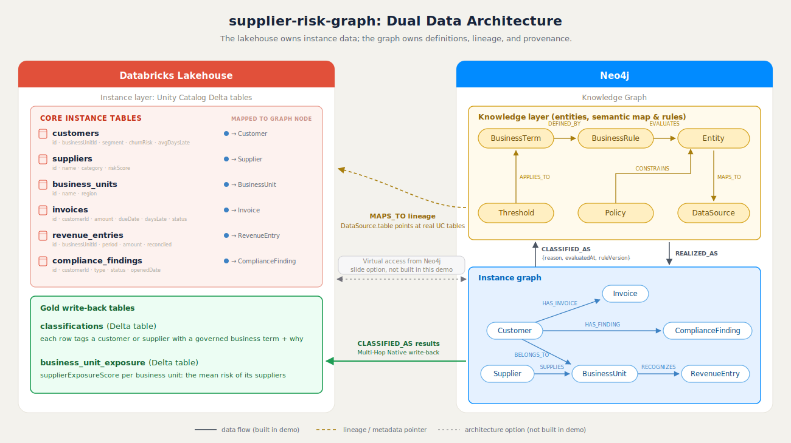

# Data Architecture

The demo uses a dual data architecture. The Databricks lakehouse owns the data / instance layer as Unity Catalog Delta tables. Neo4j owns the knowledge / semantic layer and holds a mirror of the instance data so multi-hop and provenance queries run in one graph. One set of CSVs in `data/` is the single source for both sides.

## Lakehouse Tables (Unity Catalog Delta)

| Table | Kind | Columns (key) | Notes |
|---|---|---|---|
| `invoices` | Fact | `id, customer_id, amount, currency, issue_date, due_date, paid_date, days_late, status` | Basis for payment-behavior rules; drives Q5 and the Q6 payment condition |
| `payments` | Fact | `id, invoice_id, amount, date` | Settles one or more invoices |
| `revenue_entries` | Fact | `id, business_unit_id, period, amount, currency, reconciled` | `reconciled = false` drives Q1 |
| `customers` | Dimension | `id, name, segment, business_unit_id, churn_risk, upsell_score, profitability_trend` | The last three columns are derived ML features consumed by the graph |
| `suppliers` | Dimension | `id, name, category, risk_score` | Procurement counterpart; drives Q4 |
| `business_units` | Dimension | `id, name, region` | Rolls up customers, suppliers, and revenue |
| `compliance_findings` | Operational log | `id, customer_id, type, status, opened_date` | `type = 'KYC'` and `status = 'open'` drive Q2; open findings feed Q6 |
| `classifications` | Write-back | `entity_id, entity_type, term, reason, evaluated_at, rule_version` | `CLASSIFIED_AS` results written back from Neo4j, the Multi-Hop Native story |

## Neo4j Nodes

### Data / instance layer (mirror of the lakehouse)

| Label | Key properties | Notes |
|---|---|---|
| `Customer` | `id, name, segment, profitabilityTrend, churnRisk, upsellScore` | Trend and score fields come from the warehouse ML features |
| `Supplier` | `id, name, category, riskScore` | Procurement counterpart |
| `BusinessUnit` | `id, name, region` | Rolls up customers, suppliers, revenue |
| `Invoice` | `id, amount, currency, issueDate, dueDate, paidDate, daysLate, status` | Basis for payment-behavior rules |
| `Payment` | `id, amount, date` | Settles one or more invoices |
| `RevenueEntry` | `period, amount, currency, reconciled` | `reconciled = false` drives Q1 |
| `ComplianceFinding` | `id, type, status, openedDate` | `status = 'open'` drives Q2 and Q6 |

### Knowledge / semantic layer (graph only)

| Label | Key properties | Notes |
|---|---|---|
| `EDMEntity` | `name, description` | Logical entities from the Enterprise Data Model |
| `BusinessTerm` | `name, definition` | Human-readable definition, for example "Platinum Customer" |
| `BusinessRule` | `name, expression, description` | Machine-evaluable logic behind a term |
| `Policy` | `name, type` | For example KYC Policy, Procurement Policy |
| `Threshold` | `name, value, currency` | For example Materiality Threshold |
| `DataSource` | `name, system, table` | Lineage target; `table` holds the real Unity Catalog table name |

## Relationships

### Instance layer

| Relationship | Pattern | Notes |
|---|---|---|
| `HAS_INVOICE` | `(:Customer)-[:HAS_INVOICE]->(:Invoice)` | Payment behavior per customer |
| `SETTLED_BY` | `(:Invoice)-[:SETTLED_BY]->(:Payment)` | Invoice settlement |
| `BELONGS_TO` | `(:Customer)-[:BELONGS_TO]->(:BusinessUnit)` | Customer roll-up |
| `RECOGNIZES` | `(:BusinessUnit)-[:RECOGNIZES]->(:RevenueEntry)` | Revenue recognition per unit |
| `SUPPLIES` | `(:Supplier)-[:SUPPLIES]->(:BusinessUnit)` | Supply relationships |
| `HAS_FINDING` | `(:Customer)-[:HAS_FINDING]->(:ComplianceFinding)` | Compliance exposure |

### Knowledge layer

| Relationship | Pattern | Notes |
|---|---|---|
| `DEFINED_BY` | `(:BusinessTerm)-[:DEFINED_BY]->(:BusinessRule)` | A term is backed by an explicit rule |
| `EVALUATES` | `(:BusinessRule)-[:EVALUATES]->(:EDMEntity)` | The rule operates over EDM entities |
| `CONSTRAINS` | `(:Policy)-[:CONSTRAINS]->(:EDMEntity)` | Policy scope |
| `APPLIES_TO` | `(:Threshold)-[:APPLIES_TO]->(:BusinessTerm)` | Threshold that parameterizes a term |
| `MAPS_TO` | `(:EDMEntity)-[:MAPS_TO]->(:DataSource)` | Lineage from logical entity to physical source; `DataSource.table` points at the real UC table |

### Cross-layer

| Relationship | Pattern | Notes |
|---|---|---|
| `REALIZED_AS` | `(:EDMEntity)-[:REALIZED_AS]->(:Customer\|:Invoice\|...)` | Logical entity to its physical instances |
| `CLASSIFIED_AS` | `(:Customer\|:Supplier)-[:CLASSIFIED_AS {reason, evaluatedAt, ruleVersion}]->(:BusinessTerm)` | Materialized classification with provenance; written back to the `classifications` Delta table |

The `CLASSIFIED_AS` edge is the explainability payoff: every answer can be traced instance to business term to rule to EDM entity to data source, so Q6 can report which business definitions and data sources were used.

## CSV Mapping

Each node label and each relationship type loads from one CSV in `data/`. The same node CSVs are uploaded to Unity Catalog as the tables above.

- Node CSVs: `customers.csv`, `suppliers.csv`, `business_units.csv`, `invoices.csv`, `payments.csv`, `revenue_entries.csv`, `compliance_findings.csv`, `edm_entities.csv`, `business_terms.csv`, `business_rules.csv`, `policies.csv`, `thresholds.csv`, `data_sources.csv`
- Relationship CSVs: `has_invoice.csv`, `settled_by.csv`, `belongs_to.csv`, `recognizes.csv`, `supplies.csv`, `has_finding.csv`, `defined_by.csv`, `evaluates.csv`, `constrains.csv`, `applies_to.csv`, `maps_to.csv`, `realized_as.csv`, `classified_as.csv`

`classified_as.csv` carries the provenance columns `reason`, `evaluatedAt`, and `ruleVersion`.
