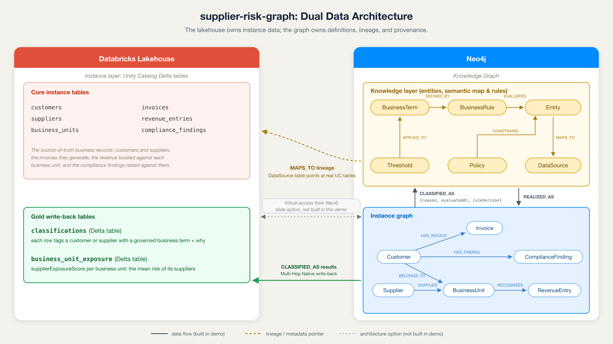

# Data Architecture

The demo uses a dual data architecture. The Databricks lakehouse owns the data / instance layer as Unity Catalog Delta tables. Neo4j owns the knowledge / semantic layer and holds a mirror of the instance data so multi-hop and provenance queries run in one graph. One set of CSVs in `data/` is the single source for both sides.

## A note on BusinessUnit

`BusinessUnit` is an internal division of the enterprise this demo models, not a unit of a supplier or a customer. It is the shared pivot of the instance layer: customers roll up into it (`BELONGS_TO`), suppliers feed it (`SUPPLIES`), and revenue is booked against it (`RECOGNIZES`). A customer is therefore a customer of the enterprise; `BELONGS_TO` only records which internal division carries that account for revenue roll-up, and `SUPPLIES` points a vendor into the division it serves. This convergence on the same unit is what lets Q4 propagate supplier risk to a division's customers along the path `Supplier-SUPPLIES->BusinessUnit<-BELONGS_TO-Customer`.

## Lakehouse Tables (Unity Catalog Delta)

Instance-table columns are camelCase, since the CSV headers load verbatim into both Neo4j and UC. The two graph-derived gold tables are snake_case, built from Cypher `RETURN` aliases.

| Table | Kind | Business description | Columns (key) | Notes |
|---|---|---|---|---|
| `invoices` | Fact | Bills the enterprise issued to its customers, each recording what was owed, when it was due, and how late it was paid | `id, customerId, amount, currency, issueDate, dueDate, paidDate, daysLate, status` | `customerId` joins to `customers.id`. Basis for payment-behavior rules; drives Q5 and the Q6 payment condition |
| `payments` | Fact | Cash the enterprise received to settle invoices | `id, invoiceId, amount, date` | `invoiceId` joins to `invoices.id` |
| `revenue_entries` | Fact | Revenue booked to an internal division for a period, marked reconciled or not | `id, businessUnitId, period, amount, currency, reconciled` | `businessUnitId` joins to `business_units.id`; `reconciled = false` drives Q1 |
| `customers` | Dimension | The accounts the enterprise sells to, with commercial segment and risk/ML attributes | `id, businessUnitId, name, segment, churnRisk, upsellScore, profitabilityTrend, avgDaysLate, overdueShare` | `businessUnitId` joins to `business_units.id`. The trend, churn, and score columns are derived ML features consumed by the graph |
| `suppliers` | Dimension | The vendors the enterprise buys from, each carrying a procurement risk score | `id, name, category, riskScore` | Procurement counterpart; drives Q4 |
| `business_units` | Dimension | The enterprise's own internal divisions; the pivot customers roll up into, suppliers feed, and revenue is booked to | `id, name, region` | Rolls up customers, suppliers, and revenue |
| `compliance_findings` | Operational log | Compliance issues (KYC, AML, sanctions) raised against a customer, open or closed | `id, customerId, type, status, openedDate` | `customerId` joins to `customers.id`; `type = 'KYC'` and `status = 'open'` drive Q2; open findings feed Q6 |
| `supplier_business_units` | Bridge | Which suppliers feed which internal divisions | `supplierId, businessUnitId` | The many-to-many supplier-to-unit link, so the lakehouse can join suppliers to the units they supply. Mirrors the `SUPPLIES` edge |
| `classifications` | Write-back | Business-term labels assigned to customers and suppliers, with the reason and the source that produced them | `entity_id, entity_type, term, source, algorithm, score, reason, evaluated_at, rule_version` | `CLASSIFIED_AS` results written back from Neo4j, the Multi-Hop Native story. Join `entity_id` to `customers.id` or `suppliers.id`. `source` is `rule` for the pre-planted edges or `gds` for the algorithm-derived ones; `algorithm`, `score` are populated only for `gds` rows and `rule_version` only for `rule` rows |
| `business_unit_exposure` | Write-back | Each internal division's aggregate supplier-risk exposure | `business_unit_id, name, supplier_exposure_score, supplier_count, avg_supplier_risk, max_supplier_risk` | The Q4 supplier-risk propagation result, one row per business unit |

## Neo4j Nodes

### Data / instance layer (mirror of the lakehouse)

Because the instance CSVs are the single source for both sides, the mirror nodes also carry the foreign-key columns as properties (`Invoice.customerId`, `Payment.invoiceId`, `RevenueEntry.businessUnitId`, `ComplianceFinding.customerId`, `Customer.businessUnitId`). They are redundant with the instance-layer relationships below, which is what the demo's Cypher traverses.

| Label | Key properties | Business description | Notes |
|---|---|---|---|
| `Customer` | `id, name, segment, profitabilityTrend, churnRisk, upsellScore` | An account the enterprise sells to | Trend and score fields come from the warehouse ML features |
| `Supplier` | `id, name, category, riskScore` | A vendor the enterprise buys from | Procurement counterpart |
| `BusinessUnit` | `id, name, region` | An internal division of the enterprise; the pivot customers, suppliers, and revenue attach to | Rolls up customers, suppliers, revenue |
| `Invoice` | `id, amount, currency, issueDate, dueDate, paidDate, daysLate, status` | A bill issued to a customer | Basis for payment-behavior rules |
| `Payment` | `id, amount, date` | Cash received to settle an invoice | Settles one or more invoices |
| `RevenueEntry` | `period, amount, currency, reconciled` | Revenue booked to a division for a period | `reconciled = false` drives Q1 |
| `ComplianceFinding` | `id, type, status, openedDate` | A compliance issue raised against a customer | `status = 'open'` drives Q2 and Q6 |

### Knowledge / semantic layer (graph only)

| Label | Key properties | Business description | Notes |
|---|---|---|---|
| `EDMEntity` | `name, description` | A logical business entity from the Enterprise Data Model | Logical entities from the Enterprise Data Model |
| `BusinessTerm` | `name, definition` | A named business definition the organization agrees on | Human-readable definition, for example "Platinum Customer" |
| `BusinessRule` | `name, expression, description` | The machine-evaluable logic that backs a term | Machine-evaluable logic behind a term |
| `Policy` | `name, type` | A governance policy that scopes entities and rules | For example KYC Policy, Procurement Policy |
| `Threshold` | `name, value, currency` | A parameter value a business term depends on | For example Materiality Threshold |
| `DataSource` | `name, system, table` | The physical table a logical entity is stored in | Lineage target; `table` holds the real Unity Catalog table name |

## Relationships

### Instance layer

| Relationship | Pattern | Business description | Notes |
|---|---|---|---|
| `HAS_INVOICE` | `(:Customer)-[:HAS_INVOICE]->(:Invoice)` | A customer was billed on this invoice | Payment behavior per customer |
| `SETTLED_BY` | `(:Invoice)-[:SETTLED_BY]->(:Payment)` | This invoice was paid off by this payment | Invoice settlement |
| `BELONGS_TO` | `(:Customer)-[:BELONGS_TO]->(:BusinessUnit)` | A customer account rolls up into this internal division | Customer roll-up |
| `RECOGNIZES` | `(:BusinessUnit)-[:RECOGNIZES]->(:RevenueEntry)` | A division books this revenue entry | Revenue recognition per unit |
| `SUPPLIES` | `(:Supplier)-[:SUPPLIES]->(:BusinessUnit)` | A supplier feeds this internal division | Supply relationships |
| `HAS_FINDING` | `(:Customer)-[:HAS_FINDING]->(:ComplianceFinding)` | A customer has this compliance issue | Compliance exposure |

### Knowledge layer

| Relationship | Pattern | Business description | Notes |
|---|---|---|---|
| `DEFINED_BY` | `(:BusinessTerm)-[:DEFINED_BY]->(:BusinessRule)` | A business term is backed by this rule | A term is backed by an explicit rule |
| `EVALUATES` | `(:BusinessRule)-[:EVALUATES]->(:EDMEntity)` | A rule operates over this logical entity | The rule operates over EDM entities |
| `CONSTRAINS` | `(:Policy)-[:CONSTRAINS]->(:EDMEntity)` | A policy governs this logical entity | Policy scope, the entity a policy governs |
| `GOVERNS` | `(:Policy)-[:GOVERNS]->(:BusinessRule)` | A policy operationalizes this rule | The rules a policy operationalizes, an explicit edge so rules are read directly rather than inferred from a shared entity. Procurement governs the High-Risk Supplier rule, Revenue Recognition the Unreconciled Revenue rule. KYC governs no rule: it is operationalized through `ComplianceFinding` records, and the Platinum, Strategic, and Risky Customer rules are commercial and credit definitions outside its scope |
| `APPLIES_TO` | `(:Threshold)-[:APPLIES_TO]->(:BusinessTerm)` | A threshold parameterizes this term | Threshold that parameterizes a term |
| `MAPS_TO` | `(:EDMEntity)-[:MAPS_TO]->(:DataSource)` | A logical entity is stored in this physical source | Lineage from logical entity to physical source; `DataSource.table` points at the real UC table |

### Cross-layer

| Relationship | Pattern | Business description | Notes |
|---|---|---|---|
| `REALIZED_AS` | `(:EDMEntity)-[:REALIZED_AS]->(:Customer\|:Invoice)` | A logical entity is realized by these physical instances | Logical entity to its physical instances. The demo realizes only the Customer and Invoice entities, the ones the six questions traverse: 100 Customer edges and 612 Invoice edges. |
| `CLASSIFIED_AS` | `(:Customer\|:Supplier)-[:CLASSIFIED_AS {reason, evaluatedAt, ruleVersion}]->(:BusinessTerm)` | An instance is labeled with this business term | Materialized classification with provenance; written back to the `classifications` Delta table |

The `CLASSIFIED_AS` edge is the explainability payoff: every answer can be traced instance to business term to rule to EDM entity to data source, so Q6 can report which business definitions and data sources were used.

## CSV Mapping

Each node label and each relationship type loads from one CSV in `data/`. The seven instance node CSVs, plus the `supplier_business_units.csv` bridge, are uploaded to Unity Catalog as the tables above; the knowledge-layer and relationship CSVs stay graph-only.

- Node CSVs: `customers.csv`, `suppliers.csv`, `business_units.csv`, `invoices.csv`, `payments.csv`, `revenue_entries.csv`, `compliance_findings.csv`, `edm_entities.csv`, `business_terms.csv`, `business_rules.csv`, `policies.csv`, `thresholds.csv`, `data_sources.csv`
- Relationship CSVs: `has_invoice.csv`, `settled_by.csv`, `belongs_to.csv`, `recognizes.csv`, `supplies.csv`, `has_finding.csv`, `defined_by.csv`, `evaluates.csv`, `constrains.csv`, `governs.csv`, `applies_to.csv`, `maps_to.csv`, `realized_as.csv`, `classified_as.csv`
- Lakehouse-only CSV: `supplier_business_units.csv`, the camelCase bridge uploaded to UC but not loaded into Neo4j, where the `SUPPLIES` edge already carries the link.

`classified_as.csv` carries the provenance columns `reason`, `evaluatedAt`, and `ruleVersion`.

## Graph Analytics Extensions

The demo uses two graph analytics passes to extend the rule-based answers: a plain Cypher exposure aggregation for Q4 and one Graph Data Science algorithm, kNN, for Q5/Q6. Both write their results back as `CLASSIFIED_AS` edges, so they join the same provenance story and flow into the `classifications` Delta table.

### Supplier risk exposure (extends Q4)

- **ELI5:** think of each supplier as carrying a risk score. A business unit's exposure is the average risk of all the suppliers feeding it. A unit served by several middling-risk suppliers can carry high average exposure even when no single supplier looks alarming on its own.
- **Method:** the mean supplier `riskScore` per business unit. This is a one-hop aggregation, computed with a single Cypher `avg()` over the supply edges.
- **Edges aggregated:** `Supplier-SUPPLIES->BusinessUnit`.
- **What it does:** averages supplier risk per business unit to score its exposure.
- **Why it matters:** the rule filter `riskScore >= 70` only finds individually risky suppliers. The aggregation finds a business unit whose average exposure is high because several mid-risk suppliers serve it, even though no single supplier crosses the threshold.
- **Demo line:** the rule finds risky suppliers; the graph finds risky exposure.

### Customer similarity (extends Q5 and Q6)

- **ELI5:** describe every customer as a point on a map, where the coordinates are how late they pay, how much of their book is overdue, and how their profitability is trending. Customers who behave alike land close together. If a customer's point sits in the same neighborhood as the known troublemakers, they probably belong to that crowd, even if they have not broken a rule yet.
- **Algorithm:** GDS k-Nearest Neighbors over payment-behavior features. It builds a similarity graph, linking each customer to its most similar peers by feature distance, then ranks the non-flagged customers by their highest similarity to any member of the known risky cohort. The four nearest are the candidates; they emerge from the run, not a planted set.
- **Features:** `avgDaysLate`, `overdueShare`, `churnRisk`, and `profitabilityTrend`, with the categorical fields encoded numerically. `upsellScore` is deliberately excluded because it is random relative to risk and would make results nondeterministic.
- **What it does:** surfaces the non-flagged customers whose feature vectors sit closest to the known risky accounts in the kNN similarity graph.
- **Why it matters:** the last-3-invoices rule only catches customers who already trip it. Similarity surfaces the ones trending toward the risky cohort before the rule fires.
- **Demo line:** rule-based classification finds the ones already defined; GDS finds the next ones.

### Write-back with provenance

- Both passes write new `CLASSIFIED_AS` edges carrying `source: 'gds'`, the algorithm name, the score, and `evaluatedAt`.
- The edges have the same shape as the rule-planted ones, so the Q6 explanation query returns them without modification.
- Results are deterministic given the fixed-seed data. Q4 exposure matches the `gds_q4_*` entries in `ground_truth.json`; the Q5/Q6 kNN candidates emerge from the run and are checked only for shape (four non-flagged customers, each near the risky cohort).
