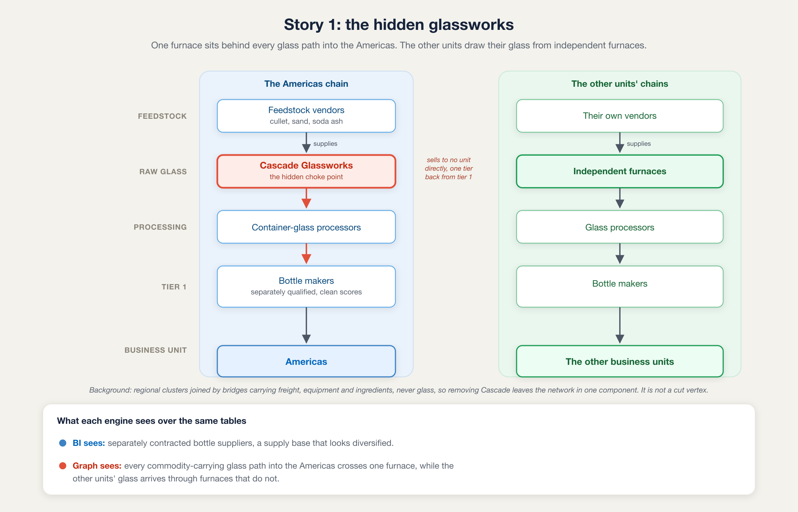

# Demo walkthrough

The speaker's script for the three-story demo. One-time setup (data generation, Neo4j load, GDS,
Unity Catalog upload, and the Genie space) is covered in the setup section at the end.

## Quick reference

- **[Overview](#overview)**
  - [What the demo proves](#what-the-demo-proves)
  - [The honesty framing](#the-honesty-framing)
  - [The chapter arc](#the-chapter-arc)
- **[Stories](#stories)**
  - [Story 1: the hidden glassworks](#story-1-the-hidden-glassworks)
  - [Story 2: the clean payer in a bad group](#story-2-the-clean-payer-in-a-bad-group)
  - [Story 3: the warning before delinquency](#story-3-the-warning-before-delinquency)
  - Presenter notes: [why the arc works](#why-the-arc-works), [the fairness rebuttal](#the-fairness-rebuttal-both-engines-get-every-table), [warm-up and other questions](#warm-up-and-other-questions)
- **[Setup](#setup)**
  - [Pre-flight check](#pre-flight-check)
  - [Genie space and MCP server](#setup-genie-space-and-mcp-server)

**Before every demo:** regenerate the data and rerun the pipeline.

- The dataset is a forward-looking snapshot from its generation date. Story 2 depends on the invoices
  reading as open and on time, and Story 3 on the delinquency behavior those same dates derive.
- Regenerating keeps `SEED = 42` and refreshes only the as-of date, so names, ids, topology, and every
  rank stay identical.
- Never edit `SEED`: that is a reseed, not a refresh, and it moves the ranks the demo rests on.

# Overview

## What the demo proves

Two engines answer the same question over the same data.

- **Genie alone:** a Databricks Genie space scoped to the `supplier_risk` schema. It reads the raw
  instance tables and the `customer_risk_exposure` metric view, nothing else.
- **Genie + Graph:** that same space under a supervisor that can also call a read-only Neo4j
  knowledge graph.

Say those two names on stage. The contrast is in the name itself, so the room follows it without
being told.

Each story puts one natural question to both engines:

- **Ungrounded:** Genie alone reads every column correctly and returns a plausible, defensible answer
  anchored to nothing, because no lakehouse artifact defines the question's terms.
- **Grounded:** Genie + Graph resolves the governed definition from the graph, walks the connections,
  and returns an answer a risk committee can act on because it cites an authored definition.

Each story is told in named chapters, not numbered beats. Everything named stays named: the two
engines above, and the three steps inside the grounded chapter, which are Definition, Discovery, and
Explanation.

## The honesty framing

**The demo is ungrounded versus grounded. It is not wrong versus right.** Genie alone is a frontier
LLM over tables; the axis it picks is generative, not reproducible. Genie + Graph's answer is
grounded in an authored definition, so it is the same answer every time.

Genie alone **can** return an answer that is false at full depth, and that is a legitimate finding.
Narrate the mechanism, never the verdict: Genie looks one level deep by default. It could likely be
prompted deeper, and saying so costs nothing, because default behavior is what an analyst gets. Never
frame a chapter as Genie being wrong, bad, or beaten. The room should leave thinking about depth of
question, not about which vendor lost.

Two claims, different strength, kept separate on stage:

- **Load-bearing, cannot fail:** no answer from Genie alone cites a governed business definition,
  because none exists in the lakehouse. True on every run.
- **Vivid, not guaranteed:** Genie alone's answers vary across runs. Show it live, never depend on it.

**Do not predict what Genie will answer, in this file or on stage.** No chapter carries a scripted answer
for Genie alone.

Never claim SQL cannot express these traversals; a Databricks audience knows recursive CTEs exist.
The defensible claims are narrower and true:

- No lakehouse column defines what "single point of failure," "same ownership group," or an account
  "heading toward delinquency" means. The definition lives in the graph.
- Supplier betweenness, weighted ownership PageRank, and delinquency-similarity kNN are graph
  computations no column carries. All three are expressible in SQL, but no BI tool writes them
  unprompted, and their cutoffs are governed values in the graph.

## The chapter arc

The two structural stories, Story 1 and Story 2, run the same five chapters, so the room learns the
rhythm on the first and feels it confirm on the second. Story 3 is a lighter governed early-warning
story that runs the opening chapters only as far as its contract specifies:

- **The problem:** the business situation and what we are looking for.
- **Ask the lakehouse alone:** one natural question, put to Genie over the tables, which answers from
  the columns correctly with nothing governing what the answer means.
- **Ask the lakehouse and the graph:** the same worry put to Genie + Graph naming the governed term,
  resolved in three steps, Definition, Discovery, and Explanation.
- **What the graph made actionable:** the grounded finding gets a euro figure and the action it points
  to, computed from the same lakehouse data.
- **Why the graph was needed:** the grounded answer is reproducible and anchored to an authored
  definition, and the ungrounded one is not.

Nothing is pasted. Both engines write their own queries; the presenter types a question. Graph
properties and instance tables both use camelCase.

# Stories

## Story 1: the hidden glassworks

### The problem

Supplier concentration risk hiding in the sub-tier. One business unit's tier-1 bottle suppliers are
separately qualified and separately contracted, so its supply base looks diversified. All of them buy
their glass, through a sub-tier of glass processors, from the same furnace. If that furnace stops,
that unit cannot bottle its product. The other units draw their glass from independent furnaces and
keep shipping. Procurement knows its tier-1 suppliers. It does not know who they buy from.

```text
 tier              the Americas chain                 the other units' chains

 feedstock         vendors across several regions     their own vendors
                   (cullet, sand, soda ash)
                            |                                  |
 raw glass         Cascade Glassworks                   independent furnaces
                            |                                  |
 processing        glass processors                     glass processors
                   (container glass)
                            |                                  |
 tier 1            bottle makers, separately            bottle makers
                   qualified, all clean scores                 |
                            |                                  |
 business unit     Americas                             the other business units

 each column reads downward as "supplies". Cascade sells to no business unit
 directly, and sits one tier back from the bottle makers rather than beside them.

 BI sees:    separately contracted bottle suppliers, a supply base that looks diversified
 Graph sees: every commodity-carrying glass path into the Americas crosses one furnace,
             while the other units' glass arrives through furnaces that do not
```



Deleting Cascade would not split the network into pieces: the other clusters stay connected through
links that carry freight, equipment, and ingredients but never glass. Cascade earns its position by
spanning the feedstock and processor tiers of the glass chain, not by being the only route across the
whole graph.

What we are hunting is the supplier that every glass path into the Americas runs through, one tier
below the suppliers procurement actually contracts with. The tables carry every supply link, but
nothing in them says which supplier that is, or what would make it critical.

### Ask the lakehouse alone

We put the question to Genie over the lakehouse first, exactly as a procurement analyst would type it.

```text
ASK GENIE  (lakehouse alone)

"How diversified is our glass bottle supply for the Americas?"
```

We put the blunt version of the same worry beside it:

```text
ASK GENIE  (lakehouse alone)

"What is our single biggest point of failure in our supply base?"
```

Background to share, and two cautions:

- **The point of this question is to surface that ambiguity, not resolve it.** "Diversified" can mean
  units per supplier or sources per unit, and nothing in the lakehouse says which is meant. Do not
  reword the question to force one axis.
- **Avoid "depend on" and "common upstream" in the diversification ask.** They hand Genie the
  convergence query directly. "Point of failure" is safe.
- **The point-of-failure question is safe to ask and no step depends on Genie alone answering it any
  particular way.** Ask it live and script neither side.

What Genie alone does, no script:

- **Ask it three times, live, in fresh conversations.** Two asks can land on the same axis and show no
  spread.
- **Read out what comes back and note that nothing references a governed definition.** That is the
  load-bearing observation and it holds on every run.
- **If the three answers differ, narrate the spread. If they agree, narrate the ungroundedness.** Both
  land. Do not ask a fourth to manufacture a disagreement.
- **Every table is in the space,** including `supply_relationships` and `supplier_business_units`. The
  gap is grounding, not access.

### Ask the lakehouse and the graph

Now take the same worry to Genie + Graph, and name the governed term so the supervisor resolves it
rather than guessing which term sounds closest.

```text
ASK GENIE + GRAPH  (lakehouse + graph)

"Using the Critical Supplier definition in the graph, which suppliers
 are critical to our Americas glass bottle supply?"
```

- **Ask for the governed term by name.** Say "Critical Supplier" rather than describing the idea in
  loose business language. It is a term in the ontology with an authored definition, a rule, and a
  threshold. Genie alone cannot answer at all, because no column of that name exists on its side.
  Describing the term instead routes the request to whichever governed term sounds closest, usually
  High-Risk Supplier, which answers a different question.

The graph answers in three named steps, each with its own visible output:

- **Definition.** It resolves what a Critical Supplier means from the graph: a supplier that a
  disproportionate share of the multi-tier supply paths carrying a commodity into a business unit run
  through, leaving few alternatives around it, and one that need not sell to that unit directly. The
  Supply Concentration Threshold parameterizes it. The lakehouse has no answer to that question at all.
- **Discovery.** It reads the precomputed supply betweenness and applies the governed threshold, which
  returns a cohort of suppliers rather than a single name.
- **Explanation.** It walks the commodity-carrying glass chain and shows that the Americas
  container-glass processors all draw their raw glass from one upstream furnace, Cascade Glassworks.

The result: Cascade clears the Supply Concentration Threshold, and so do other suppliers, because the
threshold catches a cohort.

- What singles Cascade out is the definition and the commodity scoping applied together.
- **The finding does not come from topping a ranking, so do not describe it as one.**
- Cascade's own risk score sits below the High-Risk threshold, so no risk-score filter surfaces it.

#### The convergence question, invited not hidden

Convergence is cheap in SQL once you know where to start. "Which supplier feeds all of these" is a
short query against the tier-1 bottle makers, well within Genie alone. The graph-native step is the
one before it: knowing which suppliers to ask about at all.

Invite the question rather than hoping nobody asks it. The invited phrasing, distinct from the three
questions frozen in CONTRACT section 6, is:

```text
ASK EITHER ENGINE

"Do all our Americas glass bottle suppliers share a common upstream supplier?"
```

- **One hop up lands on the processors, not the furnace.** With a processor tier between Cascade and
  the bottle makers, the convergence query Genie alone writes answers about the tier it can see. The
  graph, walking the commodity-carrying chain to full depth, answers about the tier below.
- **Narrate the mechanism:** Genie looks one level deep by default and could likely be prompted deeper.

This works whichever way Genie alone answers. If it converges on the furnace on the day, nothing
breaks: the graph still resolved the definition, the commodity scoping, and the tier that made the
finding actionable.

### What the graph made actionable

Now the finding gets a number and an action, both from the same lakehouse data.

```text
ASK GENIE + GRAPH  (lakehouse + graph)

"What is our business exposure to Cascade Glassworks?"
```

Genie alone cannot answer it, because no lakehouse column connects Cascade to a business unit's
revenue.

- **What the grounded step handed over:** an entity, Cascade Glassworks, not a number. The graph holds
  no euros.
- **How Genie + Graph gets to a number:** it follows `MEASURED_BY` from the Critical Supplier term to
  the Supply Exposure measure, reads the Supply Exposure Rule, and lands on the `RevenueEntry` and
  `BusinessUnit` tables. That turns "exposure to Cascade" into a revenue question about one unit.
- **What the measure says:** the recognized revenue that stops when a Critical Supplier stops, for the
  most recent full quarter, for every business unit whose supply of the commodity at risk runs wholly
  through that supplier. A path that does not carry the commodity is excluded. The measure returns one
  unit and no other.
- **The arithmetic, sent to Genie:** recognized revenue per business unit for the most recent full
  quarter, so the exposed unit's figure sits next to the units that keep shipping. Read it off the
  screen.
- **Why the revenue stops, not just dips:** you cannot ship a bottled product without bottles. If the
  furnace stops, that unit's revenue stops rather than degrades, while the other units keep shipping.
  The comparison across units is the argument; a single number is not.
- **The kicker, presenter framing:** what you pay Cascade is a rounding error. The exposure is the
  revenue that stops when they do. The dataset carries no supplier-spend column, so this line is said,
  not queried.
- **Why this is the honest step:** the lakehouse had the money the whole time. What it lacked was a
  reason to ask about this unit, because no column says whose glass supply runs wholly through one
  furnace. The graph supplies the entity and the governed measure; Genie supplies the arithmetic.

The fix is a second glass source for the exposed unit, and Genie + Graph can show whether a given
candidate actually is one. Ask it to walk the candidate's chain: a supplier drawing raw glass from an
independent furnace breaks the dependency, and one that routes back to Cascade does not.

**A second supplier whose own glass also traces back to Cascade changes nothing,** because the
commodity-carrying paths still converge on the same furnace. Sourcing decisions made on the tier-1
view cannot tell the two cases apart; the governed definition can. The cost of a second source is
presenter framing, not a data answer.

### Why the graph was needed

Genie alone read every column correctly and returned a plausible, defensible answer anchored to
nothing, because no lakehouse artifact defines what a Critical Supplier is or whose glass runs wholly
through one furnace. Genie + Graph resolved that definition from the graph, applied its governed
threshold, and walked the commodity-carrying chain, so the same question returns the same answer on
every run and a risk committee can act on it. The difference is not that one engine is smarter. It is
that one answer is grounded in an authored definition and the other is not.

### Graph mechanics

- **The traversal:** a variable-length traversal walks the multi-tier chain. `SUPPLIES` points from a
  supplier toward what it feeds:
  `(Cascade)-[:SUPPLIES]->(processor)-[:SUPPLIES]->(bottle maker)-[:SUPPLIES]->(Americas)`. Cascade
  never appears one hop from a business unit.
- **The commodity test:** a path counts only when every supplier on it trades in a glass subcategory.
  Without it, the non-glass bridges would leak the exposure measure into units that are not exposed.
- **The GDS piece:** supplier betweenness, a graph score for how often a node sits on the paths between
  others, precomputed as a node property over an undirected projection of the supplier network.
- **The cutoff:** the Supply Concentration Threshold is a hand-set percentile of supply betweenness,
  fixed before the run. Cascade clears it and the clearing cohort has more than one member. That is
  cohort membership, not rank.

## Story 2: the clean payer in a bad group

### The problem

Group credit exposure hiding in the ownership structure. A customer pays every bill on time and is
assessed standalone, the way credit control assesses every account. Nothing near it looks alarming.
But the group that controls it also controls four companies that went bankrupt, two levels further
down, and it holds all of them outright. A lender would call these a group of connected clients and
aggregate the exposure. The account-level rating cannot.

```text
                     Kestrel Holdings
              85%          70%         65%
               /            |            \
    Jade Beverage    Harbour Group    Tern Capital
     Distribution       Holdings         Partners
  (spotless record)    90%    80%     85%     75%
                        /      \       /       \
                   Marlin    Osprey Pelican   Heron
                  DEFAULTED       DEFAULTED
                              (all four)

 BI sees:    an on-time payer, nothing within two hops to flag
 Graph sees: four failures arriving through controlling stakes
```

Nothing is one hop away, which is the point. Clean accounts sit directly next to defaults across the
book, but they hold only a few percent of the company that failed. Jade holds nothing directly and is
owned 85% by a group that owns its failures outright, so far more damage reaches Jade than reaches
anyone standing closer.

#### Pipes, not distance

If you explain one thing in Story 2, explain this. It is the whole reason the graph is required.

The instinct everyone has is that risk is about **distance**: who is standing closest to the fire.
That instinct is what SQL is good at, and it is wrong here.

Ownership is not a distance, it is a **pipe**. Owning 90% of a company is a wide pipe, and almost
everything that happens to it flows through to you. Owning 3% is a straw. So the question is not "how
close are you to a failure" but "how many pipes lead from failures to you, and how wide is each one."

- Accounts standing right next to a bankruptcy hold only a few percent of it. Straws. Almost nothing
  arrives.
- Jade is three levels from four bankruptcies, but every pipe on the path is 65% to 90% wide. Four
  failures arrive largely intact.

Distance says Jade is fine. Pipes say Jade is the most exposed trading account on the book. Adding up
flow through a web of pipes, where damage arrives by several routes at once, is what the graph
algorithm does in one line and what a join cannot express.

### Ask the lakehouse alone

We put the question to Genie over the lakehouse first, the way credit control would phrase it.

```text
ASK GENIE  (lakehouse alone)

"Which customers should credit review look at next?"
```

What Genie alone does with it:

- **What it does:** goes to the `customer_risk_exposure` metric view, ranks customers by
  `credit_utilization` and `overdue_amount`, and takes the top ten. A clean, sensible query.
- **What it does not do:** `avgDaysLate` and `churnRisk` never enter the query. It reads the exposure
  measures correctly and has no reason to reach past them.
- **Who is missing:** Jade Beverage Distribution.
- **Why:** every column it reads is clean. Jade carries no overdue balance, so `overdue_amount` is
  zero, and it draws a modest share of a large committed facility, so `credit_utilization` sits nowhere
  near the top. Widen the ranking to lateness or churn and Jade is still clean. A correct read of every
  column that misses the account credit review should worry about most.
- **If the room asks about the ownership table:** it is in the space, stakes and all. Ask which
  customers are near a default and the lakehouse still misses Jade, because the nearest accounts hold a
  few percent of it. Ask which ownership group holds the most defaults and it returns a different
  group, not Kestrel's. Both right, both the wrong account.

### Ask the lakehouse and the graph

Now take the same question to Genie + Graph, and name the governed term so the supervisor resolves it
rather than routing to whichever term sounds closest.

```text
ASK GENIE + GRAPH  (lakehouse + graph)

"Which customers have Ownership Risk?"
```

- **The governed definition:** Genie + Graph resolves what Ownership Risk means from the graph: "an
  active customer with a clean record of its own, no default and never delinquent, that absorbs more
  failure through its ownership stakes than any other trading customer," parameterized by the Ownership
  Contagion Threshold, a weighted PageRank cutoff.
- **How it filters:** it excludes the defaulted customers and the invoice-less holding companies, then
  returns the clean operating customers whose stake-weighted propagated risk clears the cutoff, with
  the ownership chain as the stated reason.
- **The result:** Jade Beverage Distribution, a platinum account owned 85% by Kestrel Holdings, which
  owns Harbour Group and Tern Capital outright, and those two own the four companies that defaulted in
  the most recent quarter. Jade scores clearly ahead of the next trading customer, a gap wide enough
  that the cutoff sits between them with room to spare, even though Jade never missed a payment and
  nothing within two hops of it has failed.
- **Why nobody else clears it:** accounts sitting directly beside a default hold only a few percent of
  it. Kestrel's stakes are 65% to 90% at every level, so four failures arrive at Jade largely intact.
- **If someone asks why not Kestrel or Harbour:** they score higher and are correctly excluded. They
  are holding companies: they buy nothing and carry no invoices, so there is no receivable to act on
  and no facility to cut. The definition says "an active customer" for exactly this reason. The demo
  answers which trading account is most exposed, and that is Jade.

#### Keep the customer status simple

For the demo output, present one mutually exclusive status per customer:

- **Defaulted:** the customer has a recorded default.
- **High Risk:** the customer has not defaulted and qualifies for Ownership Risk.
- **Other:** every remaining customer.

Apply the statuses in that order so a defaulted customer never also appears as High Risk. **High Risk
is a presentation label, not another business term in the ontology.** The graph can retain the richer
definitions and provenance behind the result while the audience sees three action queues. Story 2 then
has one simple reveal: Jade moves from Other in an account-level view to High Risk in the governed
graph view.

- **Ask for the governed term by name.** The neutral opening question can route Genie + Graph into a
  loose delinquency-and-holdco list that never resolves the definition, the same way loose phrasing
  routes Story 1 to whichever term sounds closest. Name Ownership Risk instead, the way Story 1 names
  Critical Supplier. It is a term in the ontology with an authored definition, a rule, and a threshold.
- **Questions to try, tested live before the demo.** The callout above is the shortest phrasing; probe
  these against the live space too and keep whichever resolves the definition cleanest. Do not script
  which one lands.
  - "Which customers have Ownership Risk?"
  - "Using the Ownership Risk definition in the graph, which trading customer is most exposed to its
    ownership group's defaults?"
  - "Which active customer with a clean payment record absorbs the most failure through its ownership
    stakes?"
  - "Apply the Ownership Contagion Threshold from the graph and list the trading customers that clear
    it."

### What the graph made actionable

Now the finding gets a number and an action, both from the same lakehouse data.

- **What the grounded step handed over:** an entity, Jade Beverage Distribution, not a number.
- **How Genie + Graph gets to a number:** it follows `MEASURED_BY` from the Ownership Risk term to the
  Credit Exposure measure, reads the Credit Exposure Rule, and lands on the `Invoice` and `Customer`
  tables.

The follow-on question, put to Genie:

```text
ASK GENIE + GRAPH  (lakehouse + graph)

"What is Jade Beverage Distribution's committed credit facility, and how
 much of it is drawn as open invoice balance?"
```

- **The figure:** a committed facility, of which a smaller amount is drawn across the open invoices.
  Both come back from plain Genie over the instance tables. Read them off the screen. The exposure is
  the whole facility, not the drawn portion, because all of it is committed and can be drawn.
- **Why this is the honest step:** the credit line and the open invoices were in the lakehouse the
  whole time. Nothing in those columns flags Jade, because Jade's own record is spotless.
- **Why it lands:** Jade is also a Strategic Account, so the biggest clean customer on the book is the
  one absorbing the most failure in it.

The fix is to cut Jade's committed facility down toward the balance already drawn, using the two
figures the exposure step returned, and to require prepayment on new orders, so the enterprise stops
carrying the full committed exposure on the account absorbing more of the book's failure than any
other.

### Why the graph was needed

An account-level view reads every column on Jade correctly and still cannot see the exposure, because
no column defines a group of connected clients or weights how failure propagates through ownership
stakes. Genie + Graph resolves Ownership Risk and its weighted-PageRank cutoff from the graph, so the
same account surfaces on every run and credit control can act on it. The difference is not that one
engine is sharper. It is that one answer is grounded in an authored definition and the other is not.

### Graph mechanics

- **The algorithm:** weighted personalized PageRank, seeded on every defaulted customer and propagated
  over the `OWNED_BY` edges with `ownershipPct` as the relationship weight, precomputed as a node
  property on every Customer.
- **The flow:** failure flows out of every default in proportion to who holds it. Through Kestrel's 65%
  to 90% stakes it arrives at Jade nearly intact, three levels up and back down. Through a filler's
  few-percent stake it effectively stops.
- **Why the weight is the whole story:** unweighted, this collapses into a hop count and the nearest
  account wins, a query anyone can write. Weighted, the answer depends on the product of stakes along
  every route and the sum over all routes, which no join reproduces.
- **The cutoff:** the Ownership Contagion Threshold is set from the score distribution so Jade clears
  it and no other trading customer does.

## Story 3: the warning before delinquency

### The problem

Credit risk that has not happened yet. The Delinquent Customer rule fires only after each of a
customer's last three invoices passes the Late Payment Threshold, so it reports failure rather than
warning of it. Risky Customer is its governed early-warning counterpart: an active customer that has
neither defaulted nor already become Delinquent, whose payment behavior already sits among the
accounts that have. The two terms are independent, and a customer already classified Delinquent is
excluded from this one by the definition itself.

```text
        payment-behavior space  (avgDaysLate x overdueShare)

           already Delinquent
             *   *   *
           *   *   *   *           o   the near-miss account,
                                  /|\  clean by the Delinquent rule
                                 / | \
                        its nearest neighbours, a governed
                        majority already Delinquent

 BI sees:    a clean account, its last three invoices not all past the Late Payment Threshold
 Graph sees: an account whose payment behavior already clusters with the delinquent book
```

### Ask the lakehouse alone

We put the natural question to Genie over the lakehouse first, the way credit review would phrase it.

```text
ASK GENIE  (lakehouse alone)

"Which customers should we review next as most likely to default, and why?"
```

What Genie alone does, no script:

- **What is fairly conceded:** the lakehouse can rank customers by lateness. `invoices` ships
  `daysLate` and `status`, so a ranking built on them is available to Genie alone. Concede it on stage
  rather than hope nobody tries it.
- **The simple point underneath it: the ranking looks backward.** The columns that stand out most are
  the ones that record a failure that already happened, a booked default or a large overdue balance.
  Rank on those and the accounts that surface tend to be the ones that have already failed, where the
  loss is booked and credit control already knows. Risky Customer is defined to exclude defaulted and
  already-delinquent accounts on purpose, so it looks forward instead, at the clean customers heading
  that way while there is still a decision to make. Narrate the mechanism, that the lakehouse ranks on
  failures already on the books, never a verdict on any account it names.
- **What holds on every run:** no authored definition of a Risky Customer exists in the lakehouse for
  any answer to cite. The two features the score is built from, `avgDaysLate` and `overdueShare`, are
  excluded from the Unity Catalog `customers` table by `upload.py`, so they are graph-only. The gap is
  grounding, not access to lateness.
- **Read out what comes back and note that nothing references a governed definition.** That is the
  load-bearing observation and it holds every run.

### Ask the lakehouse and the graph

Now take the same worry to Genie + Graph, and name the governed term, Risky Customer, so the
supervisor resolves its authored definition rather than routing to whichever term sounds closest.

```text
ASK GENIE + GRAPH  (lakehouse + graph)

"Which customers have Risky Customer status and why?"
```

- **Probe these phrasings live before the demo** and keep whichever resolves the definition cleanest;
  do not script which one lands.
  - "Using the Risky Customer definition in the graph, which active accounts are heading toward
    delinquency?"
  - "Which clean customers have payment behavior most like our already-delinquent accounts?"

The graph answers in three named steps, each with its own visible output:

- **Definition.** It resolves what Risky Customer means from the graph: an active customer, neither
  defaulted nor already Delinquent, that qualifies when at least the governed share of its nearest
  payment-behavior neighbours are themselves Delinquent Customers. The rule states it and the Customer
  Similarity Threshold parameterizes it, both read off the graph. The neighbourhood size and the share
  are governed constants authored before any similarity is computed. This is what answers the default
  question honestly: these accounts have not defaulted and have not even been classified Delinquent,
  they already pay like the book that does, which is the earliest point credit review can act, before a
  default rather than after.
- **Discovery.** It reads the precomputed Delinquency Similarity, a deterministic GDS kNN score over a
  standardized two-feature payment-behavior vector stored as `Customer.delinquencySimilarity`, and
  applies the governed screen over the eligible population. Eligibility is applied after scoring, so
  delinquent customers stay available as neighbours but are never classified as an early warning about
  themselves. The result is a derived cohort of more than one member, not a single name.
- **Explanation.** Each classified customer carries `SIMILAR_PAYMENT_BEHAVIOR` edges to the delinquent
  neighbours that counted toward its score, with similarity, neighbour rank, and evaluation time.
  Rather than reach for a traversal to explain itself, this story reads its evidence off edges the
  scoring already wrote, and can answer both "who should we review?" and "which known delinquent
  accounts does this customer resemble?"

The cohort is derived, never enumerated. The generator plants near-miss payment behavior on a set of
accounts and plants no label. Which of them clear the governed share is an output of the scoring:
planted accounts are free to fall under it and accounts nobody planted are free to clear it. Do not
build the story on a particular name, a particular cohort size, or the planted set and the classified
set being the same set.

#### The honest shortcut, conceded not hidden

The math is not the barrier. A ranking by lateness runs fine against the lakehouse and returns the
accounts already in trouble. What no BI tool reaches for unprompted is a governed nearest-neighbour
screen over a standardized behavior vector, and the cutoff that decides the answer is a governed value
in the graph, not a column to sort on. Story 3 leans on that distinction, not on Genie failing to rank
late payers.

### What the graph made actionable, not yet authored

Risky Customer would be measured by the existing Credit Exposure measure, so an exposure step would
resolve the measure and its rule from the graph, then send the arithmetic to
Genie over the `Invoice` and `Customer` tables. It is not authored yet, and neither is a fix. Do not
script either from expectation. They are a future addition, not a gap to fill on stage.

### Why the graph was needed

Genie alone can rank late payers, but no authored definition of an early warning exists in the
lakehouse to cite, and the two features the screen is built from live only in the graph. Genie + Graph
resolves the Risky Customer definition and its Customer Similarity Threshold, applies the governed
nearest-neighbour screen, and returns the cohort with its evidence, so credit review gets the same
warning on every run, before the Delinquent rule fires. The difference is not that one engine is
sharper. It is that one answer is grounded in an authored definition and the other is not.

### Graph mechanics

- **The algorithm:** it runs a graph algorithm called kNN, for k-nearest-neighbours, that finds for
  each customer the handful of other customers whose payment profile looks most like theirs. The
  profile is two numbers, how late they pay on average and how much of their book goes overdue. The
  score kept for each customer is the share of those nearest matches that are already delinquent.
- **The threshold:** the Customer Similarity Threshold is a fixed number between zero and one,
  authored before any scoring runs. A job runs the graph analytics, then reads this number and applies
  it as the cutoff. It never works the cutoff out from the results it just produced, so the same
  customers clear it on every run.
- **Who the list leaves off:** accounts that have already defaulted or already gone delinquent are
  removed from the final list, but only after scoring. They still count as matches when everyone else
  is scored, so a clean customer can be flagged for resembling them. What is left is only the accounts
  you can still act on before they fail.
- **Why each name is on the list:** the scoring also records, for every flagged customer, which
  delinquent accounts it was matched against and how close each match was. The list comes with its own
  reasons attached, not just a name.

## Why the arc works

- **The grounding gap is the proof.** The lakehouse-only engine reading every column correctly and
  still having nothing to anchor the answer to is the whole argument, demonstrated live, in each story.
- **The closing chapter shows the fix.** Attaching a concrete action to the euro figure converts the
  contrast into something a risk officer acts on rather than an abstract point.
- **Genie + Graph's answers read like actions.** It composes its reason from the path itself and closes
  with the recommended action, something a risk officer acts on.

## The fairness rebuttal: both engines get every table

The room will ask whether plain Genie was denied the scores. The rebuttal is an answer, not a
demonstration.

- **Both engines get every table,** including the raw supply links and the ownership stakes. What plain
  Genie will not do is invent an all-pairs shortest-path computation or an iterative weighted
  propagation, unprompted, from a business question. Both are expressible in SQL; neither is what a BI
  tool reaches for; both are one line of GDS.
- **Do not say BI cannot compute these at all.** It can, and a Databricks audience knows it. The claim
  that holds is the one above.
- **If challenged, invite the shortcut.** Counting connections over `supply_relationships` does not
  name Cascade. Ranking customers by distance to a default, or by defaults per ownership group, does
  not return Jade. Those shortcuts run, and they return a different name.
- **The one shortcut that does reach Cascade, conceded not hidden.** Ask plain Genie to list the
  tier-2 and tier-3 suppliers behind the Americas bottle makers and it writes the recursion, walks the
  chain, and names Cascade as a single point of failure. Say so plainly rather than hoping nobody
  tries it. What it returns is an unscoped, ungoverned list: Cascade appears beside a warehousing
  supplier and a hops supplier that are reachable only through non-glass bridge edges and are not part
  of the glass supply at all, under concentration cutoffs Genie invents rather than the governed
  threshold it cannot see. Genie alone surfaces Cascade as one flagged name among false positives; it
  cannot tell you Cascade is the glass single point of failure. The commodity test and the governed
  definition are what isolate it, and Story 1 leans on the default questions of its opening chapters
  rather than on Genie failing to recurse.
- **The scores and the classification verdicts are graph-only and never synced to Delta.** Neither the
  precomputed graph properties nor the governed labels they resolve to are written into a gold table.
  Doing so would recreate the write-back leakage this demo removes. Do not run GDS on stage.

## Warm-up and other questions

- **Warm-up, if the room needs it:** ask both engines "Which suppliers are high-risk?" Genie alone has
  the `riskScore` column but no governed threshold, so it guesses a cutoff and can miscount. Genie +
  Graph reads the governed threshold off the rule and returns every supplier at or above it, consistent
  no matter who asks. This is the honest baseline: with a column and a governed number, BI can close
  most of the gap, and the two stories are exactly the cases where there is no such column.
- **Genie + Graph also answers questions that span definitions:** impact analysis ("if we lower the
  Late Payment Threshold to 45 days, which terms, rules, and tables change?"), policy scope ("which
  policies govern customer data?"), provenance ("show the full lineage behind Jade's Strategic Account
  label"), and a queryable glossary of every governed term, threshold, and rule.

# Setup

## Pre-flight check

You do not need to verify figures. Every number comes back from Genie live. What you need is
confidence that the three stories still have their shape, because if one breaks the demo silently stops
making its point.

- **`make demo`** rebuilds everything. The generator asserts all three story shapes, so a clean run
  with no `AssertionError` is the check.
- **`make expected`** prints the figures this build produced. Read it once as the answer key.
- **`make check`** validates the CSVs offline.

Three checks that run on every demo day, after everything else has passed:

- **`make guard`** runs the vocabulary guard against the live Genie space, which is hand-synced and can
  drift after a build. It protects the load-bearing claim, so it runs last.
- **Confirm today's quarter still matches the quarter the build was shaped around.** Read the "Last
  full quarter" row from `make expected`. A calendar quarter rolling between build and demo silently
  changes what "the most recent full quarter" means in the exposure chapter. The fix is a regenerate.
- **Re-probe the live questions after any model update or regenerate.** Genie's default reflex drifts
  with model updates even though the data does not move.

The three shapes the generator asserts:

- **Story 1.** One unit's glass suppliers all trace to Cascade through commodity-carrying paths and
  every other unit has at least one that does not; the commodity-scoped exposure measure returns that
  one unit; Cascade clears the Supply Concentration Threshold with a cohort of more than one member;
  Cascade is not the top-degree supplier; the network is one connected component. Cascade's betweenness
  rank is read from the output, never asserted.
- **Story 2.** Jade tops weighted PageRank among trading customers, far enough ahead that the cutoff
  sits between it and the field; Jade sits three hops from the nearest default while other clean
  accounts sit one hop away; another ownership group holds more defaults than Kestrel's.
- **Story 3.** The Risky Customer cohort is a multi-member early-warning set with at least one planted
  near-miss account clearing the Customer Similarity Threshold; no classified customer is defaulted or
  already Delinquent; every classified customer carries its `SIMILAR_PAYMENT_BEHAVIOR` evidence edges;
  and the graph's threshold and the rule's inline threshold both match the generator's authored
  constant. The cohort's members, which planted customers cleared, and every score are read from the
  `gds.py` output, never asserted.

### Four changes that quietly break the demo

All four look like harmless cleanups and all four destroy the answer rather than degrade it.

- **Do not drop the trading-customer filter.** GDS ranks only customers that carry invoices and are
  neither defaulted nor delinquent. The holding companies score higher than Jade, so removing the
  filter makes the answer a paperwork company with no receivable and no decision. The filter is the
  governed definition ("an active customer"), not a convenience.
- **Do not lower the PageRank iteration limit.** The ownership structure is deep and the stakes are
  lopsided, so the scores take many times the GDS default to settle. The convergence check fails the
  build loudly if this happens; leave it in place.
- **Do not "fix" the UNDIRECTED graph projections.** Both stories depend on erased edge direction. Jade
  is reached only by travelling up to the shared parent and back down, so a directed projection scores
  it zero and Story 2 disappears.
- **Do not flatten the gap between Kestrel's controlling stakes and the filler minority stakes.** The
  gap is what makes accumulation beat proximity. Flatten it and the nearest account wins again, which
  anyone can write in SQL.

### The fanout check

Genie once answered a combined exposure-and-findings question by joining the two one-to-many branches
off `customers` in a single pass, so each branch multiplied the other and both numbers came back
inflated.

- **How to run it:** pick a customer with both open invoices and open findings, confirm the true
  figures, then ask the space for that customer's open exposure and open findings together. Pick from
  the current data, since which customers carry open findings is date-derived.
- **How to read it:** correct figures confirm the guards. Figures that are exact multiples of the true
  ones mean Genie joined the two branches without aggregating each to grain first, and the Story 2 miss
  will read as a broken BI tool rather than a blind one.

## Setup: Genie space and MCP server

The one-time setup that creates the Genie space and loads the graph is covered in the project README.
The blocks below are the authored text that setup depends on.

**Guardrail: the pipeline materializes no gold tables.** Earlier builds wrote two graph-derived gold
tables into Delta, `classifications` and `business_unit_exposure`, and fenced them out of the Genie
space by hand. They are gone. Materializing the graph's conclusions into a column is the write-back
leakage this demo is built to avoid, where the lakehouse-only engine reads the graph's answer straight
from a column and ties, so those conclusions now live only in the graph. `upload.py` drops any stale
copy a prior build left, and `guard.py` keeps the two names in its banned list as a defensive backstop.
The space holds every instance table (`compliance_findings` and `owned_by` included) plus the
`customer_risk_exposure` metric view.

### MCP server description

Paste into the server or tool `description` field and adjust names to match your deployment. The
supervisor decides when to call the graph from this description alone.

```text
This server exposes a Neo4j knowledge graph for the supplier and customer risk
domain of a global beverage producer. Use it to resolve governed business
definitions, to apply the three graph-native definitions that have no lakehouse
column, and to explain the provenance behind an answer. Databricks Genie owns
the raw facts and aggregations; this graph owns their meaning and lineage.

Use this server to:
- Resolve what a business term means before querying facts. Terms: Strategic
  Account, Defaulted Customer, Delinquent Customer, High-Risk Supplier,
  Critical Supplier, Ownership Risk, Risky Customer.
- Apply the three graph-native terms that no column can express, Critical
  Supplier, Ownership Risk, and Risky Customer. Resolve each definition and its
  governing threshold from the graph; never assume any of them.
- Resolve what a governed term is worth, not only what it means. A term may
  carry a measure describing the exposure behind it; read the measure and the
  rule it is defined by, then send the arithmetic to Genie.
- Read a governed threshold value instead of assuming one. Thresholds: Supplier
  Risk Threshold, Late Payment Threshold, Supply Concentration Threshold,
  Ownership Contagion Threshold, Customer Similarity Threshold.
- Explain why a record was classified, tracing it to the rule, entity, and
  source table behind it.
- Answer policy, governance, and impact questions that span definitions.

Do NOT use this server for large scans, counts, sums, or joins over the fact
tables. Send those to Genie.

Graph shape. A knowledge layer of business terms, rules, policies, thresholds,
and lineage, plus an instance layer that mirrors the lakehouse tables. Discover
the exact labels, relationships, and properties through the schema tools.

Conventions:
- Supplier betweenness and customer PageRank are precomputed graph metrics
  stored as node properties.
- The graph is read-only. Emit read Cypher only, and prefer parameters over
  string interpolation.
```

### Genie space description and instructions

Two separate authored fields. **Description** is the short blurb on the About tab. **Instructions** is
its own tab. Genie ships auto-generated text for both the moment a space is created, so both must be
overwritten by hand and checked against these blocks after any build.

**Description.** Replace the generated capability marketing with:

```text
Answers questions over the supplier and customer data in Unity Catalog schema
supplier_risk, for a global beverage producer. It reports rows, counts, totals,
and rankings from the instance tables and the customer_risk_exposure metric view.
```

Nothing more. A capabilities list tells the model which questions it is expected to answer, and the
demo turns on the model reaching its own conclusions about what it can see.

**Instructions.** Schema facts only: grain, units, join paths, and what a coded value means. No
analytical conclusions, and never a chapter's own question word, which would prime the axis Genie picks.

```text
This Genie space answers questions over the supplier and customer risk data in
Unity Catalog schema supplier_risk, for a global beverage producer. It answers
from the raw facts: rows, counts, totals, and rankings over the instance tables.

Use this space to:
- Return rows, counts, totals, and rankings from a single table or a join or
  two: customers by segment, suppliers by risk, invoices by status, revenue by
  business unit and period.
- Answer customer-level aggregates from the customer_risk_exposure metric view.
  It carries open exposure, overdue amount, invoice and compliance finding
  counts, credit limit, and credit utilization, each aggregated at its own grain,
  and it is the only place compliance finding counts are available.
- Apply a threshold the graph already resolved. Pass the concrete value in the
  question.
- Scope every answer to the region or business unit named in the question. When a
  question names a region or business unit, for example the Americas, filter to
  that unit before you rank, count, or aggregate, and never widen a scoped
  question to the global population.

Conventions:
- Lateness is precomputed in the daysLate and status columns; never compute
  lateness from current_date.
- Every amount in this dataset is EUR. Render amounts with the euro symbol and
  never with a dollar sign.
- invoices is a one-to-many branch off customers. Aggregate it to customer grain
  in its own subquery before joining to another customer-grain table, or read the
  metric view, which already does this.
- suppliers has no business unit column. Route through the
  supplier_business_units bridge to scope any supplier question to a region or
  business unit.
- revenue_entries.period is a monthly DATE on the first of the month, not a
  quarter label. Derive quarters with YEAR and QUARTER.
- Invoice status values are paid, open, and overdue; only open and overdue are
  live exposure. Compliance finding status values are open and closed.
```

The instructions field drifts, so read it back from the live space and compare it line by line against
this block after every build.

**Supervisor routing (Genie + Graph only).** Routing lives in the supervisor's description of the
Genie tool, never in the neutral space above. Set that tool description to: Genie owns facts, counts,
totals, and rankings over the instance tables; route anything that needs a business-term definition, a
relationship judgment, or classification provenance to the graph tool instead.
