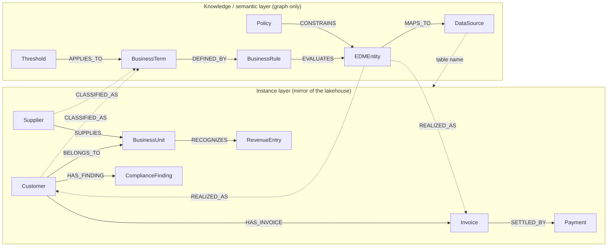

# supplier-risk-graph

A small demo of a dual data architecture for supplier and customer risk. The Databricks lakehouse owns the data / instance layer as Unity Catalog Delta tables. Neo4j owns the knowledge / semantic layer and holds a mirror of the instance data, so multi-hop and provenance queries run in one graph. One set of CSVs in `data/` is the single source for both sides, so the demo runs offline and the two sides always match.

The graph answers all six of the validation questions and explains which business definitions, thresholds, policies, and data sources backed each answer. Two Graph Data Science algorithms extend the rule-based answers: supplier risk exposure for Q4 and customer similarity for Q5 and Q6.

## The two-layer model

The instance layer is a mirror of the lakehouse tables. The knowledge layer holds the Enterprise Data Model, business terms, rules, policies, thresholds, and lineage to the real Unity Catalog tables. Two cross-layer edges tie them together: `REALIZED_AS` links a logical EDM entity to its physical instances, and `CLASSIFIED_AS` records a classification with provenance.

See the rendered image `dual-data-architecture.svg` in this folder for the same picture. The model below is built from `DATA_ARCHITECTURE.md`.



The full label, relationship, and property model is in `DATA_ARCHITECTURE.md`. All property names are camelCase in both Neo4j and Unity Catalog, so the Cypher below runs unchanged.

## How to run

Run these in order from this folder. Steps 1 and 2 need no live service; steps 3 to 5 need `.env` filled in.

1. Generate the data. This writes the 13 node CSVs, 13 relationship CSVs, and `ground_truth.json` to `data/`. It is deterministic, with a fixed seed and a frozen as-of date of 2026-07-01.

   ```bash
   uv run generate_data.py
   ```

2. Copy the environment sample and fill it in. The Neo4j section drives `load.py` and `gds.py`; the Databricks section drives `upload.py`.

   ```bash
   cp .env.sample .env
   # edit .env: NEO4J_URI, NEO4J_PASSWORD, and the Databricks / Unity Catalog values
   ```

3. Load Neo4j. The loader wipes the target database, creates id uniqueness constraints, then loads nodes and relationships in `UNWIND` batches. Point it at a database dedicated to this demo. Use `--check` to validate the CSVs offline without connecting.

   ```bash
   uv run load.py            # wipe and load
   uv run load.py --check    # validate CSVs only, no database
   ```

4. Run the GDS analytics. This runs the two algorithms and writes their results back into Neo4j: a `supplierExposureScore` on each `BusinessUnit` and `CLASSIFIED_AS {source: 'gds'}` edges to the Risky Customer term. Run it after the loader.

   ```bash
   uv run gds.py
   ```

5. Upload to Unity Catalog. This uploads the instance CSVs as Delta tables and materializes the two graph-derived gold tables, `business_unit_exposure` and `classifications`.

   ```bash
   uv run upload.py
   ```

## The six questions

Each query resolves its definition in the knowledge layer and pulls its facts from the mirrored instance data. Thresholds are read from the graph, never hardcoded.

### Q1 — Unreconciled revenue above the materiality threshold, per business unit

Sums unreconciled revenue per business unit and keeps only the units whose total exceeds the Materiality Threshold read from the Threshold node. Backed by rule RULE-05, term "Unreconciled Revenue" (TERM-05), and Threshold "Materiality Threshold" (THR-01, 100000 EUR). Facts come from the `revenue_entries` table via `RevenueEntry`.

```cypher
MATCH (thr:Threshold {name: 'Materiality Threshold'})
MATCH (bu:BusinessUnit)-[:RECOGNIZES]->(re:RevenueEntry {reconciled: false})
WITH bu, thr.value AS threshold, sum(re.amount) AS unreconciledTotal
WHERE unreconciledTotal > threshold
RETURN bu.id AS businessUnitId, bu.name AS name,
       round(unreconciledTotal, 2) AS unreconciledTotal, threshold
ORDER BY unreconciledTotal DESC
```

Expected: 2 units, BU-04 Asia Pacific (189924.86) and BU-02 Southern Europe (175803.01).

### Q2 — Customers with open KYC compliance findings

The KYC Policy constrains the Customer EDM entity; that entity realizes as the mirrored `Customer` instances, which are then checked for open KYC findings. Backed by policy "KYC Policy" (POL-01), which CONSTRAINS the Customer entity (EDM-01). Facts come from `customers` and `compliance_findings`.

> Direction note: the requirements doc traverses `REALIZED_AS` the wrong way. The model uses the entity-to-instance direction `(:EDMEntity)-[:REALIZED_AS]->(:Customer)`, so this query traverses entity to instance. This is the query the requirements doc had backwards.

```cypher
MATCH (pol:Policy {name: 'KYC Policy'})-[:CONSTRAINS]->(edm:EDMEntity)-[:REALIZED_AS]->(c:Customer)
MATCH (c)-[:HAS_FINDING]->(f:ComplianceFinding {type: 'KYC', status: 'open'})
RETURN c.id AS customerId, c.name AS name, collect(f.id) AS openKycFindings
ORDER BY c.id
```

Expected: 6 customers, CUST-016, CUST-017, CUST-024, CUST-040, CUST-067, CUST-080.

### Q3 — Platinum customers ranked by upsell score

Returns platinum-segment customers ordered by upsell score. Backed by term "Platinum Customer" (TERM-01) and rule RULE-01 (`customer.segment = 'platinum'`). Facts come from `customers`, including the derived `upsellScore` ML feature.

```cypher
MATCH (c:Customer {segment: 'platinum'})
RETURN c.id AS customerId, c.name AS name, c.upsellScore AS upsellScore
ORDER BY c.upsellScore DESC
```

Expected: 15 customers, led by CUST-065 Orchid Retail (100), CUST-019 Alder Drinks Co (99), CUST-011 Ridgeline Trading (98).

### Q4 — High-risk suppliers

Reads the supplier risk threshold from the rule behind the High-Risk Supplier term, then returns suppliers at or above it. Backed by rule RULE-03 and term "High-Risk Supplier" (TERM-03); the threshold of 70 is stored on the rule and also as Threshold "Supplier Risk Threshold" (THR-02). Facts come from `suppliers`.

```cypher
MATCH (term:BusinessTerm {name: 'High-Risk Supplier'})-[:DEFINED_BY]->(rule:BusinessRule)
MATCH (s:Supplier)
WHERE s.riskScore >= rule.threshold
RETURN s.id AS supplierId, s.name AS name, s.riskScore AS riskScore,
       rule.threshold AS threshold
ORDER BY s.riskScore DESC
```

Expected: 5 suppliers, SUP-024 (94), SUP-010 (90), SUP-003 (86), SUP-007 (85), SUP-001 (77).

### Q5 — Risky customers: more than 60 days late on each of their last 3 invoices

For each customer, takes the three most recent invoices by issue date and keeps only customers whose all three are more than the Late Payment Threshold days late. Backed by rule RULE-04, term "Risky Customer" (TERM-04), and Threshold "Late Payment Threshold" (THR-03, 60). Facts come from `invoices`.

```cypher
MATCH (thr:Threshold {name: 'Late Payment Threshold'})
MATCH (c:Customer)-[:HAS_INVOICE]->(inv:Invoice)
WITH c, thr.value AS lateThreshold, inv
ORDER BY inv.issueDate DESC
WITH c, lateThreshold, collect(inv)[0..3] AS lastThree
WHERE size(lastThree) = 3
  AND all(i IN lastThree WHERE i.daysLate > lateThreshold)
RETURN c.id AS customerId, c.name AS name,
       [i IN lastThree | {invoiceId: i.id, daysLate: i.daysLate}] AS lastThree
ORDER BY c.id
```

Expected: 5 customers, CUST-015, CUST-020, CUST-036, CUST-067, CUST-091.

### Q6 — Strategic accounts at risk

A strategic account that is also trending down on every risk dimension: profitability declining, churn risk high, at least one overdue invoice, and at least one open compliance finding. Backed by term "Strategic Account" (TERM-02), whose `CLASSIFIED_AS` edges are pre-planted. Facts come from `customers`, `invoices`, and `compliance_findings`.

```cypher
MATCH (c:Customer)-[:CLASSIFIED_AS]->(:BusinessTerm {name: 'Strategic Account'})
WHERE c.profitabilityTrend = 'declining' AND c.churnRisk = 'high'
  AND EXISTS { (c)-[:HAS_INVOICE]->(:Invoice {status: 'overdue'}) }
  AND EXISTS { (c)-[:HAS_FINDING]->(:ComplianceFinding {status: 'open'}) }
RETURN c.id AS customerId, c.name AS name,
       c.profitabilityTrend AS profitabilityTrend, c.churnRisk AS churnRisk
ORDER BY c.id
```

Expected: 3 customers, CUST-019, CUST-065, CUST-067. CUST-067 also appears in Q2 and Q5; the cohorts overlap by design.

### Q6 explanation query — the explainability payoff

For any strategic-at-risk customer, this returns the business terms it is classified as, plus the full lineage from term to backing rule to EDM entity to the real Unity Catalog table. Every answer can be traced from instance to definition to data source.

```cypher
MATCH (c:Customer {id: 'CUST-019'})-[cls:CLASSIFIED_AS]->(term:BusinessTerm)
MATCH (term)-[:DEFINED_BY]->(rule:BusinessRule)-[:EVALUATES]->(edm:EDMEntity)-[:MAPS_TO]->(ds:DataSource)
RETURN term.name AS term, cls.reason AS reason,
       rule.name AS rule, edm.name AS edmEntity, ds.table AS dataSource
ORDER BY term.name, edm.name
```

For CUST-019 this returns the Platinum Customer and Strategic Account terms, their rules RULE-01 and RULE-02, the Customer EDM entity, and the `supplier_risk.customers` table.

## How Genie consumes the graph semantics

Genie stays prominent as the consumer of graph semantics, never as a standalone answer path. The graph supplies the definitions that make Genie answers accurate, cheaper, and explainable. When a user asks Genie "which business units have material unreconciled revenue" or "who are our high-risk suppliers", the meaning of "material" and "high-risk" lives in the knowledge layer as thresholds and rules, not in an ad hoc SQL guess. The graph resolves the definition, points at the real Unity Catalog tables through `MAPS_TO` lineage, and hands Genie a grounded query. Classification results, both rule-based and GDS-scored, flow back into Delta so Databricks users see the graph value in their own tables. Positioning Genie as a standalone path would concede the questions to the lakehouse alone and lose the definitions and provenance.

## The two GDS extensions

Both algorithms write their results back into the graph so they join the same provenance story and flow into Unity Catalog. They are deterministic given the fixed-seed data.

### Q4 exposure — supplier risk to business unit exposure

The flat rule finds individually risky suppliers but says nothing about aggregate exposure. `gds.py` aggregates supplier risk over the `Supplier-SUPPLIES->BusinessUnit` edges and writes the mean supplying-supplier risk onto each `BusinessUnit` as `supplierExposureScore`. This result is materialized to the `business_unit_exposure` gold table by `upload.py`.

The flat rule finds the 5 obvious suppliers and misses BU-03:

```cypher
MATCH (s:Supplier)
WHERE s.riskScore >= 70
RETURN s.id AS supplierId, s.name AS name, s.riskScore AS riskScore
ORDER BY s.riskScore DESC
```

The mean-exposure aggregation surfaces BU-03 Americas at the top, even though none of its suppliers cross 70:

```cypher
MATCH (bu:BusinessUnit)
RETURN bu.id AS businessUnitId, bu.name AS name,
       bu.supplierExposureScore AS supplierExposureScore
ORDER BY bu.supplierExposureScore DESC
```

Expected top result: BU-03 Americas. It is served by 4 mid-risk suppliers with an average risk of 64.2 and no single score over 67, so the flat filter never sees it. Demo line: the rule finds risky suppliers; the graph finds risky exposure.

### Q5 / Q6 similarity — the next risky customers

`gds.py` runs kNN over the payment-behavior features `avgDaysLate`, `overdueShare`, `churnRisk`, and `profitabilityTrend`, then writes `CLASSIFIED_AS {source: 'gds', algorithm: 'knn', score, evaluatedAt, reason}` edges from the similarity candidates to the "Risky Customer" term. These flow into the `classifications` gold table via `upload.py`.

```cypher
MATCH (c:Customer)-[cls:CLASSIFIED_AS {source: 'gds'}]->(:BusinessTerm {name: 'Risky Customer'})
RETURN c.id AS customerId, c.name AS name,
       cls.algorithm AS algorithm, cls.score AS score, cls.reason AS reason
ORDER BY cls.score DESC
```

Expected: 4 candidates, CUST-072, CUST-025, CUST-082, CUST-073. None trips the last-3-invoices rule, but each sits close to the known risky cohort. Demo line: rule-based classification finds the ones already defined; GDS finds the next ones.

## Expected results

From `ground_truth.json`, so you can verify a load worked.

| Question | Result | Count |
|---|---|---|
| Q1 unreconciled business units | BU-04, BU-02 | 2 |
| Q2 open KYC violators | CUST-016, CUST-017, CUST-024, CUST-040, CUST-067, CUST-080 | 6 |
| Q3 platinum by upsell | led by CUST-065, CUST-019, CUST-011 | 15 |
| Q4 high-risk suppliers | SUP-024, SUP-010, SUP-003, SUP-007, SUP-001 | 5 |
| Q5 risky customers | CUST-015, CUST-020, CUST-036, CUST-067, CUST-091 | 5 |
| Q6 strategic at risk | CUST-019, CUST-065, CUST-067 | 3 |
| GDS Q4 exposed business unit | BU-03 Americas (top by exposure) | 1 |
| GDS Q5 similarity candidates | CUST-072, CUST-025, CUST-082, CUST-073 | 4 |
